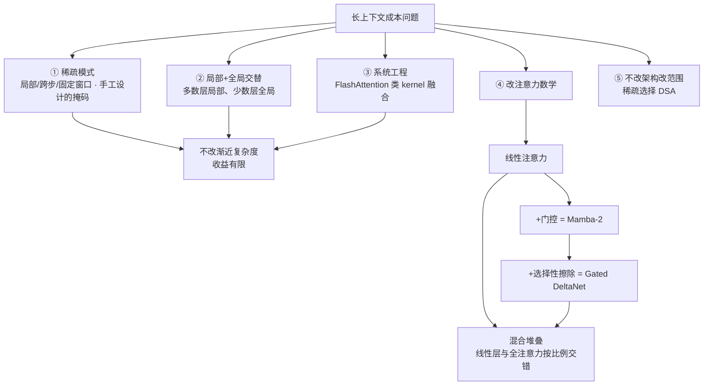
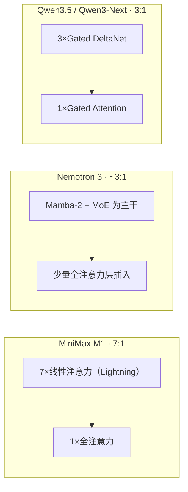

# Attention 替代方案：从线性注意力到稀疏注意力

> 整理自 **Stanford CS336（Language Modeling from Scratch）Lecture 4** 关于 attention alternatives 的部分（MoE 之前）。原讲义把这条线当作 MoE 的铺垫：两者都在问同一个问题——**怎么在固定算力下塞进更多参数/更长的上下文**。

!!! abstract "TL;DR"
    - 长上下文下注意力的成本随序列长度**平方增长**且逐渐压过 FFN，这是整条替代路线的动机
    - 关键恒等式：ρ 取恒等时 (QKᵀ)V = Q(KᵀV)——把平方换成线性，代价是失去 softmax 的"选择性"
    - 由此得到**对偶性**：并行二次形式用于训练、串行线性形式（RNN 形态）用于推理
    - 补回表达力的路径：加数据依赖门控（Mamba-2）→ 再加选择性擦除（Gated DeltaNet）
    - 工程上没人纯用线性层：**混合堆叠**是当前主流（MiniMax M1 7:1、Nemotron 3 ~3:1、Qwen3.5 3:1）
    - 另一条路是不改架构而改注意力范围：**DSA 稀疏注意力**（DeepSeek-V3.2 / GLM），靠轻量 indexer 选 top-k

## 1 动机：上下文在涨，注意力成本也在涨

2018–2025 年主流模型的上下文窗口从千级涨到百万级甚至千万级。问题在于标准注意力的成本随序列长度**平方增长**，而 FFN 部分是线性的——序列一长，注意力就成了时间与显存的主要开销来源，且占比随长度扩大。于是"如何控制注意力的成本"成为一条独立的研究路线。

讲义把解决思路分成三层，前两层是"沿用现有注意力但省钱"，第三层才是改数学：

**基础工具箱（① ② ③）**——都在 O(n²) 的渐近复杂度内做优化：

| 路线 | 做法 | 代价 |
|---|---|---|
| 稀疏注意力模式 | 手工设计注意力掩码：滑窗局部、跨步、固定跨步 | 模式由人定，可能切断必要依赖 |
| 局部 + 全局交替 | 大部分层只做局部注意力（窗口内），少数层做全局；用偏移技巧制造信息流；全局层需把维度加倍以容纳整个序列；最后一层通常固定为全局 | 层间设计复杂，长程依赖靠少数层承载 |
| 系统工程 | FlashAttention 系列的 kernel 融合与分块：不改变数学，只改变内存访问与并行方式 | 不改渐近复杂度；长到一定程度仍会 OOM |

系统工程能拿到很实的速度提升（讲义展示 FlashAttention-2 在长序列上吞吐显著高于朴素 PyTorch 实现，后者在 16K 附近直接显存不足），但这是"常数级"的胜利。讲义随即转向真正的问题：**要更根本的收益，必须动注意力的数学形式**。

## 2 线性注意力：一个"很蠢但极其重要"的恒等式

标准注意力写为（ρ 一般是 softmax）：

\[ \mathrm{Attn}(Q, K, V) = \rho(QK^\top)V, \qquad Q \in \mathbb{R}^{n \times d_k},\; K \in \mathbb{R}^{n \times d_k},\; V \in \mathbb{R}^{n \times d_v} \]

成本主要来自 QKᵀ 这个 n×n 矩阵（约 n²d_k），加上再乘 V 的 n²d_v。

**关键观察**：当 ρ 退化为恒等映射时，矩阵乘法满足结合律，可以换一个计算顺序：

\[ (QK^\top)V = Q(K^\top V) \]

左边先算 n×n 的注意力矩阵（平方），右边先算 d_k×d_v 的"状态"矩阵（与 n 无关），再让 Q 去乘它。复杂度从 n²d_k + n²d_v 变成约 2·n·d_v·d_k——**对序列长度 n 是线性的**。

这个变换简单到"看起来很蠢"，但它是后面所有线性注意力、状态空间模型（SSM）工作的起点。代价也很明确：softmax 提供的**选择性**（让某个 query 只关注少数 key、忽略其余）被丢掉了，因为 ρ 必须是恒等才有结合律。补回表达力，正是后面 Mamba-2、GDN 的主线。

!!! note "与原讲义关联的两点"
    - 讲义把这条线追溯到 Shen et al. 2018 与 Katharopoulos 2020（后者的 kernel 化版本即"Transformers are RNNs"），并指出它与 fast weight programmers 的思想相通；
    - 一个常见的误解是把"线性注意力"理解成"低秩近似注意力"（如 Linformer 把 n×n 投影到 n×d）。**这里不是近似**：在 ρ 为恒等的设定下，两种计算顺序给出**完全相同的数值结果**——区别只在计算图与复杂度。[BIOT](../papers/2026-09/0918-biot.md) 走的是低秩近似那条路，两者容易混淆。

## 3 循环形式与对偶性

把上面的线性形式按时间步展开，就得到一个 RNN 形态的递推：

\[ S_t = S_{t-1} + k_t v_t^\top, \qquad y_t = q_t^\top S_t \]

其中状态 S 是一个 d_k×d_v 的矩阵（与序列长度无关的"记忆"），每来一个 token 做一次外积写入、再用 query 读取一次。逐 token 计算量恒定，推理时不需要保留过去的 KV cache。

这就带来讲义强调的**对偶性**：同一个模型有两种等价写法——

- **并行形式**（二次复杂度）：训练时一次算完，能充分利用 GPU 的矩阵乘吞吐；
- **串行形式**（线性复杂度、恒定状态）：推理时逐个 token 递推，每步开销与历史长度无关。

训练用前者、推理用后者，这是线性注意力类模型在工程上最漂亮的性质。讲义还点出一个细节：如果给 S_{t-1} 乘一个衰减系数 γ，得到的正是 **RetNet**——也就是说"遗忘"这件事可以简单地由一个标量门来承担。

## 4 加门控：从线性注意力到 Mamba-2

Mamba-2 在做的事，是把上面那个常数改成**数据依赖的逐位置门控**：

\[ S_t = \gamma_t S_{t-1} + k_t v_t^\top, \qquad y_t = q_t^\top S_t + v_t^\top D, \qquad \gamma_t = f(x_t) \]

相比线性注意力多了两处：状态衰减系数 γ_t 由当前输入算出（而不是固定常数），以及一个从 v 直连输出的跳连项（D 项，类似残差，让模型不必把所有信息都塞进状态）。讲义的评价很直接：**门控让线性注意力更富表达力**（"gating is good"）。直觉上，γ_t 让模型自己决定"保留多少历史"——输入变化剧烈时把旧状态清掉，信息平稳时长期保留。

并且对偶性依然成立，只是并行形式的实现换成了 SSM 的扫描（scan）算法：γ 可以并行算出，再套用对偶性。讲义用 Mamba-2 论文里的两张图说明同一层的两种形态——串行版逐 token 递推，并行版用卷积 + 扫描一次算完。

## 5 选择性擦除：Gated Delta Net

线路继续往"记忆更像可读写寄存器"的方向走。Mamba-2 的门控只能整体缩放旧状态（衰减），不能**定点删除**某类信息。GDN（Gated Delta Net）引入了第二个门 β_t 和一个投影项：

\[ S_t = \gamma_t (I - \beta_t k_t k_t^\top) S_{t-1} + \beta_t k_t v_t^\top, \qquad y_t = q_t^\top S_t \]

\[ \gamma_t = f(x_t), \qquad \beta_t = f(x_t) \]

两个门的职责分工很清晰：

- **β_t 控制写入强度**：β=0 时整个更新项消失，等价于"这一步不再写入"；
- **(I − β_t k_t k_tᵀ) 做定向擦除**：这个投影算子会把旧状态中**与当前 key 方向重合的成分**抹掉，再写入新的 (k, v) 对。

这就是 delta rule（增量/纠错式更新）的思想：不是无脑叠加新信息，而是先把"关于这个 key 的旧答案"擦掉，再写上新的。它更接近"读写内存"而非"不断累加的寄存器"，因此对需要**覆盖旧信息**的任务（如精确检索、状态跟踪）更友好。讲义也指出这条线与 fast weight programming、test-time training 一脉相承。

把经典 RNN 到 GDN 的更新规则并排看，能看出这条线的演进逻辑（下表整理自讲义引用的 ByteDance Seed 系统研究，各行为原论文的更新规则）：

| 族 | 代表模型 | 状态更新 | 记忆机制 |
|---|---|---|---|
| 向量状态（经典/门控 RNN） | HGRN | h_t = α_t ⊙ h_{t-1} + (1−α_t) ⊙ v_t | 逐维衰减累加 |
| 向量状态 | Hawk (RG-LRU) | h_t = γ_t h_{t-1} + i_t ⊙ z_t | 门控 + 输入门 |
| 矩阵状态（外积写入） | RetNet / Lightning | S_t = γ S_{t-1} + k_t v_tᵀ | 固定衰减 |
| 矩阵状态 | GLA | S_t = S_{t-1} ⊙ (1αᵀ) + k_t v_tᵀ | 逐维衰减 |
| 矩阵状态 | Mamba-2 | S_t = γ_t S_{t-1} + k_t v_tᵀ | 数据依赖衰减 |
| 矩阵状态 | RWKV-6 | S_t = S_{t-1} − Diag(α) + k_t v_tᵀ | 数据依赖衰减 |
| 增量规则 | DeltaNet | S_t = S_{t-1}(I − β_t k_t k_tᵀ) + β_t k_t v_tᵀ | 定向擦除 + 写入 |
| 增量规则 | **Gated DeltaNet** | S_t = α_t S_{t-1}(I − β_t k_t k_tᵀ) + β_t k_t v_tᵀ | 衰减 + 定向擦除 + 写入 |

一句话概括演进：**状态从向量变矩阵（外积写入，容量更大）→ 衰减从固定变数据依赖（该记多久自己学）→ 从累加变先擦后写（delta rule）。**

## 6 工程实践：混合堆叠已成主流

纯线性层目前还打不过全注意力（尤其在需要精确回忆的任务上），所以近一年的落地形态都是**按比例交错**：多数层用线性/SSM，少数层保留全注意力。

- **MiniMax M1**：7 层线性（Lightning Attention）配 1 层全注意力的 7:1 混合，配合 MoE；讲义给出的消融里，hybrid-lightning 在多数推理类基准上优于等价 softmax 版本（BBH、DROP、MATH、ARC-C、WG 等指标上升，个别如 CMMLU 略有下降），并展现出**随上下文长度近似线性**的成本增长；
- **Nemotron 3**：以 Mamba-2 + MoE 为骨干、按固定模式插入极少数全注意力层（讲义图里的层序大致是连续若干 Mamba 块后插一个注意力块），在推理基准与超长上下文任务上达到同级模型的水平，同时吞吐更好；
- **Qwen3.5 / Qwen3-Next**：3:1 的 GDN / Attention 混合，配套 Gated Attention 与 Zero-Centered RMSNorm；讲义给的结果是性能合理、推理特性明显更好（长上下文下的解码吞吐相对基线大幅提升）。

**混合比例有没有系统依据？** 讲义引用 ByteDance Seed 与 UCSC 的《A Systematic Analysis of Hybrid Linear Attention》，结论是**受控消融仍然很少**，但已有证据指向"小比例线性层即可、再往上加收益递减"：在召回类任务（RULER）上，从 3:1 到 24:1 的线性占比增加会带来召回能力下滑，而 3:1 附近的损失最小。也就是说，混合比例本质上是在**效率与精确回忆能力之间取平衡点**。

## 7 另一条路：稀疏注意力（DSA）

与其把所有 token 都换成线性混合，另一条路是**保留标准注意力，但只让它看一部分 token**。DeepSeek Sparse Attention（用于 DeepSeek-V3.2 一系）的框架是两段式：

**（a）轻量 indexer 打分**：用一个头数很少、可跑 FP8 的小模块算 query 与历史 token 的相关性分数：

\[ I_{t,s} = \sum_{j=1}^{H^I} w^j_{t,s} \cdot \mathrm{ReLU}\big(q^j_{t,s} \cdot k^j_s\big) \]

这里刻意用 ReLU 而非 softmax（为了吞吐），且 indexer 的头数远少于主注意力——所以它的开销可以忽略。

**（b）细粒度 top-k 选择**：只对被选中的 key-value 计算真正的注意力：

\[ u_t = \mathrm{Attn}\big(h_t, \{c_s \mid I_{t,s} \in \mathrm{Top}\text{-}k(I_{t,:})\}\big) \]

两个工程上极有价值的性质：

1. **可后置适配**：可以在训练好的稠密短上下文模型上"事后"接上 DSA 继续训练，不必从头预训练——讲义引用 GLM-4.7-Flash 的消融：只训 indexer（冻结底座）与联合训练两种变体在 4K–64K 都与基线相当，但到 **128K 时只训 indexer 的变体明显退化（71.35 vs 基线 79.21），联合训练能保持在基线水平（78.86）**。含义很实际：**只训 indexer 不够，长上下文能力需要底座参与**；
2. **成本曲线被压平**：DeepSeek-V3.2 相比 V3.1-Terminus，prefilling 与 decoding 的每百万 token 成本随位置增长要平缓得多——这正是长上下文服务成本的痛点所在。

## 8 与 EEG 的关联

这条线对 EEG 建模不是"隔壁领域的技术"，而是直接可用的工具：

- **BIOT 用的就是线性注意力这一族**——它借鉴 Linformer 式的低秩投影来把多通道长句子压到线性复杂度。读完本节再回看 [BIOT 笔记](../papers/2026-09/0918-biot.md)，可以清楚区分"低秩近似"与"结合律重排"两种省算力的思路；
- **EEG 的上下文问题比语言更尖锐**：临床长程监测可达数小时到数十小时（如 LaBraM 的 2500 小时语料、NeuroLM 的 25000 小时），若把整段记录当一个序列建模，二次复杂度是硬瓶颈——这正是 SleepGPT（Nature Comms 2026）把"二次复杂度不利于长时/实时场景"列为自身局限的原因；
- **GDN / Mamba 类模型在生理信号上已是常见选择**：恒定状态 + 线性推理的特性天然契合"可穿戴设备上做长时低功耗推理"的需求，这也是为什么 SSM 一系在 EEG/ECG/PPG 的轻量部署工作里出现频率很高；
- **一个值得注意的取舍**：EEG 的很多任务是"精确回忆型"（找出某次发作的开始时刻、某个导联的特定波形），而混合研究显示这类任务正是线性层最吃亏的地方——如果做长时 EEG 模型，混合比例这个旋钮值得专门做消融，而不是照搬语言模型的 3:1。

## 自问自答

??? question "Q1 · 既然 (QKᵀ)V = Q(KᵀV) 只是换个顺序，为什么不直接全用？"

    因为恒等式成立的前提是 ρ 为恒等。一旦要保留 softmax（它带来注意力分布的选择性——让 query 聚焦少数 key），结合律就不成立，右边的推导不再等价。线性注意力的代价就在这：能换顺序，但换掉之后就必须放弃 softmax，表达力靠后续的门控与擦除机制补回来。另一个实际代价是"状态容量"——把任意长的历史压进固定大小的 d_k×d_v 状态，天然是瓶颈。

??? question "Q2 · 门控（γ）到底解决了什么问题？"

    固定衰减意味着所有位置用同一个遗忘速率，而真实序列的"该记多久"是随内容变化的：一段关键信息可能需要长期保留，噪声应当快速遗忘。让 γ_t = f(x_t) 把遗忘速率变成输入的函数，模型就能按内容动态决定记忆深度。GDN 在此之上再加 β 与擦除项，把"遗忘"从整体衰减细化成"按 key 方向定向清除"。

??? question "Q3 · 混合架构为什么非要保留少量全注意力层？"

    因为线性/SSM 层的状态是固定容量的压缩记忆，做**精确检索**（从长历史里精确取回某一项信息）时先天吃亏——这正是 ByteDance 的研究在召回类任务上观察到的现象：线性比例越高、召回越差。保留少数全注意力层，相当于在压缩记忆之外留了一条"无损直通通道"，专门服务需要精确定位的依赖关系。比例因此是能力与成本的折中旋钮，而不是越线性越好。

??? question "Q4 · DSA 和线性注意力是竞争关系吗？"

    更像是两种不同的省钱方式，可以叠加。线性注意力改的是**每层的注意力数学**（平方→线性，但需要重新训练或改造架构）；DSA 改的是**每次注意力看多少 token**（top-k 稀疏选择，且能后置适配到已有稠密模型）。前者更激进、收益更大但要动训练配方；后者更兼容、工程落地成本低。GLM 的消融还提示了一个共同规律：**在长上下文能力上，底座是要参与训练的**，纯外挂式的轻量适配在极长上下文会掉点。

!!! abstract "复现速查卡"
    - **原讲义**：[CS336 lecture_04.pdf](https://github.com/stanford-cs336/lectures/blob/main/lecture_04.pdf)（本页只整理 MoE 之前的部分）
    - **核心公式**：线性注意力结合律 (QKᵀ)V = Q(KᵀV)；递推形式 S_t = S_{t-1} + k_t v_tᵀ；Mamba-2 加 γ_t；GDN 加 β_t 与 (I − β_t k_t k_tᵀ) 擦除项
    - **沿革线索**：Shen et al. 2018 / Katharopoulos 2020（线性注意力）→ RetNet（衰减）→ Mamba-2（数据依赖门控）→ Gated DeltaNet（delta rule）→ 混合堆叠 → DSA（稀疏选择）
    - **落地参考**：MiniMax M1（7:1 线性/全注意力）、Nemotron 3（Mamba-2+MoE 骨干）、Qwen3.5/Next（3:1 GDN/Attention，Gated Attention + Zero-Centered RMSNorm）、DeepSeek-V3.2 与 GLM（DSA）
    - **要点**：混合比例在召回能力与效率间折中；DSA 可后置适配但长上下文仍需底座参与训练

---

**相关阅读**

:material-angle-acute: [LoRA · 低秩适配](lora.md) ｜ :material-sitemap: [Tokenization 演进](../topics/tokenization.md) ｜ :material-heart-pulse: [BIOT（线性注意力的工程实例）](../papers/2026-09/0918-biot.md) ｜ :material-home: [首页](../index.md)
