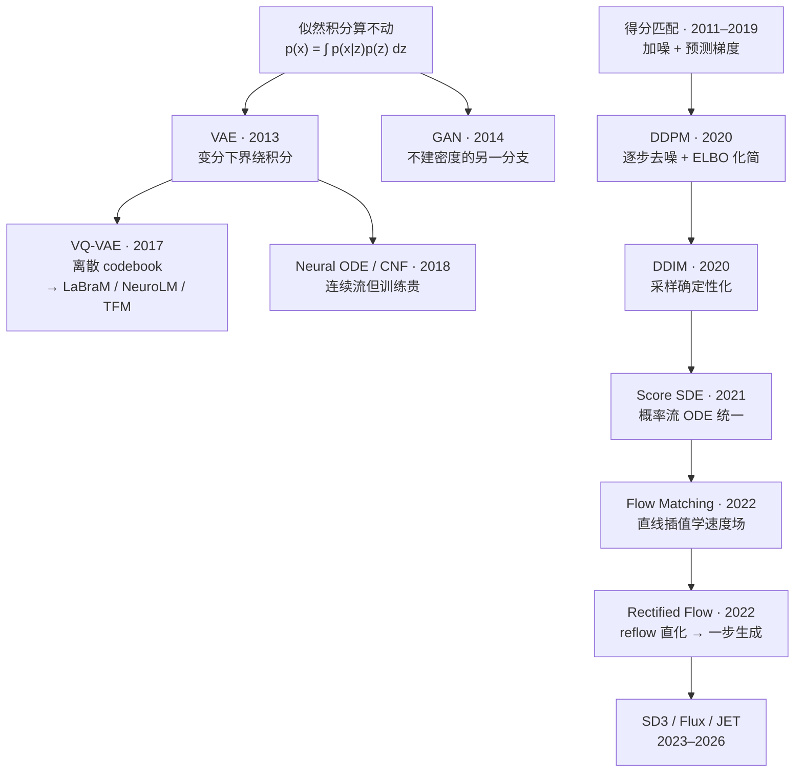
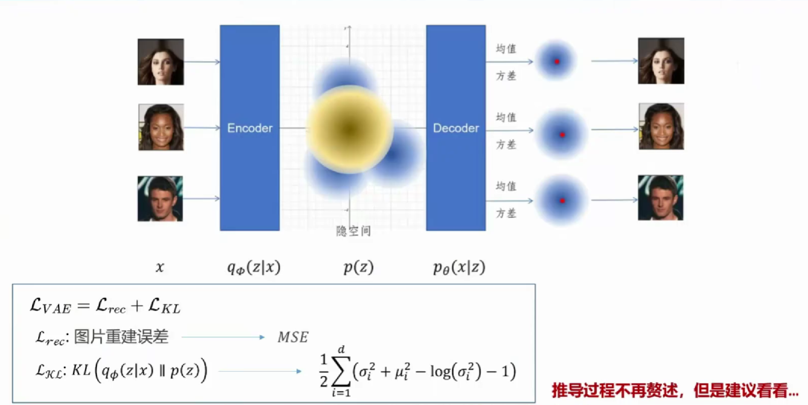
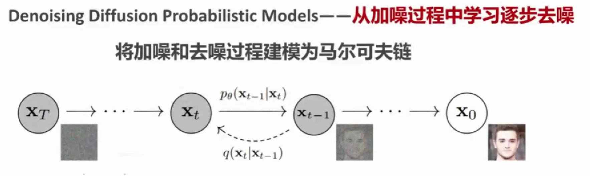
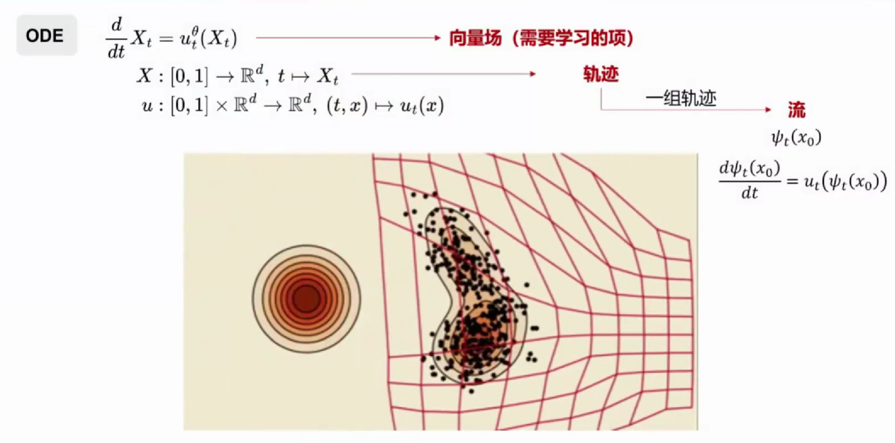

# 生成模型三代脉络：VAE → DDPM → Flow Matching

> 「模型架构基础」第三篇。深度生成模型三十年只有一条主线：**latent variable model 的似然积分算不动**，VAE、DDPM、Flow Matching 是三种越来越聪明的绕法。理解了主线，所有公式都不是孤立记忆的——本文把三代的原理、核心公式与血缘关系一次讲透，并接回站内的 [JET 笔记](../papers/2026-09/0923-jet.md)。

!!! abstract "TL;DR"
    - 主线：\( p(x) = \int p(x|z)\,p(z)\,dz \) 这个积分算不可积，三代模型给出三种绕法
    - **VAE**（2013）：变分下界 ELBO + 重参数化，一步编码-解码——代价是模糊（均值坍缩）
    - **DDPM**（2020）：把生成拆成 T 步小去噪，ELBO 逐级闭式化简成"预测噪声"MSE——锐利但采样慢、调度手工
    - 桥梁：得分匹配（预测噪声 = 预测 \( \nabla_x \log p \)）与 SDE 视角（扩散本质是一条概率流 ODE）
    - **Flow Matching**（2022）：直接学从噪声到数据的速度场，路径自由（直线 + reflow 直奔一步生成）——DDPM 是它取"VP 路径 + 噪声参数化"的特例
    - 三代共享同一骨架：**在噪声与数据之间插值，让网络回归中间动力学**；进化的只是"谁决定插值的形状"

## 1 全景时间线

## 2 第一代 · VAE：变分绕积分（2013）

**要解决的问题**：想学含隐变量的生成模型 \( p_\theta(x) = \int p_\theta(x|z)\,p(z)\,dz \)（先验 \( z \sim \mathcal{N}(0, I) \)），这个积分算不动，最大似然不可行。

**第一步：引入近似后验。** 真实后验 \( p_\theta(z|x) = p(x|z)p(z)/p(x) \) 的分母就是那个积分，也算不动——于是用编码器网络 \( q_\phi(z|x) \) 去近似它。对任意 \( q \) 恒有：

\[ \log p_\theta(x) = \mathrm{ELBO}(\theta, \phi; x) + \mathrm{KL}\big( q_\phi(z|x) \,\|\, p_\theta(z|x) \big) \]

KL 项 ≥ 0，所以 ELBO 是下界；KL 不可算但 ELBO 可算。**最大化 ELBO 同时做两件事**：把似然推高，顺便让 \( q \) 逼近真实后验（间隙缩小）。

**第二步：ELBO 拆成两项**（对积分取 log 用 Jensen 不等式）：

\[ \mathrm{ELBO} = \underbrace{\mathbb{E}_{q(z|x)}\big[ \log p_\theta(x|z) \big]}_{\text{重构项}} \;-\; \underbrace{\mathrm{KL}\big( q_\phi(z|x) \,\|\, \mathcal{N}(0, I) \big)}_{\text{正则项}} \]

重构项要求编码出的 \( z \) 能解回 \( x \)（decoder 取高斯似然时就是最小化 MSE）；正则项把每个 \( x \) 的后验拉向标准正态，保证潜空间平滑、从先验采样就能 decode 出合理样本。高斯 \( q \) 配高斯先验时 KL 有闭式解：每维 \( -\tfrac{1}{2}(1 + \log \sigma^2 - \mu^2 - \sigma^2) \)。

**第三步：重参数化技巧。** "从 \( q_\phi(z|x) \) 采样"是随机节点，梯度断路。把随机性挪到网络外面：

\[ z = \mu_\phi(x) + \sigma_\phi(x) \odot \varepsilon, \qquad \varepsilon \sim \mathcal{N}(0, I) \]

\( z \) 变成对 \( \varepsilon \) 的确定性函数，反向传播可以穿过采样直达编码器。这一招在所有概率生成模型里反复出现。

*VAE 架构与损失分解：\( x \to q_\phi(z|x) \to p(z) \to p_\theta(x|z) \) 的完整链路；图中 KL 闭式解 \( \frac{1}{2}\sum_i(\sigma_i^2 + \mu_i^2 - \log\sigma_i^2 - 1) \) 即上文正则项的逐维展开*

**固有缺陷与分支**：decoder 逐像素独立高斯似然的最优解是**所有可能样本的均值**——均值模糊，所以 VAE 生成总是糊的；decoder 太强（自回归）时还会**后验坍缩**（KL 把 \( q \) 压向先验，\( z \) 失去信息）。VQ-VAE（2017）把连续高斯隐变量换成离散 codebook（commitment loss + stop-gradient，扔掉 KL）——这就是 [LaBraM](../papers/2026-09/0918-labram.md) / [NeuroLM](../papers/2026-09/0918-neurolm.md) / [TFM-Tokenizer](../papers/2026-09/0918-tfm-tokenizer.md) 的 tokenizer 血统；LaBraM 附录那个 ELBO 解释（tokenizer = 后验、decoder = 似然、掩码建模 = 学先验）正是这个框架的离散版。

## 3 暗线 · 得分函数：换一个问题问（2011–2019）

在 DDPM 之前有条容易被忽略的暗线：不建密度 \( p(x) \) 本身，学它的**梯度**。

\[ s(x) = \nabla_x \log p(x) \qquad \text{—— 指向数据密度上升最快方向的场} \]

- **Denoising Score Matching**（Vincent 2011）：对数据加噪声 \( \tilde{x} = x + \sigma\varepsilon \) 后"预测噪声"等价于"预测得分"——因为 \( \nabla_{\tilde{x}} \log q(\tilde{x}|x) = -(\tilde{x} - x)/\sigma^2 \)；
- **Langevin 动力学**：有了得分就能采样——沿密度梯度爬升并加随机扰动，迭代逼近数据分布；
- **NCSN**（Song & Ermon 2019）：单个噪声尺度不够（大噪声处无信号、小噪声处无覆盖），于是用**一系列从大到小的噪声级**，同一个网络以 \( (x, \sigma) \) 为条件预测所有尺度的得分。

关键伏笔："加噪声 + 预测噪声"的训练范式在这里已经成型，只是还没有马尔可夫链的衣裳。

## 4 第二代 · DDPM：给去噪装上马尔可夫链（2020）

DDPM 把 NCSN 的多尺度噪声重述成一条 \( T \) 步前向链（**固定、无参数**）：

\[ q(x_t | x_{t-1}) = \mathcal{N}\big( \sqrt{1-\beta_t}\; x_{t-1},\; \beta_t I \big) \quad\Longrightarrow\quad x_t = \sqrt{\bar{\alpha}_t}\; x_0 + \sqrt{1-\bar{\alpha}_t}\; \varepsilon \]

其中 \( \bar{\alpha}_t = \prod_{s=1}^{t}(1-\beta_s) \)（累乘）。任意时刻一步到位，这是纯代数——训练时造带噪样本就靠右式。走到底 \( x_T \approx \mathcal{N}(0, I) \)。

**反向过程**是要学的 \( p_\theta(x_{t-1}|x_t) \)（直接算需要对未知的 \( x_0 \) 积分）。理论骨架仍是对整条链写负 ELBO——妙处在**每一项都是两个高斯之间的 KL，全有闭式解**：VAE 里最难算的正则项在这里免费了。化简到底只剩 Ho et al. 的：

\[ \mathcal{L}_{\mathrm{simple}} = \mathbb{E}_{t,\,x_0,\,\varepsilon} \big\| \varepsilon - \varepsilon_\theta(x_t,\,t) \big\|^2 \]

用人话说：**拿一张干净图，按公式加一份已知噪声，让网络看带噪图、猜出那份噪声，用 MSE 惩罚**，\( t \) 随机采。网络实际在学的是得分——\( \varepsilon_\theta(x_t, t) / \sqrt{1-\bar{\alpha}_t} \approx -\nabla_x \log p_t(x_t) \)，与 denoising score matching 是同一件事。生成从此锐利：每步只做小幅残差修正，网络永远不必像 VAE 那样一步输出条件均值。

*DDPM 的马尔可夫链视角：灰色圆是带噪状态，\( q(x_t|x_{t-1}) \)（虚线）是固定的前向加噪，\( p_\theta(x_{t-1}|x_t) \) 是要学习的反向去噪——"从加噪过程中学习逐步去噪"*

**DDIM（2020）是承前启后的一步**：ancestral sampling 去掉每步随机项后，采样变成一个**确定性 ODE 积分**——同一个模型不用重训，路径从 SDE 换成 ODE。人们由此意识到：扩散模型骨子里是一条连续的流。

## 5 桥梁 · SDE 统一（2021）

Song et al. 把所有加噪方案写成连续时间的**前向 SDE**（VP-SDE 即 DDPM 的连续极限）：

\[ dx = f(x, t)\,dt + g(t)\,dw \]

Anderson (1982) 的结论：每个前向 SDE 都有一个时间倒着走的**反向 SDE**（需要得分场），且有一条确定性伴随物——**概率流 ODE**：

\[ dx = \Big[ f(x, t) - \tfrac{1}{2}\, g(t)^2\, \nabla_x \log p_t(x) \Big] dt \qquad \text{（同样的边缘分布，无随机项）} \]

**这就是 DDPM → Flow Matching 的桥**：扩散模型的三个身份（离散链 / 反向 SDE / 概率流 ODE）里，概率流 ODE 已经是"把噪声分布输运到数据分布的向量场"——和生成流是同一个数学对象。DDPM 的全部特殊之处，只剩它的向量场形状由**手工噪声调度** \( \beta(t) \) 决定。

## 6 第三代 · Flow Matching：把调度也交出去（2022）

更早的 Neural ODE / CNF（2018）想过"用 ODE 定义生成流"，但训练要算雅可比迹、在 ODE solver 里反传——贵到不可用。**Flow Matching（Lipman et al. 2022）的贡献是 simulation-free 训练**：想学速度场 \( v_\theta(x, t) \)，它生成的 ODE 把先验 \( p_0 = \mathcal{N}(0, I) \) 输运到数据 \( p_1 \)。边缘速度场没有真值，但对**成对样本** \( (x_0, x_1) \) 可定义条件路径与条件速度：

\[ \text{路径：}\; x_t = (1-t)\,x_0 + t\,x_1 \qquad \text{目标：}\; u_t = x_1 - x_0 \]

\[ \mathcal{L}_{\mathrm{FM}} = \mathbb{E} \big\| v_\theta(x_t,\,t) - (x_1 - x_0) \big\|^2 \]

关键定理：对条件目标回归与对边缘目标回归的**梯度相同**（边缘速度恰是条件速度的期望 \( u_t(x) = \mathbb{E}[x_1 - x_0 \mid x_t = x] \)，MSE 的最优解就是条件期望）——所以不必知道边缘场，采样配对做回归即可。

*Flow Matching 的三个核心名词：**向量场**（\( u_t \)，要学习的项）、**轨迹**（一条 ODE 解 \( X_t \)）、**流**（全体轨迹 \( \psi_t(x_0) \)）——生成就是把左侧高斯先验"揉"成右侧数据分布的那组形变*

**Rectified Flow（Liu et al. 2022，同期工作）**补上直化：用训好的模型生成新配对再重训（reflow），轨迹越来越直 → 少步乃至**一步生成**。"straighter trajectories, faster sampling"的出处，也是 JET 引用 Mean Flow（2025）的那条线。

**与 DDPM 的精确关系**：把插值路径从直线换成 VP 路径（系数 \( \sqrt{\bar{\alpha}_t} \)、\( \sqrt{1-\bar{\alpha}_t} \)），FM 的回归目标就退化回噪声预测——扩散的概率流 ODE 是 Flow Matching 取特定路径的特例：

\[ \text{Flow Matching} = \text{扩散的推广（路径自由）} + \text{简化（无调度表、纯确定性、目标是速度而非噪声）} \]

## 7 三代统一对照

| | VAE | DDPM | Flow Matching |
|---|---|---|---|
| 绕积分的方式 | 变分下界（一次近似） | 变分下界（T 级链，逐级闭式） | 不走 ELBO：直接回归向量场 |
| 中间变量 | 一个全局 `z` | T 个逐步状态 | 连续路径 `x(t)`，t 从 0 到 1 |
| 网络学什么 | decoder 似然 | 噪声 ε（= 得分的缩放） | 速度场 v(x, t) |
| 训练回归目标 | 重构误差 | 噪声 ε | 速度 `x1 − x0` |
| 采样方式 | 一步 decode | SDE 采样 / DDIM（ODE） | ODE 积分（路径可任意直化） |
| 先验/调度 | 高斯先验 | **手工**噪声调度 | 路径自由选（常用直线） |
| 固有缺陷 | 模糊、后验坍缩 | 采样慢、调度手工 | 矫直不彻底则少步掉点 |

## 8 三条"缺陷驱动进化"的主线

把整个脉络压缩成三句话，每句对应一个公式组件的消亡：

1. **"模糊"死于分步**——VAE 一步解码输出条件均值；DDPM 把生成拆成上千个小残差修正，模糊消失（2020）；
2. **"慢"死于 ODE 化**——DDPM 的 T 次 SDE 采样，经 DDIM 与 SDE 视角变成确定性 ODE，为少步化铺路（2020–2021）；
3. **"手工调度"死于路径自由**——FM 把 \( \sqrt{\bar{\alpha}_t} \) 这张人拍的表换成可自由设计的插值路径，直线路径 + reflow 直奔一步生成（2022–2025）。

## 9 在 EEG 语境中的位置

- **VQ-VAE 分支** → 已精读的 LaBraM（神经码本 + 频谱重构目标）/ NeuroLM（码字并入 LLM 词表）/ TFM（时频 motif 词表）；
- **DDPM 线** → [JET](../papers/2026-09/0923-jet.md) 的 Vanilla Diffusion 基线与 EEG-GAN 对照。LaBraM 的"原始波形不可重构、改频谱目标"与扩散"分步去噪才能锐利"，其实是同一现象（一步回归的均值坍缩）的两种表述；
- **FM 线** → JET 本体：\( x_t = t\,x_1 + (1-t)\,x_0 \) 就是直线插值路径，三条生理约束相当于在 FM 损失外加了结构正则；
- **先验的拓扑要求三代一致**：JET 的"零噪声初始化灾难失败"（TS-FID 1600+）正是"先验必须非退化、有全空间支撑"的实证——VAE 的 \( z \sim \mathcal{N}(0, I) \)、DDPM 的 \( x_T \)、FM 的 \( x_0 \) 没有例外。

## 自问自答

??? question "Q1 · 为什么 VAE 模糊而扩散锐利？"

    根因在一步回归的均值坍缩：逐像素独立高斯似然下，最优解码器输出的是条件均值——把多种可能平均成一张糊图。DDPM 把一步生成拆成 T 步小去噪，每步只需处理小残差、且采样过程中有随机项维持多样性，不需要任何一步"押注"完整样本。VQ-VAE 走的是另一条修路：把隐变量离散化，重构目标变成离散码预测，绕开连续均值。

??? question "Q2 · Flow Matching 和 DDPM 到底什么关系？"

    同一家族的两个参数化。DDPM 在"VP 路径 + 预测噪声"参数化下是 FM 的特例：把 FM 的直线插值换成 \( x_t = \sqrt{\bar{\alpha}_t}\,x_0 + \sqrt{1-\bar{\alpha}_t}\,\varepsilon \)、把回归目标从速度 \( x_1 - x_0 \) 换成噪声 \( \varepsilon \)，就还原回扩散。差别有三：FM 的插值路径自由（直线/最优传输），DDPM 的由手工调度表决定；FM 训练回归的是速度场，采样纯确定性 ODE；DDPM 的反向采样天然带随机性（SDE 视角），少步采样时随机项有助于覆盖多模态。

??? question "Q3 · 条件速度场没有真值，凭什么对配对样本回归就行？"

    边缘速度场是条件速度在配对分布下的期望：\( u_t(x) = \mathbb{E}[x_1 - x_0 \mid x_t = x] \)。MSE 回归的最优解恰好是条件期望——所以对随机采样的配对 \( (x_0, x_1) \) 做回归，其梯度与对边缘场回归的梯度一致。这与"DDPM 预测噪声等价于预测得分"是同构的逻辑：都在用一个可采样的条件量替代不可算的边缘量。

??? question "Q4 · 为什么三代模型的先验都要求非退化？"

    从单个点出发要把退化的分布展开成复杂多模态的数据分布，是一对多的映射——连续流（ODE）无法表示，只有带全空间支撑的随机先验（如高斯）才能给输运提供覆盖数据支撑的自由度。JET 的消融给了实证：零噪声初始化下 TS-FID 从 188 崩到 1615 以上，且换任何损失权重都救不回来——这不是超参问题而是结构性不可表示。

!!! abstract "关键文献速查"
    - **VAE**：Kingma & Welling, *Auto-Encoding Variational Bayes*, arXiv:1312.6114（2013）
    - **VQ-VAE**：van den Oord et al., *Neural Discrete Representation Learning*, NeurIPS 2017
    - **DDPM**：Ho et al., *Denoising Diffusion Probabilistic Models*, NeurIPS 2020（arXiv:2006.11239）
    - **DDIM**：Song et al., *Denoising Diffusion Implicit Models*, ICLR 2021
    - **Score SDE**：Song et al., *Score-Based Generative Modeling through SDEs*, ICLR 2021（arXiv:2011.13456）
    - **Flow Matching**：Lipman et al., arXiv:2210.02747（2022）
    - **Rectified Flow**：Liu et al., *Flow Straight and Fast*, arXiv:2209.03003（2022）
    - **EEG 落点**：[JET（ICML 2026）](../papers/2026-09/0923-jet.md)——直线插值 + 生理约束的本站精读

---

**相关阅读**

:material-creation: [JET · 流匹配生成 EEG（本站精读）](../papers/2026-09/0923-jet.md) ｜ :material-angle-acute: [LoRA · 低秩适配](lora.md) ｜ :material-vector-polyline: [Attention 替代方案](attention-alternatives.md) ｜ :material-heart-pulse: [LaBraM（VQ-VAE 分支的 EEG 实现）](../papers/2026-09/0918-labram.md) ｜ :material-home: [首页](../index.md)
