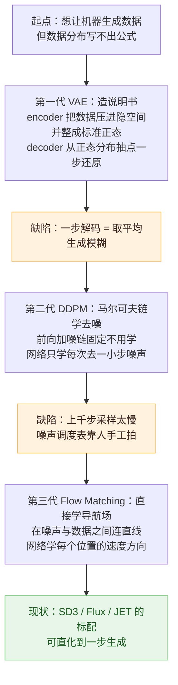

# 生成模型三代脉络：VAE → DDPM → Flow Matching

> 「模型架构基础」第三篇。**本文结构刻意做成"思维链优先"**：第 1 节用大白话把三代的核心思想与演进逻辑一次讲完——看懂第 1 节就拿到了整个框架；之后各节的公式只是把思维链落到实处，按需回来查即可。落地实例见站内 [JET 笔记](../papers/2026-09/0923-jet.md)。

!!! abstract "TL;DR · 每代一句话"
    - **VAE**：把数据映射到隐空间，并让隐空间整体呈**标准正态分布**；生成 = 从正态分布抽一个点，用 decoder 一步还原出样本。**能生成，但模糊。**
    - **DDPM**：用**马尔可夫链建模去噪过程**——先把数据一步步加噪声变成纯噪声（固定、不用学），再教网络学会倒着走；生成 = 从纯噪声逐步去噪回来。**锐利，但慢、调度靠人拍。**
    - **Flow Matching**：扔掉"去噪"的说法，直接学一个**从噪声指向数据的导航场**（向量场）；生成 = 沿着场从噪声走到数据，路径可拉直到一步。**DDPM 是它的特例。**

## 1 思维链总览（先读这节）

**起点问题**：我们想让机器生成数据——图片、语音，或者本站的 EEG。难点在于：数据的分布"长什么样"说不出来，更写不出公式。三代模型，就是三代越来越聪明的绕法。

**第一棒 · VAE——造一份"说明书"**。既然分布写不出公式，就不写了：encoder 把每条数据映射到隐空间的一个点，并顺手把所有点**整成一团标准正态**；decoder 学会从这团分布里的点还原出数据。生成时从正态分布里随便抽一个点解码即可。**但生成是糊的**——decoder 被要求"一步画出完整样本"，它学会的最优策略是把所有可能的答案**取平均**。

**第二棒 · DDPM——既然一步画会糊，就分一千步画**。先把真实数据一点点加噪声、直到变成纯噪声——注意这条加噪链是**固定的、不用学**；然后教一个网络"只往前去噪一小步"。生成 = 从纯噪声出发倒着走一千步，每步只做小修正，不再需要一步押注完整答案 → **锐利了**。但留下两件烦心事：一千步采样太慢；每步"去多少噪声"的调度表是人**手工拍的**。

**第三棒 · Flow Matching——把"去噪"这个说法也扔掉**。去噪只是"从噪声走向数据"的一种实现方式；直接学一个**导航场**（向量场）：在噪声和数据之间连直线，让网络学会"在路径上每个位置，该往哪个方向、以多快速度走"。生成 = 从噪声出发沿导航场积分到数据。路径自己选、可以拉直、甚至直化到**一步生成**；DDPM 那张手工调度表，在这个视角下只是无数可选路径里的一种。

**这条链的规律**：每一代都是为了修上一代最疼的缺陷——**VAE 的模糊逼出 DDPM 的分步；DDPM 的慢与手工调度逼出 FM 的路径自由**。记住这一句，下面的公式全部各归其位。

## 2 第一代 · VAE：造一份"说明书"

!!! note "核心思想（大白话）"
    把数据映射到隐空间，并让隐空间整体呈标准正态分布；生成 = 从正态分布抽一个点，用 decoder 一步还原。encoder 是"存入"，decoder 是"取出"。

**思维链位置**：回答了"分布写不出公式怎么办"——不写分布，写"数据 ↔ 隐空间"的往返说明书。留下的缺陷：**一步解码取平均 → 模糊**（这就是第二棒要解决的问题）。

### 落到公式

积分写不出来：\( p_\theta(x) = \int p_\theta(x|z)\,p(z)\,dz \) 算不动，最大似然不可行。VAE 用变分下界绕开它——用一个编码器 \( q_\phi(z|x) \) 近似真实后验，对任意 \( q \) 恒有：

\[ \log p_\theta(x) = \mathrm{ELBO}(\theta, \phi; x) + \mathrm{KL}\big( q_\phi(z|x) \,\|\, p_\theta(z|x) \big) \]

KL 项 ≥ 0，所以 ELBO 是下界、且可算。把它拆开就是训练目标的两大块：

\[ \mathrm{ELBO} = \underbrace{\mathbb{E}_{q(z|x)}\big[ \log p_\theta(x|z) \big]}_{\text{重构项：说明书要能还原}} \;-\; \underbrace{\mathrm{KL}\big( q_\phi(z|x) \,\|\, \mathcal{N}(0, I) \big)}_{\text{正则项：把隐空间整成标准正态}} \]

高斯情形下 KL 有闭式解（每维 \( -\tfrac{1}{2}(1 + \log \sigma^2 - \mu^2 - \sigma^2) \)）。还有一处工程关键——**重参数化技巧**：采样节点梯度断路，把随机性挪到网络外 \( z = \mu_\phi(x) + \sigma_\phi(x) \odot \varepsilon \)（\( \varepsilon \sim \mathcal{N}(0, I) \)），梯度就能穿过采样直达 encoder。

*VAE 架构与损失分解：\( x \to q_\phi(z|x) \to p(z) \to p_\theta(x|z) \) 的完整链路；图中 KL 闭式解 \( \frac{1}{2}\sum_i(\sigma_i^2 + \mu_i^2 - \log\sigma_i^2 - 1) \) 即上文正则项的逐维展开*

**为什么模糊（思维链里那句话的机制）**：decoder 逐像素独立高斯似然的最优解是所有可能样本的**条件均值**——多种可能的答案平均成一张糊图。decoder 太强时还会**后验坍缩**（KL 把 \( q \) 压向先验，隐变量失去信息）。**分支记忆**：VQ-VAE（2017）把连续隐变量换成离散 codebook（commitment loss + stop-gradient，扔掉 KL）——即 [LaBraM](../papers/2026-09/0918-labram.md) / [NeuroLM](../papers/2026-09/0918-neurolm.md) / [TFM-Tokenizer](../papers/2026-09/0918-tfm-tokenizer.md) 的 tokenizer 血统。

## 3 第二代 · DDPM：用马尔可夫链学去噪

!!! note "核心思想（大白话）"
    把"加噪"和"去噪"建模成一条马尔可夫链：前向把数据一步步加噪声变成纯噪声——这条链**固定、无参数、不用学**；反向教一个网络每次只去一小步噪声。生成 = 从纯噪声倒着走到数据。

**思维链位置**：修复 VAE 的模糊——分步小修正替代一步取平均。留下新问题：**上千步采样太慢**、**噪声调度表靠人手工拍**（这是第三棒要解决的问题）。

### 落到公式

前向链每步保留一点旧信号、注入一点新噪声（\( \bar{\alpha}_t = \prod_{s=1}^{t}(1-\beta_s) \) 为累乘，任意时刻可一步到位——纯代数）：

\[ q(x_t | x_{t-1}) = \mathcal{N}\big( \sqrt{1-\beta_t}\; x_{t-1},\; \beta_t I \big) \quad\Longrightarrow\quad x_t = \sqrt{\bar{\alpha}_t}\; x_0 + \sqrt{1-\bar{\alpha}_t}\; \varepsilon \]

反向过程 \( p_\theta(x_{t-1}|x_t) \) 要学（直接算需对未知的 \( x_0 \) 积分）。对整条链写负 ELBO——**每一项都是两个高斯的 KL，全有闭式解**（VAE 里最难算的正则项在这里免费了），化简到底只剩：

\[ \mathcal{L}_{\mathrm{simple}} = \mathbb{E}_{t,\,x_0,\,\varepsilon} \big\| \varepsilon - \varepsilon_\theta(x_t,\,t) \big\|^2 \]

大白话：**拿干净图加一份已知噪声，让网络看带噪图、猜出那份噪声，MSE 惩罚**。网络实际在学的是得分函数——\( \varepsilon_\theta(x_t, t) / \sqrt{1-\bar{\alpha}_t} \approx -\nabla_x \log p_t(x_t) \)，即"数据密度上升最快的方向"（这正是"加噪 + 预测噪声"这条暗线从 denoising score matching 一路传下来的原因）。

*DDPM 的马尔可夫链视角：灰色圆是带噪状态，前向 \( q(x_t|x_{t-1}) \)（虚线）固定，反向 \( p_\theta(x_{t-1}|x_t) \) 是要学的网络——"从加噪过程中学习逐步去噪"*

**DDIM（2020）埋下伏笔**：把采样中的随机项去掉，采样变成确定性 ODE 积分——同一个模型不用重训，路径从 SDE 换成 ODE。人们由此意识到：扩散模型骨子里是一条连续的流。

## 4 桥梁：扩散的本质是一条 ODE

**思维链位置**：这一节不引入新模型，只换一副眼镜——为"导航场"视角铺路。

Song et al.（2021）把所有加噪方案写成连续时间的**前向 SDE** \( dx = f(x, t)\,dt + g(t)\,dw \)（VP-SDE 即 DDPM 的连续极限）。每个前向 SDE 都有确定性伴随物——**概率流 ODE**：

\[ dx = \Big[ f(x, t) - \tfrac{1}{2}\, g(t)^2\, \nabla_x \log p_t(x) \Big] dt \qquad \text{（同样的边缘分布，无随机项）} \]

也就是说：扩散模型除了"逐步去噪"的身份，还有一个**"把噪声分布输运到数据分布的向量场"**的身份——和生成流是同一个数学对象。DDPM 的全部特殊之处，只剩它的向量场形状由**手工调度** \( \beta(t) \) 决定。

## 5 第三代 · Flow Matching：直接学导航场

!!! note "核心思想（大白话）"
    不叫"去噪"了——直接学一个**从噪声指向数据的导航场**（向量场）：在噪声和数据之间连直线，网络学会"路径上每个位置该往哪个方向、以多快速度走"。生成 = 从噪声沿场积分到数据。路径自己选、可拉直、可一步。

**思维链位置**：同时修复 DDPM 的两大遗留问题——**慢**（ODE 路径可拉直、少步甚至一步）与**手工调度**（路径自由选择，调度表只是无数路径之一）。DDPM 取"VP 路径 + 噪声参数化"时恰好退化回扩散——它是 Flow Matching 的特例而非对照。

### 落到公式

Flow Matching（Lipman et al. 2022）解决了老方法 CNF"训练要在 ODE solver 里反传"的不可用问题——**simulation-free 训练**：边缘速度场没有真值，但对成对样本 \( (x_0, x_1) \) 可定义条件路径与条件速度：

\[ \text{路径：}\; x_t = (1-t)\,x_0 + t\,x_1 \qquad \text{目标：}\; u_t = x_1 - x_0 \qquad \mathcal{L}_{\mathrm{FM}} = \mathbb{E} \big\| v_\theta(x_t,\,t) - (x_1 - x_0) \big\|^2 \]

关键定理：**对条件目标回归与对边缘目标回归的梯度相同**（边缘速度恰是条件速度的期望 \( u_t(x) = \mathbb{E}[x_1 - x_0 \mid x_t = x] \)，MSE 的最优解就是条件期望）——所以不必知道边缘场，采样配对做回归即可。**Rectified Flow**（Liu et al. 2022）补上直化：用训好的模型生成新配对再重训（reflow），轨迹越来越直 → 少步乃至一步生成。

*Flow Matching 的三个核心名词：**向量场**（\( u_t \)，要学习的项）、**轨迹**（一条 ODE 解 \( X_t \)）、**流**（全体轨迹 \( \psi_t(x_0) \)）——生成就是把左侧高斯先验"揉"成右侧数据分布的那组形变*

## 6 三代统一对照

| | VAE | DDPM | Flow Matching |
|---|---|---|---|
| **一句话心智模型** | 造说明书：压进正态隐空间，一步还原 | 学去噪：马尔可夫链上倒着走一千步 | 学导航场：沿向量场从噪声走到数据 |
| 中间变量 | 一个全局 `z` | T 个逐步状态 | 连续路径 `x(t)`，t 从 0 到 1 |
| 网络学什么 | decoder 似然 | 噪声 ε（= 密度梯度的缩放） | 速度场 v(x, t) |
| 训练目标 | 重构 + KL 正则（ELBO） | 噪声预测 MSE（ELBO 化简） | 速度回归 `x1 − x0` |
| 采样方式 | 一步 decode | SDE / DDIM（ODE） | ODE 积分（路径可直化） |
| 固有缺陷 | 模糊、后验坍缩 | 慢、调度手工 | 矫直不彻底则少步掉点 |

## 7 在 EEG 语境中的位置

- **VQ-VAE 分支** → 已精读的 [LaBraM](../papers/2026-09/0918-labram.md)（神经码本 + 频谱重构目标）/ [NeuroLM](../papers/2026-09/0918-neurolm.md)（码字并入 LLM 词表）/ [TFM](../papers/2026-09/0918-tfm-tokenizer.md)（时频 motif 词表）；
- **DDPM 线** → [JET](../papers/2026-09/0923-jet.md) 的 Vanilla Diffusion 基线与 EEG-GAN 对照。LaBraM 的"原始波形不可重构、改频谱目标"与扩散"分步去噪才能锐利"，其实是同一现象（一步回归的均值坍缩）的两种表述；
- **FM 线** → JET 本体：直线插值路径 + 三条生理约束（在 FM 损失外加结构正则）；
- **先验的拓扑要求三代一致**：JET 的"零噪声初始化灾难失败"（TS-FID 1600+）正是"先验必须非退化、有全空间支撑"的实证——VAE 的标准正态先验、DDPM 的 \( x_T \)、FM 的 \( x_0 \) 没有例外。

## 自问自答

??? question "Q1 · 为什么 VAE 模糊而扩散锐利？"

    根因在一步回归的均值坍缩：逐像素独立高斯似然下，最优解码器输出的是条件均值——把多种可能平均成一张糊图。DDPM 把一步生成拆成上千个小去噪步，每步只处理小残差、采样中的随机项维持多样性，任何一步都不需要"押注"完整样本。VQ-VAE 是另一条修路：隐变量离散化后重构目标变成离散码预测，绕开连续均值。

??? question "Q2 · Flow Matching 和 DDPM 到底什么关系？"

    同一家族的两个参数化：把 FM 的直线插值换成扩散的 \( \sqrt{\bar{\alpha}_t} \) 插值、把回归目标从速度换成噪声，就还原回 DDPM——所以 DDPM 是 FM 的特例。实际差别有三：FM 的插值路径自由（直线/最优传输），DDPM 的由手工调度表决定；FM 回归速度场、采样纯确定性 ODE；DDPM 反向采样带随机性（SDE 视角），少步采样时随机项有助于覆盖多模态。

??? question "Q3 · 条件速度场没有真值，凭什么对配对样本回归就行？"

    边缘速度场是条件速度在配对分布下的期望：\( u_t(x) = \mathbb{E}[x_1 - x_0 \mid x_t = x] \)。MSE 回归的最优解恰好是条件期望——所以对随机采样的配对 \( (x_0, x_1) \) 做回归，梯度与对边缘场回归一致。这与"DDPM 预测噪声等价于预测得分"是同构的逻辑：都在用一个可采样的条件量替代不可算的边缘量。

??? question "Q4 · 为什么三代模型的先验都要求非退化？"

    从单个点出发要把退化的分布展开成复杂多模态的数据分布，是一对多的映射——连续流（ODE）无法表示，只有带全空间支撑的随机先验（如高斯）才能给输运提供覆盖数据支撑的自由度。JET 的消融给了实证：零噪声初始化下 TS-FID 从 188 崩到 1615 以上，且换任何损失权重都救不回来——这不是超参问题而是结构性不可表示。

!!! abstract "关键文献速查"
    - **VAE**：Kingma & Welling, *Auto-Encoding Variational Bayes*, arXiv:1312.6114（2013）
    - **VQ-VAE**：van den Oord et al., *Neural Discrete Representation Learning*, NeurIPS 2017
    - **DDPM**：Ho et al., *Denoising Diffusion Probabilistic Models*, NeurIPS 2020（arXiv:2006.11239）
    - **DDIM**：Song et al., *Denoising Diffusion Implicit Models*, ICLR 2021
    - **Score SDE**：Song et al., *Score-Based Generative Modeling through SDEs*, ICLR 2021（arXiv:2011.13456）
    - **Flow Matching**：Lipman et al., arXiv:2210.02747（2022）
    - **Rectified Flow**：Liu et al., *Flow Straight and Fast*, arXiv:2209.03003（2022）
    - **EEG 落点**：[JET（ICML 2026）](../papers/2026-09/0923-jet.md)——直线插值 + 生理约束的本站精读

---

**相关阅读**

:material-creation: [JET · 流匹配生成 EEG（本站精读）](../papers/2026-09/0923-jet.md) ｜ :material-angle-acute: [LoRA · 低秩适配](lora.md) ｜ :material-vector-polyline: [Attention 替代方案](attention-alternatives.md) ｜ :material-heart-pulse: [LaBraM（VQ-VAE 分支的 EEG 实现）](../papers/2026-09/0918-labram.md) ｜ :material-home: [首页](../index.md)
