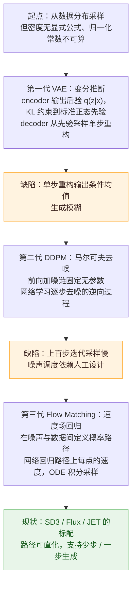
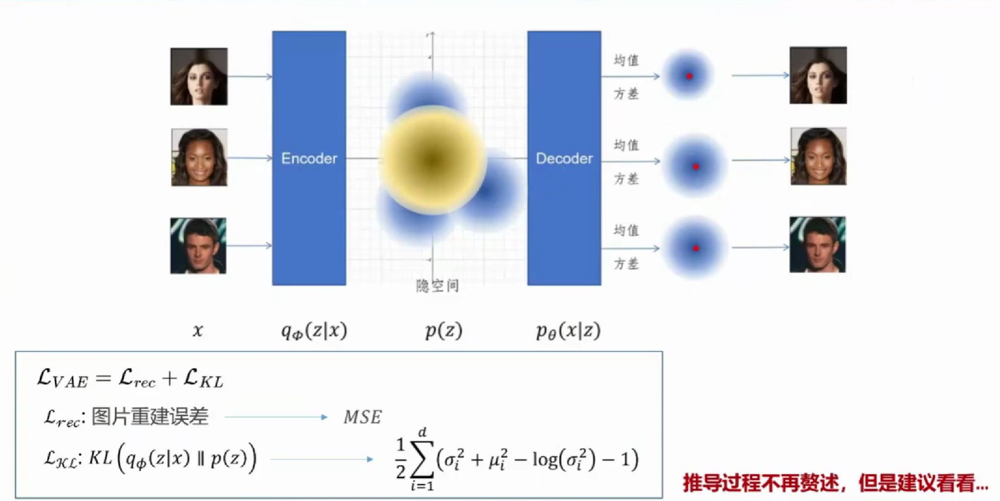
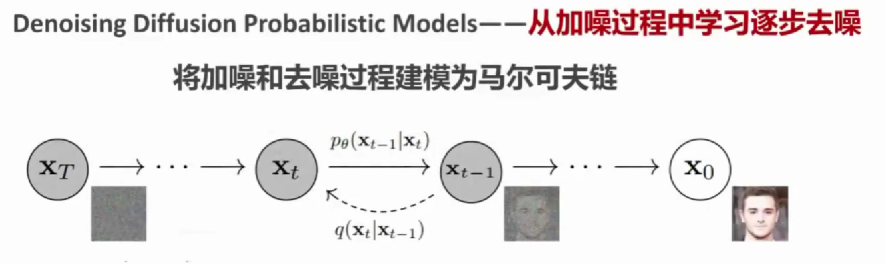
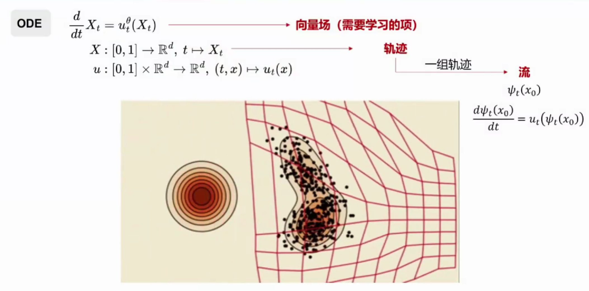

# 生成模型三代脉络：VAE → DDPM → Flow Matching

> 「模型架构基础」第三篇。**结构为脉络优先**：第 1 节以严格的叙述把三代模型的核心思想与演进逻辑一次讲清，看懂第 1 节即获得整体框架；其后各节将脉络落到公式，供按需查阅。落地实例见站内 [JET 笔记](../papers/2026-09/0923-jet.md)。

!!! abstract "TL;DR · 每代一句话"
    - **VAE**：引入隐变量 \( z \)，encoder 将数据编码为隐空间中的后验分布并约束其逼近标准正态先验（KL 正则）；生成即从先验采样、经 decoder 单步重构。**缺陷：单步重构的最优解是条件均值，输出模糊。**
    - **DDPM**：前向过程是固定、无参数的马尔可夫加噪链，学习其逆向的逐步去噪转移核；生成即从纯噪声出发迭代去噪。**缺陷：采样需上百步迭代，噪声调度依赖人工设计。**
    - **Flow Matching**：直接回归连接噪声分布与数据分布的概率路径速度场；生成即沿 ODE 积分，路径可直化至少步乃至一步。**DDPM 在特定路径与参数化选择下退化为它的特例。**

## 1 脉络总览（先读这节）

**起点问题**：生成建模要求从数据分布中采样，但数据的概率密度写不出显式公式，归一化常数（配分函数）不可算——这是三代模型共同面对的障碍。三代方法对应三种绕开归一化常数的路线：优化变分下界、马尔可夫链上的逐步去噪（等价于得分匹配）、概率路径速度场回归。

**VAE——变分推断路线**。既然密度不可写，就不再对 \( p(x) \) 直接做最大似然：encoder 把每条数据映射为隐空间中的一个后验分布 \( q_\phi(z|x) \)，以 KL 项将全体后验约束到标准正态先验附近；decoder 学习从先验中的采样点重构数据。生成时从先验采样、单步解码即可。**代价是模糊**：decoder 采用逐维独立的高斯似然时，其最优输出是所有可能样本的条件均值——多模态的答案被平均成单一输出。

**DDPM——分步去噪路线**。模糊的根源在于要求网络单步给出完整样本。DDPM 将生成拆解为一条马尔可夫链上的多步小修正：前向加噪链固定且无参数，网络只需学习每步去除一小份噪声的逆向转移；任何一步都不必一次性预测完整样本，输出因此显著更锐利。**新代价有二**：采样需上百步迭代；每步去噪幅度的噪声调度表 \( \beta_t \) 由人工设计。

**Flow Matching——速度场路线**。去噪只是「把噪声分布输运到数据分布」的一种具体实现。Flow Matching 直接学习完成这个输运的速度场：在噪声与数据之间定义概率路径（常取线性插值），网络回归路径上每点的瞬时速度；生成即从噪声出发沿速度场做 ODE 积分。路径是设计自由度——可以取直线、可以直化（rectify）到少步乃至一步采样；DDPM 的手工调度在这个视角下只是无数可选路径中的一族。

```mermaid
flowchart TD
    Q0["起点：从数据分布采样<br/>但密度无显式公式、归一化常数不可算"] --> A
    A["第一代 VAE：变分推断<br/>encoder 输出后验 q(z|x)，KL 约束到标准正态先验<br/>decoder 从先验采样单步重构"] --> P1["缺陷：单步重构输出条件均值<br/>生成模糊"]
    P1 --> B["第二代 DDPM：马尔可夫去噪<br/>前向加噪链固定无参数<br/>网络学习逐步去噪的逆向过程"]
    B --> P2["缺陷：上百步迭代采样慢<br/>噪声调度依赖人工设计"]
    P2 --> C["第三代 Flow Matching：速度场回归<br/>在噪声与数据间定义概率路径<br/>网络回归路径上每点的速度，ODE 积分采样"]
    C --> P3["现状：SD3 / Flux / JET 的标配<br/>路径可直化，支持少步 / 一步生成"]
    style P1 fill:#fff3e0,stroke:#ffb74d,color:#3e2723
    style P2 fill:#fff3e0,stroke:#ffb74d,color:#3e2723
    style P3 fill:#e8f5e9,stroke:#66bb6a,color:#1b5e20
```

**演进规律**：每一代针对上一代的核心缺陷——VAE 的模糊催生 DDPM 的分步去噪；DDPM 的慢采样与手工调度催生 Flow Matching 的路径自由。抓住这条因果链，后面的公式即可各归其位。

## 2 第一代 · VAE：变分下界与隐空间正则

!!! note "核心思想"
    用变分推断绕开不可算的似然：以 \( q_\phi(z|x) \) 近似真实后验，以 KL 项将隐空间正则到标准正态先验；训练目标（ELBO）= 重构项 − 先验匹配项。生成 = 先验采样 + decoder 单步重构。

**脉络定位**：回答「密度不可写怎么办」——不写密度，改写「数据 ↔ 隐空间」的双向映射并约束隐空间分布。遗留缺陷：**单步重构的均值坍缩 → 模糊**（由下一代解决）。

### 落到公式

边缘似然 \( p_\theta(x) = \int p_\theta(x|z)\,p(z)\,dz \) 在高维隐空间下无解析解、数值估计也不可行，直接最大似然不可行。VAE 转而优化证据下界（ELBO）——引入编码器 \( q_\phi(z|x) \) 近似真实后验，对任意 \( q \) 恒有：

\[ \log p_\theta(x) = \mathrm{ELBO}(\theta, \phi; x) + \mathrm{KL}\big( q_\phi(z|x) \,\|\, p_\theta(z|x) \big) \]

KL 项 ≥ 0，故 ELBO 是对数似然的下界且可计算。将其展开即训练目标的两大块：

\[ \mathrm{ELBO} = \underbrace{\mathbb{E}_{q(z|x)}\big[ \log p_\theta(x|z) \big]}_{\text{重构项（期望对数似然）}} \;-\; \underbrace{\mathrm{KL}\big( q_\phi(z|x) \,\|\, \mathcal{N}(0, I) \big)}_{\text{先验匹配项（KL 正则）}} \]

高斯情形下 KL 有闭式解（每维 \( -\tfrac{1}{2}(1 + \log \sigma^2 - \mu^2 - \sigma^2) \)）。另一处工程关键——**重参数化技巧**：采样节点阻断梯度，将随机性移出网络 \( z = \mu_\phi(x) + \sigma_\phi(x) \odot \varepsilon \)（\( \varepsilon \sim \mathcal{N}(0, I) \)），梯度得以穿过采样回传至 encoder。

*VAE 架构与损失分解：\( x \to q_\phi(z|x) \to p(z) \to p_\theta(x|z) \) 的完整链路；图中 KL 闭式解 \( \frac{1}{2}\sum_i(\sigma_i^2 + \mu_i^2 - \log\sigma_i^2 - 1) \) 即上文正则项的逐维展开*

**模糊的机制（脉络中那句话的严格版）**：decoder 逐维独立高斯似然的最优解是所有可能样本的**条件均值**——多模态答案被平均成单一模糊输出。decoder 过强时还会发生**后验坍缩**（KL 项将 \( q \) 压向先验，隐变量不再携带信息）。**分支**：VQ-VAE（2017）将连续隐变量替换为离散 codebook（commitment loss + stop-gradient，弃用 KL）——即 [LaBraM](../papers/2026-09/0918-labram.md) / [NeuroLM](../papers/2026-09/0918-neurolm.md) / [TFM-Tokenizer](../papers/2026-09/0918-tfm-tokenizer.md) 的 tokenizer 血统。

## 3 第二代 · DDPM：马尔可夫链与逐步去噪

!!! note "核心思想"
    将加噪与去噪建模为一条马尔可夫链：前向过程每步保留部分原信号、注入小份高斯噪声，整条链固定、无参数、无需学习；网络学习的是逆向过程——每步仅去除一小份噪声的转移核。生成 = 从纯噪声出发沿逆向链迭代至数据。

**脉络定位**：修复 VAE 的模糊——以多步小修正替代单步预测条件均值。遗留问题：**上百步采样开销大**、**噪声调度表依赖人工设计**（由第三代解决）。

### 落到公式

前向链每步缩放旧信号并叠加新噪声（\( \bar{\alpha}_t = \prod_{s=1}^{t}(1-\beta_s) \) 为累乘，由此任意时刻可一步到位——纯代数性质）：

\[ q(x_t | x_{t-1}) = \mathcal{N}\big( \sqrt{1-\beta_t}\; x_{t-1},\; \beta_t I \big) \quad\Longrightarrow\quad x_t = \sqrt{\bar{\alpha}_t}\; x_0 + \sqrt{1-\bar{\alpha}_t}\; \varepsilon \]

逆向过程 \( p_\theta(x_{t-1}|x_t) \) 需要学习（精确计算要对未知的 \( x_0 \) 积分）。对整条链写负 ELBO——**每一项都是两个高斯的 KL，均有闭式解**（VAE 中最难算的正则项在此结构下免费），化简至最终只剩：

\[ \mathcal{L}_{\mathrm{simple}} = \mathbb{E}_{t,\,x_0,\,\varepsilon} \big\| \varepsilon - \varepsilon_\theta(x_t,\,t) \big\|^2 \]

训练目标的直观含义：对干净样本叠加已知噪声，网络从带噪输入预测所加噪声，以 MSE 惩罚。网络实际学习的是得分函数——\( \varepsilon_\theta(x_t, t) / \sqrt{1-\bar{\alpha}_t} \approx -\nabla_x \log p_t(x_t) \)，即对数密度梯度（这正是「加噪 + 预测噪声」与 denoising score matching 一脉相承的原因）。

*DDPM 的马尔可夫链视角：灰色圆是带噪状态，前向 \( q(x_t|x_{t-1}) \)（虚线）固定，反向 \( p_\theta(x_{t-1}|x_t) \) 是要学的网络——「从加噪过程中学习逐步去噪」*

**DDIM（2020）的关键一步**：去掉采样中的随机项，采样退化为确定性 ODE 积分——同一模型无需重训，采样过程从 SDE 换成 ODE。这揭示了扩散模型的本质身份：一条连续的流。

## 4 桥梁：扩散过程的确定性 ODE 表示

**脉络定位**：本节不引入新模型，仅更换分析视角——为速度场框架铺路。

Song et al.（2021）将所有加噪方案统一为连续时间的**前向 SDE** \( dx = f(x, t)\,dt + g(t)\,dw \)（VP-SDE 即 DDPM 的连续极限）。每个前向 SDE 都存在保持相同边缘分布的确定性伴随过程——**概率流 ODE**：

\[ dx = \Big[ f(x, t) - \tfrac{1}{2}\, g(t)^2\, \nabla_x \log p_t(x) \Big] dt \qquad \text{（相同的边缘分布，无随机项）} \]

即：扩散模型除「逐步去噪」外，还有第二个等价身份——**一个把噪声分布输运到数据分布的向量场**，与连续归一化流是同一数学对象。DDPM 的全部特殊性，仅在于其向量场的形状由**手工调度** \( \beta(t) \) 决定。

## 5 第三代 · Flow Matching：概率路径与速度场回归

!!! note "核心思想"
    直接学习实现「噪声分布 → 数据分布」输运的速度场：在两分布间定义概率路径（常取线性插值 \( x_t = (1-t)x_0 + t x_1 \)），网络回归路径上每点的瞬时速度；生成即从噪声出发沿 ODE 积分到数据。路径是设计自由度，可直化至少步乃至一步采样。

**脉络定位**：同时解决 DDPM 的两个遗留问题——**慢**（ODE 路径可直化、减少步数）与**手工调度**（路径自由选择，调度表只是无数路径中的一族）。DDPM 取「VP 路径 + 噪声参数化」时恰好退化为扩散模型——它是 Flow Matching 的特例而非对立方案。

### 落到公式

Flow Matching（Lipman et al. 2022）解决了连续归一化流「训练需在 ODE solver 内反传」的不可用问题——**simulation-free 训练**：边缘速度场没有真值，但对成对样本 \( (x_0, x_1) \) 可定义条件路径与条件速度：

\[ \text{路径：}\; x_t = (1-t)\,x_0 + t\,x_1 \qquad \text{目标：}\; u_t = x_1 - x_0 \qquad \mathcal{L}_{\mathrm{FM}} = \mathbb{E} \big\| v_\theta(x_t,\,t) - (x_1 - x_0) \big\|^2 \]

关键定理：**对条件目标回归与对边缘目标回归的梯度相同**（边缘速度是条件速度的期望 \( u_t(x) = \mathbb{E}[x_1 - x_0 \mid x_t = x] \)，MSE 回归的最优解即条件期望）——因此无需知道边缘场，采样配对做回归即可。**Rectified Flow**（Liu et al. 2022）补上直化：用训好的模型生成新配对再重训（reflow），轨迹逐步变直 → 少步乃至一步生成。

*Flow Matching 的三个核心概念：**向量场**（\( u_t \)，要学习的项）、**轨迹**（一条 ODE 解 \( X_t \)）、**流**（全体轨迹 \( \psi_t(x_0) \)）——生成即把左侧高斯先验输运为右侧数据分布的那组变换*

## 6 三代统一对照

| | VAE | DDPM | Flow Matching |
|---|---|---|---|
| **核心机制** | 隐空间 KL 正则 + 单步解码 | 固定前向马尔可夫链 + 学习逆向去噪 | 概率路径速度场回归 + ODE 积分采样 |
| 中间变量 | 一个全局 `z` | T 个逐步状态 | 连续路径 `x(t)`，t 从 0 到 1 |
| 网络学什么 | decoder 似然 | 噪声 ε（得分的缩放形式） | 速度场 v(x, t) |
| 训练目标 | 重构 + KL 正则（ELBO） | 噪声预测 MSE（ELBO 化简） | 速度回归 `x1 − x0` |
| 采样方式 | 单步 decode | SDE / DDIM（ODE） | ODE 积分（路径可直化） |
| 固有缺陷 | 模糊、后验坍缩 | 慢、调度手工 | 直化不彻底则少步掉点 |

## 7 在 EEG 语境中的位置

- **VQ-VAE 分支** → 已精读的 [LaBraM](../papers/2026-09/0918-labram.md)（神经码本 + 频谱重构目标）/ [NeuroLM](../papers/2026-09/0918-neurolm.md)（码字并入 LLM 词表）/ [TFM](../papers/2026-09/0918-tfm-tokenizer.md)（时频 motif 词表）；
- **DDPM 线** → [JET](../papers/2026-09/0923-jet.md) 的 Vanilla Diffusion 基线与 EEG-GAN 对照。LaBraM 的「原始波形不可重构、改用频谱目标」与扩散「分步去噪才能锐利」，本质是同一现象（单步回归的均值坍缩）的两种表述；
- **FM 线** → JET 本体：线性插值路径 + 三条生理约束（在 FM 损失之外施加结构正则）；
- **先验的拓扑要求三代一致**：JET 的「零噪声初始化灾难性失败」（TS-FID 1600+）是「先验必须非退化、具有全空间支撑」的实证——VAE 的标准正态先验、DDPM 的 \( x_T \)、FM 的 \( x_0 \) 无一例外。

## 自问自答

??? question "Q1 · 为什么 VAE 模糊而扩散锐利？"

    根源在单步回归的均值坍缩：逐维独立高斯似然下，最优解码器的输出是条件均值——多模态的候选答案被平均为单一模糊输出。DDPM 将单步生成拆解为上千个小去噪步，每步仅处理小残差、采样中的随机项维持多样性，任何一步都无需一次性预测完整样本。VQ-VAE 是另一条修复路径：隐变量离散化后重构目标变为离散码预测，绕开连续情形下的均值坍缩。

??? question "Q2 · Flow Matching 与 DDPM 是什么关系？"

    同一家族的两种参数化：将 FM 的线性插值换成扩散的 \( \sqrt{\bar{\alpha}_t} \) 插值、回归目标从速度换成噪声，即还原为 DDPM——故 DDPM 是 FM 的特例。实际差异有三：FM 的插值路径自由（直线 / 最优传输），DDPM 的由调度表决定；FM 回归速度场、采样为确定性 ODE；DDPM 反向采样含随机项（SDE 视角），少步采样时随机项有助于覆盖多模态分布。

??? question "Q3 · 边缘速度场没有真值，为何对配对样本回归即可？"

    边缘速度场是条件速度在配对分布下的期望：\( u_t(x) = \mathbb{E}[x_1 - x_0 \mid x_t = x] \)。MSE 回归的最优解恰为条件期望——因此对随机采样的配对 \( (x_0, x_1) \) 做回归，其梯度与直接对边缘场回归一致。这与「DDPM 预测噪声等价于预测得分」是同构逻辑：都在用可采样的条件量替代不可计算的边缘量。

??? question "Q4 · 为什么三代模型的先验都要求非退化？"

    从单个点出发把退化分布展开为复杂多模态的数据分布，是一对多的映射——连续流（ODE）无法表示；只有具有全空间支撑的随机先验（如高斯）才能为输运提供覆盖数据支撑的自由度。JET 的消融给出实证：零噪声初始化下 TS-FID 从 188 崩溃至 1615 以上，且任何损失权重组合都无法恢复——这是结构性不可表示，而非超参数问题。

!!! abstract "关键文献速查"
    - **VAE**：Kingma & Welling, *Auto-Encoding Variational Bayes*, arXiv:1312.6114（2013）
    - **VQ-VAE**：van den Oord et al., *Neural Discrete Representation Learning*, NeurIPS 2017
    - **DDPM**：Ho et al., *Denoising Diffusion Probabilistic Models*, NeurIPS 2020（arXiv:2006.11239）
    - **DDIM**：Song et al., *Denoising Diffusion Implicit Models*, ICLR 2021
    - **Score SDE**：Song et al., *Score-Based Generative Modeling through SDEs*, ICLR 2021（arXiv:2011.13456）
    - **Flow Matching**：Lipman et al., arXiv:2210.02747（2022）
    - **Rectified Flow**：Liu et al., *Flow Straight and Fast*, arXiv:2209.03003（2022）
    - **EEG 落点**：[JET（ICML 2026）](../papers/2026-09/0923-jet.md)——线性插值 + 生理约束的本站精读

---

**相关阅读**

:material-creation: [JET · 流匹配生成 EEG（本站精读）](../papers/2026-09/0923-jet.md) ｜ :material-angle-acute: [LoRA · 低秩适配](lora.md) ｜ :material-vector-polyline: [Attention 替代方案](attention-alternatives.md) ｜ :material-heart-pulse: [LaBraM（VQ-VAE 分支的 EEG 实现）](../papers/2026-09/0918-labram.md) ｜ :material-home: [首页](../index.md)
