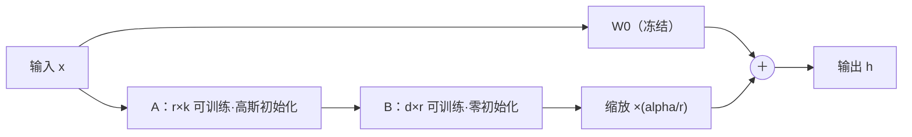

# LoRA: Low-Rank Adaptation of Large Language Models

> **ICLR 2022** · Microsoft ——「模型架构基础」系列第一篇：先讲透原论文，再给变体族谱与 EEG 大模型语境下的用法。

**作者**：Edward J. Hu, Yelong Shen, Phillip Wallis, Zeyuan Allen-Zhu, Yuanzhi Li, Shean Wang, Lu Wang, Weizhu Chen

!!! abstract "TL;DR"
    - 核心假设：预训练权重适配下游任务时的**更新量本征秩很低**——不需要动整个矩阵
    - 做法：冻结 W₀，并行旁路学习 ΔW = BA（B 置零初始化、A 高斯初始化），输出乘 α/r
    - 收益：GPT-3 175B 的可训练参数降 **10000 倍**、checkpoint 从 350GB 缩到 35MB、显存需求降 3 倍，且**推理零额外延迟**（旁路可合并进原权重）
    - 原论文只把 LoRA 挂在注意力的 Wq、Wv 上就够；r=4~8 是最常见的档位

#### 1.1 动机：全量微调的三重困境

大模型落地的标准流程是"预训练 + 适配下游任务"，主流做法全量微调（更新所有权重），但它有三重代价：

1. **部署贵**：每个下游任务都要存一份完整模型副本——GPT-3 175B 级别一个 checkpoint 就是 350GB；
2. **训练贵**：优化器状态（Adam 的动量与二阶矩）让显存开销远超权重本身；
3. **替代方案各有硬伤**：Adapter（在层间串行插入小模块）增加了推理延迟；Prefix-tuning（在输入前拼可学习的软前缀）挤占本就有限的序列长度、且优化困难。

LoRA 的出发点来自 Aghajanyan 等（2020）关于**本征维度（intrinsic dimensionality）**的观察：大模型在适配下游任务时，参数更新集中在维度远低于原矩阵的子空间里。既然更新量是低秩的，那就**别学整个 ΔW，直接把它参数化成两个低秩矩阵的乘积**。

#### 1.2 方法：低秩旁路

对预训练权重 W₀ ∈ ℝ^{d×k}，LoRA 把它冻结，在旁边加一条可训练的低秩旁路，只对旁路做前向计算：

\[ \mathbf{h} = \mathbf{W}_0 \mathbf{x} + \Delta \mathbf{W} \mathbf{x} \;=\; \mathbf{W}_0 \mathbf{x} + \frac{\alpha}{r} \, \mathbf{B} \mathbf{A} \mathbf{x} \]

其中 A ∈ ℝ^{r×k}（降维）、B ∈ ℝ^{d×r}（升维），秩 r ≪ min(d, k)。**初始化**：A 用随机高斯、B 置零——于是训练起点 ΔW = BA = 0，模型完全等价于预训练原模型，从"零偏移"出发平稳启动。

参数量的账很好算：

\[ \underbrace{d \times k}_{\text{全量微调}} \;\longrightarrow\; \underbrace{r \times (d + k)}_{\text{LoRA}} \]

以 d = k = 12288、r = 8 为例：全量 1.5 亿参数的更新空间被压到约 20 万，压缩比约 768 倍。

**两个关键性质**：

- **推理零延迟**：训练完成后 W′ = W₀ + (α/r)BA 可以直接合并成一个新的权重矩阵，推理路径与原模型完全一致——这是相对 Adapter 的决定性优势；
- **任务切换轻**：预训练底座只存一份，每个任务只存一个几 MB 的 A、B 对，换任务即换 adapter，还能对多个 adapter 做加权组合（任务算术）。

#### 1.3 效率账本（GPT-3 175B）

| 指标 | 全量微调 | LoRA |
|---|---|---|
| 可训练参数 | 175B | 约 37.7M（**降 10000 倍**） |
| Checkpoint 大小 | 350GB | 35MB |
| 训练显存 | — | 降至约 **1/3** |
| 推理延迟 | 基准 | **零增加**（合并后无差别） |

#### 1.4 实践速查

| 超参 | 原论文做法 | 通行实践 |
|---|---|---|
| 挂在哪些矩阵 | 只挂注意力 **Wq、Wv**（该组合质量最好） | 预算充足时扩展到全部注意力 + MLP 投影 |
| 秩 r | r=1 在部分任务（WS）上就够；加大 r 不一定更好 | **r = 4~8** 起步，任务复杂再升到 16/64 |
| 缩放 α | 常数超参，除以 r 稳定更新量 | **α = r 或 2r**，调 r 时不必重调学习率 |
| 学习率 | 与全量微调接近 | adapter 用比全量微调高一个量级的 lr |
| 丢弃 | — | 旁路加 dropout 0.05~0.1 防过拟合 |

一个反直觉的消融结论：**单纯增大 r 而不扩大挂载的矩阵类型，质量往往不升反降**——说明低秩子空间本身容量已够，瓶颈在"把 LoRA 放到哪些层"。

#### 1.5 为什么低秩有效，以及它的局限

**有效性**：原论文的子空间分析显示，用不同随机种子、不同 r 学到的 ΔWg 高度共享同一个子空间（相似度随 r 增大趋平）——增大会 r 并不会引入更多有用方向，佐证了"更新量本征秩低"的假设。

**局限**：

1. 逐样本而言 ΔW = BA 秩不超过 r，但**一个 batch 堆叠后的联合更新并不严格低秩**——LoRA 的秩约束只在单样本意义下成立；
2. 低秩容量上限在任务间差异巨大（重写模型行为的任务需要更高秩），r 需要按任务扫；
3. α/r 的缩放在大 r 时不稳定（rsLoRA 建议改 α/√r）。

#### 1.6 变体族谱

| 变体 | 出处 | 一句话改动 |
|---|---|---|
| **AdaLoRA** | ICLR 2023 | 按重要性评分在权重矩阵间**动态分配秩预算**，替代均匀分配 |
| **QLoRA** | NeurIPS 2023 | 底座量化到 **4-bit NF4** 冻结，LoRA 以 bf16 训练；65B 模型单张 48GB 卡可微调 |
| **DoRA** | ICML 2024 (Oral) | 把权重分解为**幅值 + 方向**两个分量，LoRA 负责方向更新，学习稳定性与容量更佳 |
| **VeRA** | ICLR 2024 | 低秩矩阵全部**共享且冻结**（随机初始化），只训练缩放向量——参数量再降约 10 倍 |

此外还有大量改进线（rsLoRA 的稳定缩放、LoRA+ 的 A/B 不等学习率、PiSSA 的主成分初始化等），思路都围绕缩放方式、初始化与预算分配三个旋钮展开。

#### 1.7 在 EEG 大模型语境下怎么用

- **已读六篇的微调光谱**：LaBraM 依赖全量微调（linear probing 在 TUEV 崩到 0.346，表示与微调强绑定）；EEGPT 主打免微调 linear probing；TFM-Tokenizer 参数太小（1.9M）可以全训。LoRA 卡在光谱中间：**比线性探针容量大、比全量微调便宜两个数量级**——正好适合"拿开源 EEG FM 的权重、适配自己的任务"的场景；
- **NeuroLM 是现成试验田**：它的底座就是 GPT-2，PEFT 库的 LoRA 配置可以直接套用；
- **EEG 数据普遍偏小**，全量微调容易过拟合且灾难性遗忘预训练知识——低秩约束本身即正则。建议从 **r=4~8、只挂注意力 q/v** 起步，任务简单时甚至可以只调分类头 + LoRA；
- 这也是 eeg2text-lite 项目"预训练 → LoRA → 解码"路线的理论支点：EEG 到文本/解码器的适配任务数据量小、映射偏移有限，处于 LoRA 的甜点区。

## 自问自答

??? question "Q1 · 为什么 A 用高斯、B 置零？反过来行不行？"

    目标是训练起点 ΔW = BA = 0（从预训练模型无损出发），同时梯度能流动。B 置零、A 随机：B 的梯度 ∝ A·(上游梯度) 非零，可以启动学习。若反过来 A 置零、B 随机，A 的梯度 ∝ B·(上游梯度) 同样非零——理论上也能启动，但通行的实现（原论文与 PEFT）都是 B 置零。若两者都置零，梯度恒为零，旁路永远学不动。

??? question "Q2 · α/r 这个缩放为什么除以 r？"

    把不同 r 下的旁路输出量级拉平，使得扫 r 时不用连带重调学习率——α 才是真正控制"适配强度"的旋钮。rsLoRA 后续指出 α/r 在大 r 时会让更新量衰减过快，改用 α/√r 更稳。

??? question "Q3 · LoRA 和 Adapter / Prefix-tuning 的本质区别？"

    Adapter 是**串行**插入（层与层之间），推理时多一串前向计算，有延迟；Prefix-tuning 占用输入序列的上下文窗口。LoRA 是**并行旁路**，推理时可完全合并进权重，零延迟、不占上下文——这决定了它成为部署侧的事实标准。

??? question "Q4 · 推理时多个任务怎么共存？"

    底座 W₀ 只存一份，每个任务存独立的 A、B 对（各几 MB）。切换任务时合并对应的 (α/r)BA 即可；也可以对多个 adapter 做线性组合实现任务插值，或按 batch 动态路由。

!!! abstract "复现速查卡"
    - **官方代码**：[github.com/microsoft/LoRA](https://github.com/microsoft/LoRA)；实践首选 HuggingFace **PEFT**：`LoraConfig(r=8, lora_alpha=16, target_modules=["q_proj","v_proj"], lora_dropout=0.05)`
    - **关键超参**：r=4~8、α=r 或 2r、dropout 0.05、adapter 学习率比全量微调高一个量级（约 1e-4~3e-4）
    - **EEG 建议**：小数据场景从 r=4~8、只挂注意力 q/v 起步；底座可量化（QLoRA 思路）再省一档显存
    - **算力参考**：LoRA 本身极轻——瓶颈在底座前向，底座 4-bit 量化后单卡即可微调数 B 参数的模型

---

**相关阅读**

:material-home: [首页](../index.md) ｜ :material-chart-box: [六篇方法对比](../comparison.md) ｜ :material-cube-outline: [基座来源分析](../topics/base-model.md) ｜ :material-robot: [NeuroLM（GPT-2 底座，LoRA 可直接套用）](../papers/2026-09/0918-neurolm.md)
