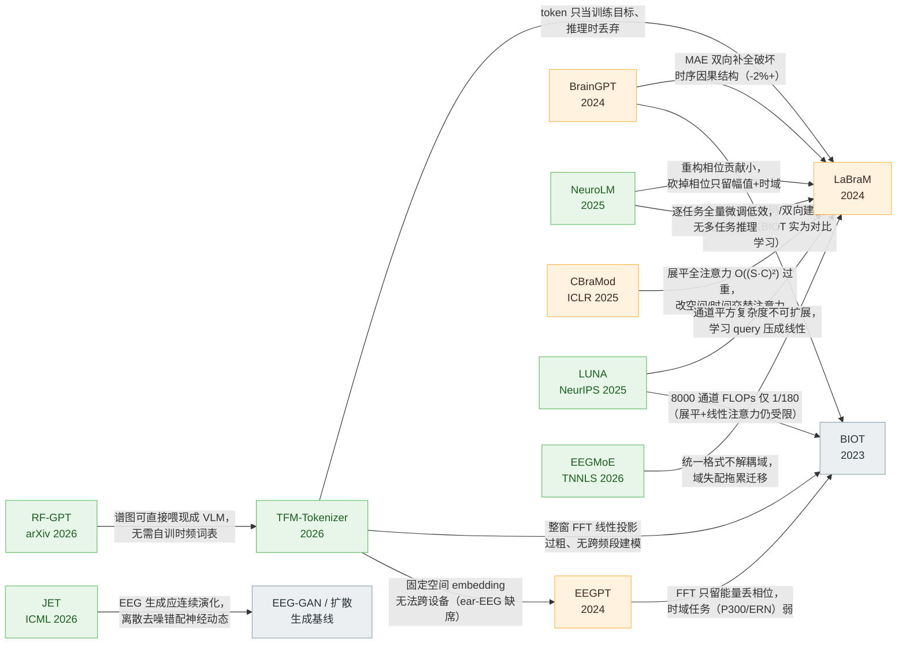

# 十篇方法对比

## 📊 TUEV Cohen's Kappa 横向对比（多数据集预训练设定）

数据来源：TFM-Tokenizer 论文 Table 1（统一评测口径）。† 表示在四个 EEG 数据集上复现预训练。

<canvas id="kappa-chart" height="130"></canvas>

## 总览表

| 维度 | BIOT | LaBraM | EEGPT | BrainGPT | NeuroLM | TFM-Tokenizer |
|---|---|---|---|---|---|---|
| **发表** | NeurIPS 2023 | ICLR 2024 | NeurIPS 2024 | arXiv 2024 | ICLR 2025 | ICLR 2026 |
| **定位** | 轻量跨格式编码器 | 大规模 EEG 基础模型 | 通用特征提取器（小模型） | 自回归 generalist | 接 LLM 的多任务基础模型 | 可插拔 tokenization 组件 |
| **token 形式** | 连续向量（规则切段） | 离散码（**仅作预训练目标**） | 连续 patch embedding | 连续 1s 片段（无离散化） | 离散码（**并入 LLM 词表作输入**） | 离散码（**作下游输入**） |
| **词表** | 无 | 8192×64（标签空间） | 无 | 无（电极词表另算） | 8192 并入 GPT-2 词表 | 8192（输入嵌入空间） |
| **预训练目标** | BYOL 式对比学习（丢通道/丢token→扰动→对比） | 掩码码字预测（BEiT 式）+ 对称掩码 | 表示对齐（JEPA 式）+ 掩码重构（MAE 式）双自监督 | 因果下一 token 预测（自回归回归原始值，MSE） | 多通道自回归（阶梯掩码预测离散码）+ GRL 对抗空间对齐 | 频带+时间+对称掩码的频谱图重构（训 tokenizer）→ masked token prediction（训下游） |
| **频域角色** | FFT 能量→FCN 作 segment embedding 特征 | DFT 幅值+相位作为 tokenizer 重构目标 | 无显式频域 | 无显式频域 | 时域信号 + DFT 幅值双 decoder 重构 | **双路径显式建模**（频率 Transformer + 门控聚合）+ 频带掩码 |
| **空间建模** | channel embedding + 正弦位置编码 | 可学习空间 embedding（10-20 系统） | Codex book 通道表（名字→向量映射） | 电极条件 prefix token + 下游 TEG 图注意力 | 空间 embedding | 单通道训练，多通道拼接 + 通道 embedding |
| **位置编码** | 有（正弦相对） | 有（可学习时+空） | RoPE（predictor 内） | GPT 式 | 复用 LLM 时间 emb + 新空间 emb | **tokenizer 内无**（消融证明更好） |
| **骨干** | 线性注意力 Transformer（Linformer 式，4层8头） | temporal conv + ViT 风格（LN-QK，无 QKV bias） | ViT 式 encoder/predictor/reconstructor + momentum encoder | GPT 式因果 Transformer + SwiGLU（ETE）+ GAT（TEG） | GPT-2（causal） | 频率/时间/ temporal Transformer + 线性注意力下游 |
| **模型规模** | 3.2M | 5.8M / 46M / 369M（tokenizer 另 8.6M） | ~10M（变体 0.4M–101M） | 1.46M / 11.29M / 183.8M / **1.09B** | 254M / 500M / 1696M | ~1.9M（tokenizer 1.2M + 下游 0.7M） |
| **预训练数据** | 1000 万样本（PREST+SHHS+ECG） | ~2500 小时（约 20 数据集） | 5 数据集（PhysioMI/HGD/TSU/SEED/M3CV） | 3750 万单电极样本（~1B token） | ~25000 小时 | 4 EEG 数据集（另有 ear-EEG 跨设备验证） |
| **下游方式** | 微调 | 微调（线性探针差） | **Linear probing**（冻结 + 1×1 空间滤波器 + 线性头） | ETE 冻结 + TEG 多任务联合微调 | 指令微调（生成文本答案，单模型多任务） | masked token prediction 预训练 + 微调；**可插拔进 BIOT/LaBraM** |
| **多任务** | 否（逐任务微调） | 否 | 否（逐任务线性探针） | **是**（TEG 联合训练，验证协同增益） | **是**（指令微调单模型六任务） | 否（但组件可迁移） |
| **跨设备** | 通道表可扩展 | 受限于 10-20 空间 embedding | 受限（固定 58 通道布局） | 支持 138 电极任意组合 | 未验证 | **单通道设计，ear-EEG 验证最强** |

## 扩展四篇速览（2025–2026：异构管理与生成轴线）

核心六篇回答的是"token 该是什么、怎么预训练"；下面四篇把问题推到了新的轴上——**EEGMoE / LUNA** 分别用「解耦」与「统一」处理 EEG 的任务域异构与电极拓扑异构（对通道异构问题的两种相反哲学），**JET** 把建模对象从"表示"换成"信号本身"（生成轴线），**RF-GPT** 则是同一套"时频图 + 大模型"思路在射频域的完整落地。

| 维度 | EEGMoE | LUNA | JET | RF-GPT |
|---|---|---|---|---|
| **发表** | IEEE TNNLS 2026 | NeurIPS 2025 | ICML 2026 | arXiv 2026 |
| **轴线** | 判别 · 多任务表示 | 判别 · 拓扑无关基础模型 | **生成**（流匹配） | 跨领域参照（RF 时频图 + LLM） |
| **核心机制** | SSMoE 块：Top-K Specific 专家（域特性）+ 软路由 Shared 专家（域共性），相加融合 | Q 个学习 query + 交叉注意力把任意电极拓扑压进固定隐空间（Q×E），时间注意力只在隐空间上做 | 条件流匹配：线性插值路径 → 预测向量场 → ODE 采样；原始多通道序列 + adaLN 条件注入 | IQ→STFT 谱图→**复用现成 VLM 视觉编码器**→RF token 前缀→LLM 生成回答 |
| **异构/域哲学** | **解耦保留**（域差异是需要学的信号） | **统一抹平**（拓扑差异是噪声，置换不变性） | 不处理（固定 16 通道 TUH 设置） | 不处理（合成数据天然统一） |
| **输入形态** | 4-D 脑地图（时间 × 5 频带 × 2D 电极网格） | 原始波形双路嵌入（1D Conv + FFT 幅相）+ 3D 电极坐标 NeRF 式编码 | 原始波形 patch（**保留通道身份**，序列 (C·N)×D） | STFT 幅值谱图（512×512，dB） |
| **词表/离散化** | 无（MoE 分工） | 无（连续隐空间瓶颈） | 无（连续向量场） | 无 RF 词表（只扩展 LLM 文本词表） |
| **训练目标** | 掩码 embedding 重构（L1）+ 负载均衡辅助损失 | 掩码 patch 重构（Smooth-L1）+ query 特化损失 | 流匹配回归 + 三条生理约束（L1 重构 / 统计一致性 / TV+Pearson） | 无预训练，纯合成数据 SFT（梯度只算答案） |
| **模型规模** | 1.68M 总 / 0.89M 激活 | 7M / 43M / 311.4M | 129.9M | Qwen2.5-VL 3B / 7B |
| **数据** | 9 数据集约 142h（6 预训练 + 3 LOSO 微调） | TUEG + Siena **21,900h**（3 种拓扑） | TUAB / TUEV / TUSZ（16 通道，>10,000 sessions） | 全合成：6 技术标准波形 + TorchSig，~12,000 场景 / 0.625M 指令对（零人工标注） |
| **下游/评测** | 线性头微调（LOSO） | 聚合 query + MLP 微调 | 生成质量 TS-FID + 下游增强 ΔAcc（CBraMod 当裁判） | 文本回答（WBMC/WBOD/WTR/WNUC/NRIE 五族） |
| **代表成绩** | DEAP-V/A 59.40 / 62.73，BCIC4-2a 47.92，STEW 72.41（全面超复现的 BIOT/LaBraM） | TUAR AUROC **0.921**、TUSL **0.802** 双 SOTA；TUAB 81.57%（-1pp vs LaBraM-Huge）；8000 通道 FLOPs 仅 BIOT 的 1/180 | TS-FID 188 / 236 / 151（基线 274–449，**-40%+**）；Silhouette≈0.99；ΔAcc 全正（基线≈0） | WTR **99.6%** joint；通用 VLM（含 GPT-5）精心 prompt 仍随机猜 |
| **代码** | 声明将放出（未附链接） | [pulp-bio/biofoundation](https://github.com/pulp-bio/biofoundation) | [项目页](https://y-research-sbu.github.io/JET/) | 论文未附仓库 |

## 核心分歧点解读

**① "token 到底是什么"——六篇的根本分野**

- BIOT：token = 规则切段的连续窗口，"tokenization"只是预处理；
- LaBraM：学出了 VQ 神经词表，但**只用于产生预训练的监督信号**（预测被 mask patch 的码字索引），推理时 tokenizer 被丢弃；
- TFM-Tokenizer 直接批评这一点，把学到的 motif token **真正作为下游模型的输入 embedding**，让"压缩 + 归纳偏置"的 tokenization 红利落到模型输入上；
- NeuroLM 走了第三条路：token 作为 **LLM 词表的扩展**，EEG 变成"外语句子"喂给 GPT-2；
- EEGPT 与 BrainGPT 则回避离散化：前者专注特征对齐+重构的自监督，后者用连续值自回归。

**② 预训练范式的三条路线**

- **对比学习**（BIOT：BYOL 式扰动-预测）→ 最早期的做法；
- **掩码建模**（LaBraM：掩码码字预测；EEGPT：对齐+重构双目标；TFM：掩码频谱图重构）→ 目前主流，其中掩码"目标"的设计是各家差异所在（离散码 / 表示 / 频谱图）；
- **自回归**（BrainGPT：连续值因果预测；NeuroLM：阶梯掩码下的离散码因果预测）→ 强调 EEG 的时序因果结构，BrainGPT 用消融证明同设定下 AR 优于 MAE 2%+。

**③ 空间（通道）异构的四种解法**

- 通道 embedding 表（BIOT）；
- 10-20 系统空间 embedding（LaBraM、NeuroLM）；
- 单通道独立建模（TFM-Tokenizer、BrainGPT 的电极级策略）——对非标准设备最友好；
- 图结构整合（BrainGPT 的 TEG：预训练图节点覆盖全电极，样本只激活子图）。

**④ 频域信息的地位递进**

BIOT 把 FFT 当特征工程的一种（能量向量）；LaBraM 把频谱当重构目标（发现相位贡献小）；NeuroLM 干脆去掉相位只留幅值+时域；TFM-Tokenizer 走得最远——把频率轴本身作为建模对象（频内 Transformer + 门控聚合 + 频带掩码）。这条线反映了社区共识的演进：**显式的时频结构建模比隐式期望模型自己学更重要**。

**⑤ 异构管理的两条相反路线（扩展四篇）**

EEG 里"数据不齐"有两个轴，2025–2026 的四篇给出了相反相成的答案：

- **电极拓扑轴 → 抹平**（LUNA）：拓扑差异被当作噪声，用学习 query 的交叉注意力压进置换不变的固定隐空间，换来对通道数的线性复杂度——代价是隐空间瓶颈（TUAB 落后全注意力约 1pp、未见拓扑 SEED-V 落后 2–3pp）；
- **任务/数据集域轴 → 解耦**（EEGMoE）：域差异被当作信号，Specific 专家按 token 路由学域特性、Shared 专家全量参与学共性——专家-任务分工可视化证明解耦真的发生了，且 1.68M 参数就够。

合起来是一张二维地图：**几何轴统一、域轴解耦**。EEGMoE 的 4-D 脑地图输入与 LUNA 的 query 统一在"输入端抹平几何差异"上异曲同工，只是实现位置不同。

**⑥ 从"理解 EEG"到"生成 EEG"（扩展四篇）**

JET 把 EEG 建模为连续动力过程（条件流匹配），核心论点是离散去噪范式与神经信号的连续演化错配；三条生理约束（L1 / 矩一致 / TV+Pearson）把频谱、时域、幅值统计的先验显式写进损失。RF-GPT 则在射频域演示了同构问题的另一解：谱图直接复用视觉编码器 + 合成数据零标注 SFT。两篇共同印证一件事——**通用大模型不会"免费"读懂生理/物理信号的谱图**（GPT-5 在 RF 谱图上随机猜），模态接地必须靠专门训练。

## 演进脉络一句话

**BIOT**（2023）解决了"异构信号如何统一编码"（连续 token + 线性注意力）→ **LaBraM**（2024）证明"低信噪比 EEG 能学出离散语义码且大规模预训练有效"（VQ+频谱目标，但 token 只当靶子）→ **EEGPT**（2024）指出掩码目标不该是原始信号而应是高质量表示（双自监督+线性探针）→ **BrainGPT**（2024）把范式从掩码补全扭向自回归并冲到十亿参数 → **NeuroLM**（2025）把 token 真正接进 LLM 实现单模型多任务指令推理 → **TFM-Tokenizer**（2026）回到 tokenization 本身，给出第一个"学词表、可解释、跨设备、即插即用"的完整答案。此后问题重心转移：**LUNA**（2025）与 **EEGMoE**（2026）分别从"统一拓扑"与"解耦域"两端吃异构性，**JET**（2026）开辟连续生成轴线，**RF-GPT**（2026）证明该范式跨模态通用——从"怎么表示 EEG"走向"怎么管理 EEG 的异构性、以及能否直接生成它"。

---

*核心六篇部分总结自各论文原文；扩展四篇同。实验数字均引自各论文报告值。*

## 🏆 跨论文 Benchmark 战绩表 {: #benchmarks }

所有数字均引自各论文自报结果（⚠️ 各论文预处理/数据划分存在差异，仅作量级参考）。`—` 表示该论文未报告该任务。

### TUAB（异常检测 · Balanced Accuracy）

| 模型 | Balanced Acc. | AUROC | 出处 |
|---|---|---|---|
| BIOT（多数据集预训练） | 0.7959 | 0.8815 | BIOT Table 4 |
| LaBraM-Huge | **0.8258** | **0.9162** | LaBraM Table 1 |
| EEGPT（linear probing, 25M） | 0.7983 | 0.8718 | EEGPT Table 2 |
| NeuroLM-XL（多任务） | 0.7969 | 0.7884 | NeuroLM Table 2 |
| BrainGPT-Giant | — | — | 未评测 |
| TFM-Tokenizer | 0.8032 | 0.8870 | TFM Table 1 |
| LUNA-Huge | 0.8157 | 0.8957 | LUNA Table 1（311.4M） |

### TUEV（事件分类）

| 模型 | Balanced Acc. | Cohen's Kappa | 出处 |
|---|---|---|---|
| BIOT（多数据集预训练） | 0.5281 | 0.5273 | BIOT Table 5 |
| LaBraM-Huge | 0.6616 | 0.6745 | LaBraM Table 2 |
| EEGPT（linear probing, 25M） | 0.6232 | 0.6351 | EEGPT Table 3 |
| NeuroLM-XL（多任务） | 0.4679 | 0.4570 | NeuroLM Table 2 |
| BrainGPT-Giant | — | — | 未评测 |
| TFM-Tokenizer | **0.5974** | **0.6189** | TFM Table 1 |

### 其他任务代表成绩

| 模型 | 任务与成绩 |
|---|---|
| LaBraM-Huge | SEED-V acc 0.4102；MoBI R² 0.3145 |
| NeuroLM-XL | TUSL balanced acc 0.6845；SEED balanced acc 0.6034 |
| BrainGPT-Giant | 12 基准 generalist：SS +11.2% / MW +8.5% / MI +6.05%（相对最优 specialist） |
| TFM-Tokenizer | IIIC Kappa 0.4979（+36% vs LaBraM）；CHB-MIT AUROC 0.8839；ear-EEG Kappa 0.3883（+14%） |
| EEGMoE | DEAP-V/A ACC 59.40 / 62.73；BCIC4-2a 47.92；STEW 72.41（LOSO ACC%，全面超复现的 EEGNet/BIOT/LaBraM 等） |
| LUNA | TUAR AUROC **0.921**、TUSL AUROC **0.802**（双 SOTA）；SEED-V Bal Acc 0.3900（未见 62 通道拓扑，落后 CBraMod） |
| JET⚙ 生成 | TS-FID 188.27 / 235.86 / 151.27（TUAB/TUEV/TUSZ，基线 274–449）；Silhouette 0.983–0.995；下游增强 ΔAcc +0.017~+0.032（CBraMod 裁判） |
| RF-GPT⚙ 跨域 | WTR joint 99.6%；WBMC 82.4 / 74.2 / 47.8（E/M/H）；通用 VLM 基线 ≤7%——射频域"时频图 + LLM"参照 |

!!! note "数据快照"
    本表数字整理于 **2026-09-25**（覆盖十篇：六篇核心 + LUNA / EEGMoE / JET / RF-GPT）。⚙ 标记行的指标口径与上方分类基准不同（生成质量 / 跨领域任务），仅供量级参考。新论文入库时请在对应行追加，并更新此日期。

## 🔗 论文互怼链 {: #critique-chain }

箭头方向 = 批评/改进指向。每条边标注批评点。

**解读**：BIOT 是公共对照组；LaBraM 承接其位置但转向离散码；EEGPT 坚持连续表示但改进自监督目标；BrainGPT 掀翻掩码范式；NeuroLM 把 token 接入 LLM；TFM 对前作做"输入表示"的终审。**扩展四篇的加入改变了图的形状**：CBraMod/LUNA/EEGMoE 三条边都指向 LaBraM——"展平全注意力 + 不解耦域"成了 2025–2026 被攻击最密集的设计；JET 把战火烧到生成范式（EEG-GAN/扩散），RF-GPT 则从跨域视角质疑"自训词表"的必要性。完整论述见各篇笔记的「与其他论文的关系」与「自问自答」板块。
