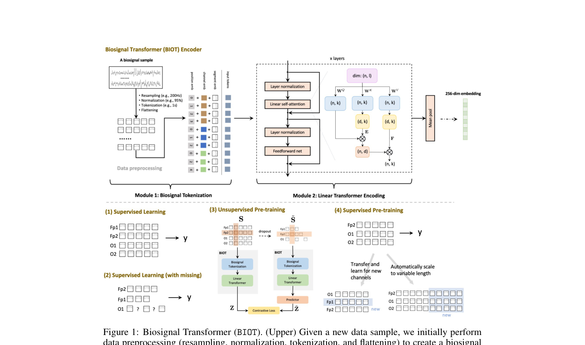
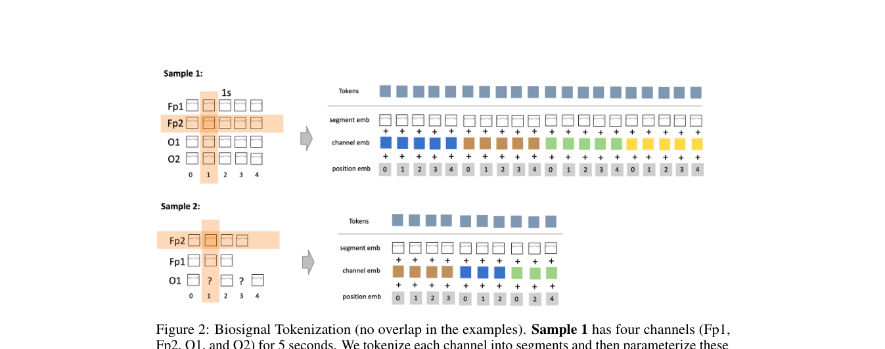

# BIOT: Cross-data Biosignal Learning in the Wild

> **NeurIPS 2023**

BIOT: Cross-data Biosignal Learning in the Wild (NeurIPS 2023)

**作者**：Chaoqi Yang, M. Brandon Westover, Jimeng Sun（UIUC / Harvard / BIDMC）

#### 1.1 问题定位

现实中的生物信号（EEG/ECG/可穿戴传感器）格式高度异构：采样率不同（200Hz vs 256Hz）、通道不匹配、时长不一（10s vs 30s）、存在缺失段。现有模型只针对单一固定格式，换数据集就失效。BIOT 是第一个能"在野"处理各种格式生物信号的统一编码模型。

#### 1.2 方法

整体由两个模块级联：**Module 1 生物信号 Tokenization**（全部非参数）+ **Module 2 线性 Transformer 编码器**。

**Module 1：Biosignal Tokenization（四步）**

1. **重采样（Resampling）**：线性插值统一到同一采样率 r（EEG 用 200Hz），依据奈奎斯特采样定理（EEG/ECG 感兴趣最高频率约 100Hz）；
2. **归一化（Normalization）**：每个通道除以自身绝对幅值的 95 分位数 `S[i] / percentile(|S[i]|, 95%)`，消除通道/数据集间的单位和幅度差异；
3. **逐通道 Tokenization**：每个通道**独立**切成 t 秒（如 1s）的 token，相邻 token 可重叠 p 秒（如 0.5s）；**缺失段的 token 直接丢弃**。逐通道独立切分是与以往"所有通道拼一起切"的关键区别——通道缺失/不匹配也能处理；
4. **Flattening**：所有通道的 token 按顺序展平成一条统一的"biosignal sentence"。

**Token embedding（三部分相加）**：
- **Segment embedding（频谱）**：对每个 token 段做 FFT，提取所有频带的能量向量，过一个全连接网络（FCN）得到；
- **Channel embedding（空间）**：可学习的通道 embedding 表，标记 token 来自哪个通道；
- **Positional embedding（时间）**：通道内 token 顺序用正弦/余弦**相对**位置编码，免参数。

最终"句子"为 `X ∈ R^{N×l}`（N 个 token，维度 l）。

**Module 2：线性 Transformer**

其线性注意力的核心公式（Linformer 式低秩投影）：

\[ \mathbf{H} = \mathrm{softmax}\left( rac{(\mathbf{X}\mathbf{W}_Q)(\mathbf{E}\mathbf{X}\mathbf{W}_K)^{	op}}{\sqrt{k}} 
ight)(\mathbf{F}\mathbf{X}\mathbf{W}_V) \]

其中 \(\mathbf{E} \in \mathbb{R}^{N 	imes d}\)、\(\mathbf{F} \in \mathbb{R}^{d 	imes N}\)（\(d \ll N\)），注意力图由 \(N 	imes N\) 压缩为 \(N 	imes d\)。

- 多通道长信号句子很长（64 通道 × 20s = 1280 tokens），标准注意力 O(N²) 不可行；
- 采用 **Linformer 式低秩线性注意力**：引入两个可学习的低秩投影矩阵 E ∈ R^{N×d}、F ∈ R^{d×N}（d≪N），注意力图从 N×N 压缩到 N×d，时间/空间复杂度对 N 均为线性 `O(Nkd)`；
- 每个模块 = 一层线性自注意力 + FCN，组件前加 LayerNorm、残差、dropout（pre-norm）；
- 默认配置：4 层、8 头；句子级表示用 **mean pooling**（试过 [CLS] token，略差）；
- 分类头：ELU + 线性层。

**无监督预训练（BYOL 风格对比学习）**

- 随机 dropout 部分通道 + 从剩余通道 dropout 部分 token，得到扰动信号 S̃；
- 同一 BIOT 编码器分别编码 S 和 S̃；S̃ 侧接两层 predictor：`Z = BIOT(S)`，`Z̃ = predictor(BIOT(S̃))`；
- 对比损失（温度 T=0.2，sample-wise L2 归一化）让扰动版预测原信号 embedding。

#### 1.3 创新点

1. **首个**能处理通道不匹配、长度可变、数据缺失的统一生物信号编码模型；
2. **逐通道独立 tokenization**——异构数据通吃的核心设计（缺失通道/短通道直接丢 token 即可）；
3. **线性注意力 Transformer** 解决多通道长句子的二次复杂度问题（低秩 E/F 投影，注意力图 N×N → N×d）；
4. 频率信息以 FFT 能量特征形式进入 segment embedding——证明频域特征对 EEG 任务（CHB-MIT、IIIC、HAR）尤其有用；
5. 同一模型结构支持四种学习场景：标准监督、带缺失监督、无监督预训练、跨任务监督预训练。

#### 1.4 流程

```
原始多通道信号
   │ 重采样(200Hz) → 95分位归一化 → 逐通道1s切段(0.5s重叠) → 丢弃缺失token → 展平
   ▼
"biosignal sentence"（token = FFT能量→FCN ⊕ 通道emb ⊕ 正弦位置emb）
   │
   ▼
线性 Transformer（4层×8头，E/F低秩投影） → mean pooling → 分类头
   │
   ├─(1) 标准监督学习
   ├─(2) 带缺失监督学习（结构不变）
   ├─(3) 无监督预训练（丢通道/丢token → 扰动信号 → 对比学习）→ 微调
   └─(4) 跨任务监督预训练 → 微调
```

#### 1.5 实验与结果

- 预训练语料：500 万静息 EEG（PREST）+ 500 万睡眠 EEG（SHHS）+ ECG（Cardiology）；
- 下游 9 个数据集：CHB-MIT（癫痫检测）、IIIC Seizure（发作分型）、TUAB（异常检测）、TUEV（事件分类）、PTB-XL（心律失常）、HAR（动作识别）等；
- 结论：监督设定下超过 SPaRCNet、ContraWR、CNN-Transformer、FFCL、ST-Transformer 等基线；带缺失设定下性能下降最少；跨数据集预训练（6 EEG 数据集）进一步提升（如 CHB-MIT balanced acc 从 0.664 提到 0.707）。
- 附录消融：更高采样率对高频敏感任务（IIIC）略好；token 太长（>1-2s）导致句子变短、性能下降；更大重叠 p 略好。

---

## 架构图



*Figure 1 · BIOT 整体架构：Module 1 生物信号 tokenization + Module 2 线性 Transformer 编码*



*Figure 2 · Tokenization 细节：逐通道切段后用 segment/channel/position 三类 embedding 参数化*


## 要点速览
!!! abstract "TL;DR"
    - 3.2M 参数；四种学习场景（监督 / 带缺失监督 / 无监督预训练 / 跨任务预训练）
    - 9 个数据集（EEG/ECG/HAR）上超过全部基线；带缺失设定下性能衰减最小
    - 多数据集联合预训练进一步提升：CHB-MIT balanced acc 0.664 → 0.707


## 与其他论文的关系

| 论文 / 工作 | 关系说明 |
|---|---|
| LaBraM / NeuroLM / EEGPT / BrainGPT / TFM-Tokenizer | 全部把 BIOT 作为公共对照组——事实上的 baseline 标尺 |
| TFM-Tokenizer | BIOT-TFM：仅把 BIOT 的输入 patch 投影替换为 TFM token，93% 指标-设定组合有提升 → 骨干仍有价值，弱在输入表示 |
| EEGPT（附录 F） | 批评其 FFT 只保留频谱能量、丢失相位，且 1s patch 的 FFT 过粗 → ERP/P300 等时域任务表现差（PhysioP300 仅 0.5485） |

## 个人思考
- 逐通道独立切分（缺失段直接丢 token）是它通吃异构格式的根本设计，后续所有工作都继承了这一点。
- 线性注意力的 E/F 投影把注意力图固定为 N×d，隐含假设'全局信息可压缩进 d 个摘要位'——分类任务够用，但牺牲了精细的 token 间路由能力。
- 频域在这里只是特征工程（FFT 能量 → FCN），模型本体仍在连续域运行——这为后来 LaBraM/TFM 的显式时频建模埋下了演进伏笔。

## 自问自答

??? question "Q1 · 为什么逐通道独立切分，而不是所有通道拼在一起切？"

    全通道拼接切分隐含假设通道数固定——换个数据集通道数变了就无法对齐。逐通道切分后每个 token 天然带通道 embedding，缺哪个通道就把对应 token 丢掉，模型结构完全不用改，这是 BIOT 能吃下异构格式的根本原因。


??? question "Q2 · FFT 能量特征丢掉了相位，有什么后果？"

    频谱能量只描述有哪些频率、各多强，不描述相位对齐关系。对癫痫检测、情绪等频域主导的任务影响小；但 ERP 类任务（P300 在刺激后约 300ms 的相位锁定偏转）依赖精确的时域波形，EEGPT 报告 BIOT 在 PhysioP300 上仅 0.5485，并把它归因于此。


??? question "Q3 · 线性注意力（Linformer 式）牺牲了什么？"

    E/F 投影把 N×N 注意力压成 N×d，隐含假设全局信息可以压缩进 d 个摘要位。代价是丢掉了细粒度的 token 间路由——每个 token 只能看 d 个全局摘要而非每个具体 token。对句子级分类（最后 mean pooling）足够，但不适合需要精确定位关系的任务。


??? question "Q4 · 为什么用 mean pooling 而不是 [CLS] token？"

    作者实验发现加 [CLS] 的性能略差。可能原因：BIOT 的句子 token 顺序是按通道依次拼接而非自然语序，[CLS] 汇聚对位置敏感；mean pooling 对所有 token 等权平均，更稳健。
