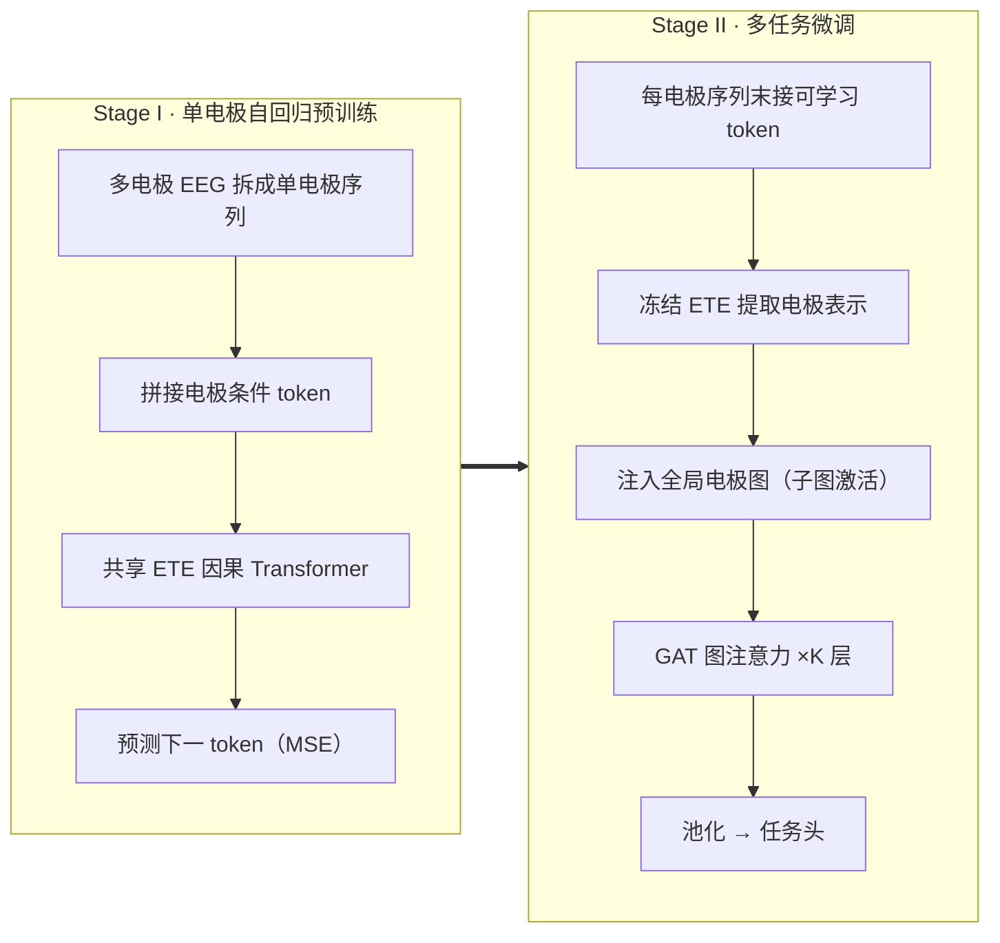
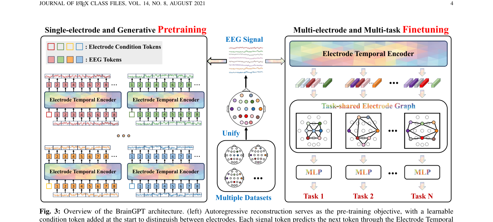

# BrainGPT: Unleashing the Potential of EEG Generalist Foundation Model by Autoregressive Pre-training

> **arXiv 2024**

BrainGPT：自回归 EEG 通用模型 (arXiv 2024)

**作者**：Tongtian Yue 等（中科院自动化所）

#### 4.1 问题定位

现有 EEG 基础模型三大局限：① 数据格式异构难以统一；② 普遍采用 MAE 式双向掩码重构，忽视 EEG 的时序依赖/因果结构；③ 任务特定微调导致 specialist 模型，无多任务协同。BrainGPT 定位为**第一个 generalist EEG 基础模型**，核心是用**自回归（下一 token 预测）替代掩码重构**。

#### 4.2 方法

**（a）电极级建模策略（Electrode-wise Modeling）**

- 多电极 EEG 先切成 T 个 1 秒区间，每区间 D 个均匀采样点；再**把每个电极的时间序列拆成独立训练样本** `x_i^e ∈ R^{T×D}`——天然适配任意电极数/组合；
- **电极词表** `V ∈ R^{E×D}`：覆盖预训练中出现的全部 E 个电极，每个电极一个可学习 embedding，作为 **prefix 条件 token** 拼在序列最前面（告诉模型信号来自哪个电极）；
- 预训练集：3750 万个单电极样本，约 10 亿 token。

**（b）自回归预训练（ETE: Electrode Temporal Encoder）**

- 所有电极**共享**一个 GPT 式因果 Transformer：多头**因果**注意力（causal mask，只看过去）+ 位置前馈网络（论文表述为 Swish 激活 FFN，公式 `W_down·(Swish(W_gate·x) ⊙ (W_up·x))` 实为门控形式）；
- 轻量 MLP 预测下一个 token（**连续原始信号值**，不做 VQ 离散化）；
- 损失：`L(θ) = (1/T) Σ ρ(x_i^e[t] − ETE(x_i^e[≤t]))`，ρ 默认 **MSE**；
- 意义：首个自回归 EEG 模型，直接建模"过去神经活动影响未来状态"的时序结构。

**（c）多任务迁移学习（TEG: Task-shared Electrode Graph）**

- ETE **冻结**，只作特征提取骨干；
- 每个样本的每条电极序列末尾追加一个可学习 special token c（利用因果注意力把整条序列信息汇聚到该位置），取出该位置输出作为电极表示 `z_j ∈ R^{E_j×D}`；
- **全局电极图**：节点 = 预训练中所有 E 个电极（可学习向量），全连接图 `G ∈ R^{E×D}`；每个样本只激活其电极对应的子图 `G_j`（indicator 矩阵 `I_{G_j}` + `diag(z_j)` 注入表示，式 10）；
- **图注意力机制**（GAT）：α_mn = ReLU(aᵀ[W h_m ‖ W h_n]) 计算节点相关性，masking 系数 β_mn（同子图=1，否则 0）保证交互只发生在激活子图内，K 层堆叠 + 残差 + pre-norm；
- 同一 batch 内不同数据集/任务通过构造各自的 β mask 矩阵统一训练；
- 图网络池化节点表示 → 任务专属头（分类或回归）。

**模型规格**：Base 1.46M / Large 11.29M / Huge 183.8M / **Giant 1.09B**（EEG 领域当时最大）。

#### 4.3 创新点

1. **电极级建模**：单电极信号为基本样本 + 电极条件 prefix token，支持最多 138 个电极及任意组合（覆盖面最大）；
2. **首个自回归 EEG 基础模型**：从"双向掩码补全"转向"因果下一 token 预测"，更贴合 EEG 的时序本质（消融：同架构同损失下 AR 比 MAE 平均高 2%+）；
3. **首次验证 EEG 预训练的 scaling law**（模型规模 4 个数量级 + 数据量 0~1B token 均正相关）；
4. **任务共享图网络（TEG）实现多任务兼容与协同**：首个证实多任务联合训练优于逐任务单独训练（joint 比 separate 在 5 个任务上全部提升，MW +3.9%）；
5. 渐进式时空解耦：ETE 管时间（预训练）→ TEG 管空间（下游）。

#### 4.4 流程

#### 4.5 实验与结果

- 12 个基准、5 类任务：情绪识别（DEAP/FACED/SEED-IV/SEED-V）、运动想象（MIBCI/BCIC4-1）、认知负荷（EEGMat/STEW）、睡眠分期（EDF/HMC）、跨模态（IMG/SPE）；
- 作为**单一 generalist 模型**全面超过各 specialist（含预训练的 BIOT/LaBraM）：Giant 在 ER +5.07%、MI +6.05%、MW +8.50%、SS +11.20%、CM +5.10%；
- 消融：模型越大 loss 越低、下游越好；数据越多性能越高（未饱和）；AR 优于 MAE（与损失度量无关，ℓ2 最好）；联合训练优于单独训练（共享电极节点相当于数据增强，小数据任务受益更大）；对未见数据（DREAMER）零训练也有强迁移表示。

---

## 架构图

*Fig. 3 · 总体架构：左=单电极自回归预训练（ETE），右=多电极多任务微调（TEG 图网络）*

## 要点速览
!!! abstract "TL;DR"
    - 最大 1.09B（EEG 领域当时最大）；3750 万单电极样本 / 约 1B token
    - 12 个基准 × 5 类任务，单一 generalist 全面超过 specialist：SS +11.2%、MW +8.5%
    - AR 比 MAE 平均高 2%+（同架构同损失对比）；联合训练全面优于逐任务训练（MW +3.9%）

## 与其他论文的关系

| 论文 / 工作 | 关系说明 |
|---|---|
| NeuroLM | 两种多任务方案的对照：BrainGPT 用 TEG 联合微调（保留任务头），NeuroLM 用指令微调（统一到文本生成） |
| EEGPT | 互补验证了 EEG 预训练的 scaling law（模型/数据规模均正相关） |
| LaBraM / BIOT | 范式之争的直接证据：同设定下自回归（AR）优于双向掩码（MAE）2%+ |

## 个人思考
- TEG 的多任务信息不在图结构里，而在'共享参数被多任务梯度共同更新'：电极节点 V_m 是跨任务的原型记忆，电极集重叠即共享交集——小任务 MW 的 +3.9% 正来源于此。
- 自回归直接回归连续值（MSE），绕开了离散化难题——与 LaBraM/TFM 的'先离散再预测'形成两条并行路线。
- 电极级拆样本让样本量 ×E 倍膨胀（3750 万），这个数字要打折看：单电极序列丢掉了跨电极同步信息，空间整合完全依赖下游 TEG 补回。

## 自问自答

??? question "Q1 · 为什么自回归比掩码建模更适合 EEG？"

    论文的消融（同架构、同损失度量）显示 AR 全面优于 MAE 平均 2% 以上：EEG 反映连续渐进的信息流，过去活动影响未来状态，因果的 next-token 预测天然贴合；MAE 的双向补全破坏了这种时序因果结构。且 AR 预测的是真实未来而非被人为挖掉的洞，任务更难、学到的表示更强。

??? question "Q2 · TEG 图里到底存了什么多任务信息？"

    图结构本身不存任务信息。多任务信息来自训练方式：节点向量 V_m（电极原型）和 GAT 权重是所有任务的梯度共同更新的共享参数——同一电极被多个任务使用时，它的 V_m 同时接收多个任务的监督信号。推理时输入的电极集决定激活哪个子图（β mask），任务头决定读出。若两个任务电极集完全不相交，空间层面的共享就只剩 GAT 权重。

??? question "Q3 · 电极级拆样本有什么代价？"

    样本量乘以电极数倍增（3750 万）有水分：单电极序列丢掉了跨电极的同步信息（空间关系、参考电极的共模成分），预训练学到的只是单电极时序动力学，空间整合完全押注在下游 TEG 上——这就是作者所说的渐进式时空解耦。

??? question "Q4 · 末尾追加的 special token c 为什么能聚合成全局表示？"

    ETE 是因果（单向）注意力：序列末尾的 token 天然能注意到它之前的所有 token。把 c 放在每个电极序列的最后，它的输出位置就自动汇聚了该电极整段时序的信息，类似 GPT 里用最后一个 token 做分类。

!!! abstract "复现速查卡"
    - **代码**：论文声明将开源（截至精读时未见仓库，复现前先确认）
    - **关键超参**：电极词表覆盖 E 个电极；patch 1s × D 采样点；ETE 门控前馈（Swish 激活）；预训练 lr 1e-4 / 3 epochs / batch 4096；微调 10 epochs（ETE 冻结，只训 TEG）；DeepSpeed Zero2/3 + bf16
    - **数据**：3750 万单电极样本（≈1B token），来自 12 个基准的预训练拆分
    - **算力参考**：8×A800-80G；Giant 1.09B 需 Zero3 + 梯度检查点

---

**相关阅读**

:material-arrow-left: [上一篇：EEGPT](0918-eegpt.md) ｜ :material-arrow-right: [下一篇：NeuroLM](0918-neurolm.md) ｜ :material-vector-link: [Tokenization 演进](../../topics/tokenization.md) ｜ :material-chart-box: [战绩总表](../../comparison.md#跨论文-benchmark-战绩表)
