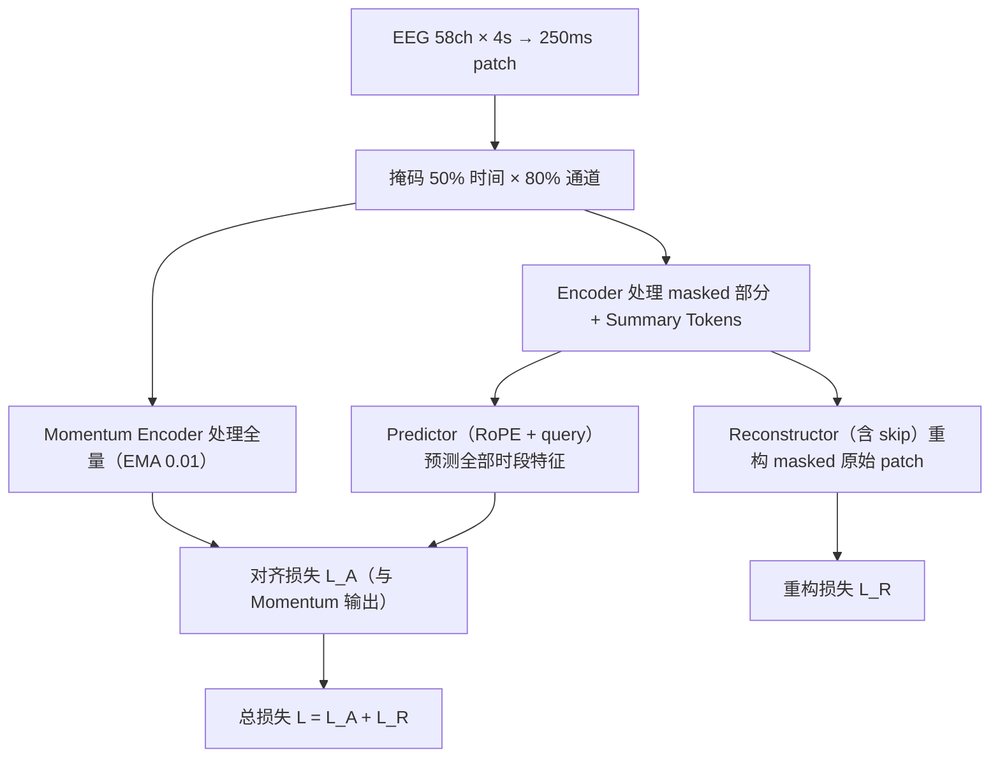
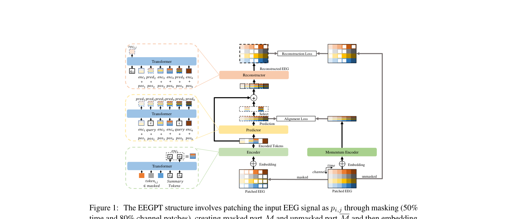

# EEGPT: Pretrained Transformer for Universal and Reliable Representation of EEG Signals

> **NeurIPS 2024**

EEGPT: Pretrained Transformer (NeurIPS 2024)

**作者**：Guagnyu Wang 等（哈尔滨工业大学）

#### 3.1 问题定位

EEG 低信噪比、被试间差异大、通道不匹配，导致掩码自编码器（MAE）学到的特征质量差、BERT 式模型没有显式表示 z。EEGPT 提出仅 ~10M 参数的通用特征提取器，用**双自监督**（时空表示对齐 + 掩码重构）训练，下游只做 **linear probing**。

#### 3.2 方法

**理论动机（式 1→2）**：标准 MAE 只有 \( \mathcal{H}(d_\phi(z),\ x \odot (1-M)) \) 重构项，没有显式的 z；EEGPT 加一条表示对齐分支 \( \mathcal{H}(z,\ f_\theta(x)) \)，显式地让 encoder 输出 z 携带全局语义（类似 MVEB 的最小充分表示），提升编码质量与泛化。

**局部时空 embedding**

- 58 电极、256Hz、输入 4 秒（T=1024）；每 patch 时间长度 d=64（250ms），共 N=16 个时间 patch；
- patch 线性嵌入 + **通道 embedding（Codex book）**：所有可学习通道向量 `{ς_i}` + 通道名→向量的映射 ℜ，**灵活对应任意数据集的通道配置**（通道适配的关键）；
- \( \mathrm{token}_{i,j} = \mathrm{Embed}(p_{i,j}) + \varsigma_i \)。

**双自监督预训练**

1. **掩码方式（与 MAE 相反的关键设计）**：mask 掉 50% 时间 × 80% 通道的 patch，**encoder 处理的恰恰是被 mask 的稀疏部分**，且每个时间步追加 S 个可学习 **summary token**（类似 [CLS]）聚合信息；
2. **时空表示对齐（JEPA 风格，损失 L_A）**：
   - **Momentum encoder**（与 encoder 同构，EMA 动量 m=0.01）处理**全部** token（masked ∪ unmasked），作为预测目标 `menc_j`；
   - **Predictor**：拿 encoder 在 masked 部分的特征 + RoPE 旋转位置编码 + 可学习 query token，预测**全部时间段**的特征 `pred_j`；
   - 对齐损失：\( \mathcal{L}_A = -\tfrac{1}{N} \sum_{j=1}^{N} \left\| \mathrm{pred}_j,\ \mathrm{LN}(\mathrm{menc}_j) \right\|_2^2 \)（LayerNorm 稳定训练）；
3. **掩码重构（MAE 风格，损失 L_R）**：
   - **Reconstructor**：encoder 特征（masked 部分）+ predictor 特征 + 位置信息 → 重构被 mask 部分的原始 patch；encoder→reconstructor 之间有 **skip connection**（保持特征、加速收敛）；
   - 重构损失：\( \mathcal{L}_R = -\tfrac{1}{|\mathcal{M}|} \sum_{(i,j) \in \mathcal{M}} \left\| \mathrm{rec}_{i,j},\ \mathrm{LN}(p_{i,j}) \right\|_2^2 \)（目标也做 LayerNorm）；
4. 总损失 \( \mathcal{L} = \mathcal{L}_A + \mathcal{L}_R \)。

**下游 Linear Probing**

- encoder 完全冻结，只加两个轻量模块：**adaptive spatial filter**（1×1 卷积，对齐数据通道与模型通道）+ 线性分类头；
- 只用 encoder 输出的 **summary token** 对应特征送入分类头；
- 目的：避免大数据模型在小样本微调下过拟合，同时让性能纯粹反映 encoder 本身的表示质量。

#### 3.3 创新点

1. **双自监督**：表示对齐（JEPA 式，在表示空间预测）+ 掩码重构（MAE 式，在信号空间重构）——显式表示 z，对抗低信噪比导致的特征质量差；
2. **掩码方向反转**：encoder 看被 mask 的稀疏部分、momentum encoder 看全量，迫使 encoder 输出含全局信息；
3. **通道 Codex book**（名字→向量映射）实现跨设备/跨通道配置适配；
4. **Linear probing 达到 SOTA**：证明学到的特征本身足够通用，小样本下游免微调；
5. 参数规模 scaling law 实证：\( \mathrm{ACC} = (33.6 \cdot N)^{0.029} \)、\( \mathcal{L}_R = (0.72 \cdot N)^{-0.014} \)。

#### 3.4 流程

#### 3.5 实验与结果

- 预训练：PhysioMI、HGD、TSU、SEED、M3CV（5 个数据集、多范式混合）；
- 下游：BCIC-2A/2B（运动想象）、Sleep-EDFx（睡眠分期）、KaggleERN、PhysioP300（ERP）、TUAB、TUEV；
- 结果：TUEV 上比 BIOT 提升 9.5% balanced acc；与 BENDR/BIOT/LaBraM 对比在多个任务领先（其中仅 BENDR 为全量微调，BIOT/LaBraM 同样采用线性探针协议）；
- 消融：去掉对齐损失 L_A 下游掉 6%~9%；去掉 predictor 会导致表示坍塌（重构 loss 不下降）；去掉 skip connection 掉 1%~3%；summary token 数量 S=4 较优。

---

## 架构图

*Figure 1 · 双自监督结构：encoder 看 masked 部分 + predictor 对齐 momentum 输出 + reconstructor 重构*

## 要点速览
!!! abstract "TL;DR"
    - ~10M 参数（8 个变体 0.4M–101M）；下游只用 linear probing 即达 SOTA
    - TUEV balanced acc 0.6232，比 BIOT（0.5281）高 9.5%
    - 双自监督：表示对齐（L_A，JEPA 式）+ 掩码重构（L_R，MAE 式）；掩码 50% 时间 × 80% 通道

## 与其他论文的关系

| 论文 / 工作 | 关系说明 |
|---|---|
| 思想上 | 承接 BYOL（momentum encoder）+ MAE（重构）+ JEPA（在表示空间预测）三条线 |
| LaBraM | 互补路线：LaBraM 走离散语义码，EEGPT 坚持连续表示但把自监督目标做得更好 |
| TFM-Tokenizer | 对照实验：EEGPT 依赖固定 58 通道布局的 Codex book，ear-EEG 跨设备实验无法参与 |

## 个人思考
- 把 linear probing 当评估协议本身就是贡献：冻结 encoder 后性能完全归因于表示质量，排除了微调技巧的干扰。
- 'encoder 看被 mask 的稀疏部分、momentum encoder 看全量'的反直觉设计，本质是用对齐任务逼迫稀疏视图输出全局语义（式 1→2 的显式表示 z）。
- 附录证明去掉 predictor 会表示坍塌（重构 loss 不再下降）——对齐分支必须保留 query/位置等余量，防止模型走捷径。

## 自问自答

??? question "Q1 · 为什么 encoder 处理的是被 mask 的部分，和 MAE 正好相反？"

    这是显式表示 z 设计的一部分：encoder 只看 50% 时间 × 80% 通道的稀疏视图，却要靠 predictor 预测全量特征、与看过完整信号的 momentum encoder 对齐——逼着稀疏视图的输出携带全局语义。若 encoder 直接看全量，对齐任务就没有信息瓶颈，学不到这个性质。

??? question "Q2 · 去掉 predictor 行不行？"

    附录 Figure 6：去掉 predictor 后对齐目标变成 encoder 与 momentum encoder 直接对齐，两者可以走捷径坍缩到相同输出（表示坍塌），重构 loss 也不再下降。predictor + 可学习 query 提供了必要的不对称性，与 BYOL 需要 predictor 同理。

??? question "Q3 · 为什么坚持 linear probing 而不微调？"

    两个动机：一是 EEG 下游标注少，全量微调大模型极易过拟合；二是 linear probing 让性能完全归因于 encoder 的表示质量——它是更严格的通用表示评估协议，EEGPT 在这个协议下超过全量微调的 BENDR，说服力更强。

??? question "Q4 · Codex book 怎么处理训练时没见过的通道？"

    它维护通道名到可学习向量的映射表，覆盖常见命名体系，新数据集的通道按名字映射即可。但表是固定的（58 电极），碰到 ear-EEG 这类体系外通道就没有对应向量——这是它跨设备能力弱于 TFM 单通道方案的原因。

!!! abstract "复现速查卡"
    - **代码**：[github.com/BINE022/EEGPT](https://github.com/BINE022/EEGPT)
    - **关键超参**：58 电极 / 256Hz / 输入 4s；patch 64 点（250ms）；掩码 50% 时间 × 80% 通道；momentum 动量 0.01；最优变体 large：d=512、8 层、4 个 summary token；AdamW OneCycle（2.5e-4 起）
    - **数据**：预训练 PhysioMI + HGD + TSU + SEED + M3CV；下游 7 数据集
    - **算力参考**：8×RTX 3090，200 epochs，bf16；下游只训线性层所以极轻

---

**相关阅读**

:material-arrow-left: [上一篇：LaBraM](0918-labram.md) ｜ :material-arrow-right: [下一篇：BrainGPT](0918-braingpt.md) ｜ :material-vector-link: [Tokenization 演进](../../topics/tokenization.md) ｜ :material-chart-box: [战绩总表](../../comparison.md#跨论文-benchmark-战绩表)
