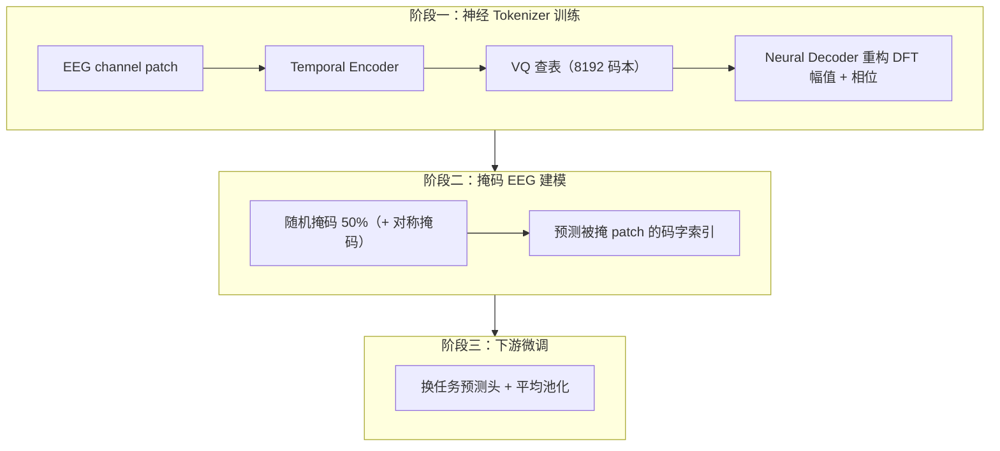
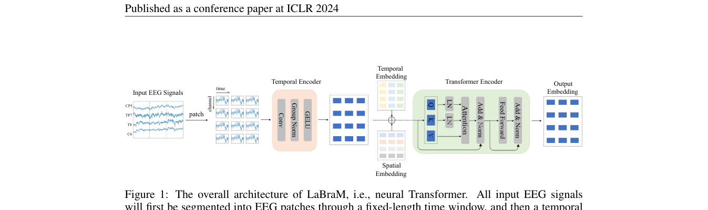
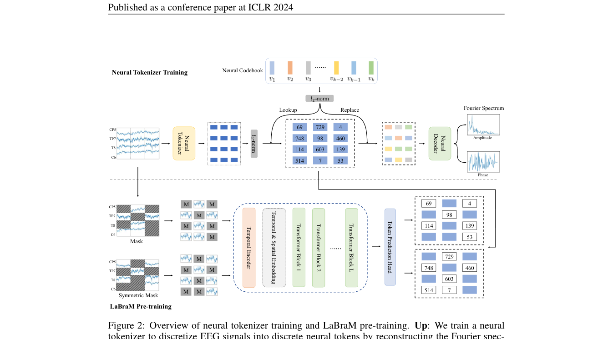

# LaBraM: Large Brain Model for Learning Generic Representations with Tremendous EEG Data in BCI

> **ICLR 2024**

LaBraM: Large Brain Model (ICLR 2024)

**作者**：Wei-Bang Jiang, Li-Ming Zhao, Bao-Liang Lu（上海交通大学）

#### 2.1 问题定位

受 LLM 启发探索大型 EEG 模型（LEMs）。三大挑战：① 缺乏足够大规模 EEG 数据（收集了 ~2500 小时、约 20 个数据集）；② EEG 采集配置多样（电极数、时长不一）；③ 缺乏有效的 EEG 表示学习范式（低信噪比）。核心答案：**把 EEG 切成 channel patch，用向量量化的"神经 tokenization"得到离散神经码，再用 BERT 式掩码预测码字来预训练**。

#### 2.2 方法

**（a）骨干架构：Neural Transformer**

- EEG `X ∈ R^{C×T}` 按 w=200（1 秒）无重叠窗口切成 channel patch，共 `N = C·⌊t/w⌋` 个；
- **Temporal Encoder**：每个 patch 过若干 1D 卷积块（Conv + GroupNorm + GELU）提取 patch 内时序特征 → patch embedding；
- **Temporal & Spatial Embedding**：可学习的时间 embedding 列表（长度 tmax）+ 空间（通道）embedding 列表（10-20 系统），相加注入时空信息（绝对位置编码）；
- **Transformer Encoder**：ViT 风格，但做两点修改（引 Dehghani et al. 2023）：Q、K 先做 LayerNorm 再点积注意力（防 attention logits 过大）；QKV 计算去掉 bias 项加速训练；
- 下游用平均池化 + 任务预测头。

**（b）神经 Tokenizer（向量量化神经频谱预测）**

- 受 VQ-VAE 启发：codebook `V ∈ R^{K×D}`（K=8192，D=64）；
- patch 表示 p 做 **ℓ2 归一化**后在 codebook 里**余弦相似度最近邻查表**得到码字索引（ℓ2 归一化提升 codebook 利用率）；
- **重构目标 = 傅里叶频谱（幅值 A + 相位 φ），不是原始波形**：EEG 低信噪比、随机、非平稳、非线性，直接重构原始波形 loss 不收敛；频谱的频率/相位分布反映底层神经生理活动。对 patch 做 DFT（欧拉公式展开），幅值/相位在样本内做 z-score 归一化；
- Neural decoder（若干 Transformer 块 + 平均池化 + 幅值/相位两个回归头）从离散码字回归频谱，MSE 损失；
- 总损失（式 9）= 幅值 MSE + 相位 MSE + **codebook loss**（`‖sg(ℓ2(p)) − ℓ2(v_z)‖²`，拉码字）+ **commitment loss**（`‖ℓ2(p) − sg(ℓ2(v_z))‖²`，稳编码器）；sg = stop-gradient；码字用 **EMA（指数滑动平均）**更新。

**（c）Masked EEG Modeling 预训练**

- patch embedding 中随机 mask 比例 r=0.5，被 mask 位置换成可学习 mask token；
- Transformer 编码可见 patch，线性分类头预测被 mask patch 对应的**码字索引**，交叉熵损失；
- **对称掩码（Symmetric Masking）**：mask 的补集也各做一次 masked modeling——省一次 tokenizer 前向 + 提供更多掩码视角（相当于数据增强），提升下游性能与稳定性；
- **VAE/ELBO 理论解释**（附录 B）：tokenizer 是后验 q_φ(z|x)，decoder 是 p_ψ(x̃|z)，masked modeling 学习先验 p_θ(z|x^M)；两阶段分别对应"最小化重构损失"和"固定 q、p_ψ 最小化 KL"。

**模型规格**：Base 5.8M（12层/200维/10头）、Large 46M、Huge 369M——当时 BCI 领域最大模型。

#### 2.3 创新点

1. **首个**在 2500 小时、约 20 个数据集上预训练的大规模 EEG 基础模型（数据本身即是贡献）；
2. **channel patch** 切分 + 可学习空间 embedding，天然兼容任意电极数/时长配置；
3. **神经 codebook**：VQ 离散码 + 傅里叶频谱重构目标——绕开原始波形不可重构的难题，把连续 EEG 变成 8192 个"神经 token"的离散语义空间；
4. **掩码码字预测**（masked neural code prediction）替代原始信号重构作为预训练目标；
5. 对称掩码策略（效率 + 数据多样性）；
6. 大规模 scaling 实验（数据量 1~2500 小时 × 模型 Base/Large/Huge），证实 EEG 领域也遵循 scaling law（Huge 模型在万小时级数据上仍会持续提升）。

#### 2.4 流程

#### 2.5 实验与结果

- 下游：TUAB（异常检测）、TUEV（事件分类）、SEED-V（情绪）、MoBI（步态回归）；
- 大幅领先 BIOT（其 TUEV 0.5281/Kappa 0.5273、TUAB 0.7959），且随模型规模递进：TUEV 0.6409（Base）→0.6616（Huge）、Kappa 0.6637→0.6745，TUAB 0.8140（Base）→0.8258（Huge）；
- 重要消融：
  - 去掉 codebook 直接重构原始信号/频谱（Setting 2/3）：低层任务（TUAB）还行，高层任务（TUEV）明显掉——**离散语义 codebook 对高层任务至关重要**；
  - 去掉空间 embedding：预训练不收敛，下游大幅下降；
  - 线性探针崩到 0.346；微调后 8 层（0.6541）与 4 层（0.6611）和全量微调（0.6409）相当甚至略好 → 依赖微调但不必全量。

---

## 架构图

*Figure 1 · Neural Transformer 整体架构：patch → temporal encoder → 时空 embedding → Transformer*

*Figure 2 · 上：神经 tokenizer 训练（VQ + 频谱重构）；下：掩码 EEG 建模预训练*

## 要点速览
!!! abstract "TL;DR"
    - 2500 小时 / 约 20 个数据集预训练；Base 5.8M / Large 46M / Huge 369M（当时 BCI 最大）
    - TUEV：Kappa 0.6745（Huge）、balanced acc 0.6616，全面超过 BIOT 等基线
    - 8192 神经 codebook；重构目标 = DFT 幅值 + 相位（重构原始波形不收敛）

## 与其他论文的关系

| 论文 / 工作 | 关系说明 |
|---|---|
| NeuroLM | 同团队续作：tokenizer 改为时频双域重构 + GRL 文本空间对齐，token 并入 GPT-2 词表 |
| TFM-Tokenizer | 批评其 token '只当训练目标、推理时被丢弃'；并入 TFM tokenizer 后（BIOT-TFM/LaBraM-TFM 合计）93% 的指标情形提升 |
| EEGPT / BrainGPT | 作为预训练基线被比较；BrainGPT 猜测其预训练语料偏癫痫临床域，domain 差异拖累一般下游任务 |

## 个人思考
- 最有价值的发现是'重构域'的选择：EEG 低信噪比导致重构原始波形不收敛 → 改为频谱目标。这一思路后来被 NeuroLM（去掉相位）和 TFM（掩码频谱图）继续演进。
- 线性探针在 TUEV 崩到 0.346，说明其表示与全量微调强绑定——对比 EEGPT 把 linear probing 做成核心卖点。
- 对称掩码让一个样本产生 mask/补集两个互补视角，既是效率技巧（省一次 tokenizer 前向）也是数据增强（大模型受益更明显）。

## 自问自答

??? question "Q1 · 为什么重构傅里叶频谱而不是原始波形？"

    EEG 低信噪比、强随机、非平稳，作者前期实验里直接重构原始波形的 loss 根本不收敛。频谱的幅值/相位分布反映底层神经生理活动且更稳定可学——换个重构域是这篇最关键的实验发现，NeuroLM（去掉相位）和 TFM（掩码频谱图）都是这条线的延续。

??? question "Q2 · codebook 是不是可有可无？直接掩码重构不行吗？"

    附录 Table 7 的消融：不用 codebook、直接重构原始信号或频谱（Setting 2/3），在低层任务 TUAB 上反而略好，但在高层任务 TUEV 上明显下降（0.6409 → 0.5630 / 0.5730，Setting 2/3）。离散语义码学到的抽象表示对区分事件类型这类高层任务至关重要。

??? question "Q3 · 对称掩码为什么能省计算？"

    tokenize 一次的开销很大（要过整个 encoder）。对称掩码对同一样本生成 M 和它的补集两个视角，共享同一次 tokenizer 前向的离散结果，相当于白拿一次数据增强；附录消融显示参数越大的模型受益越明显。

??? question "Q4 · 为什么 linear probing 在 TUEV 上崩了（0.346）？"

    说明 LaBraM 的表示与全量微调强绑定：掩码码字预测学到的特征停留在预测码字够用的层次，不经微调无法线性映射到任务空间。对比 EEGPT 把 linear probing 做成核心卖点，暴露了两种预训练目标在表示质量上的差异。

!!! abstract "复现速查卡"
    - **代码**：[github.com/935963004/LaBraM](https://github.com/935963004/LaBraM)（PyTorch 2.0.1 + CUDA 11.8）
    - **关键超参**：码本 8192×64；patch 200 点（1s）；掩码率 0.5 + 对称掩码；Base 5.8M（12 层/200 维/10 头）；lr 5e-4 cosine；EMA 0.996；温度未用于掩码（交叉熵）
    - **数据**：约 2500h / 20 数据集（TUSZ 1138h 为主力）；下游 TUAB/TUEV 划分严格沿用 BIOT
    - **算力参考**：8×A800；Huge 369M 需分布式并行（论文未披露细节，此为推测）

---

**相关阅读**

:material-arrow-left: [上一篇：BIOT](0918-biot.md) ｜ :material-arrow-right: [下一篇：EEGPT](0918-eegpt.md) ｜ :material-vector-link: [Tokenization 演进](../../topics/tokenization.md) ｜ :material-chart-box: [战绩总表](../../comparison.md#跨论文-benchmark-战绩表)
