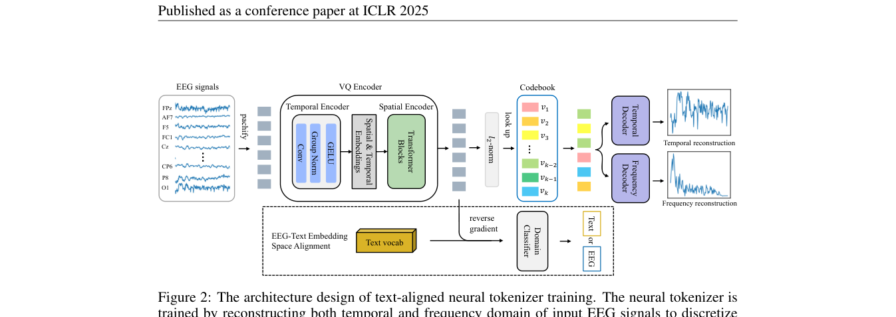
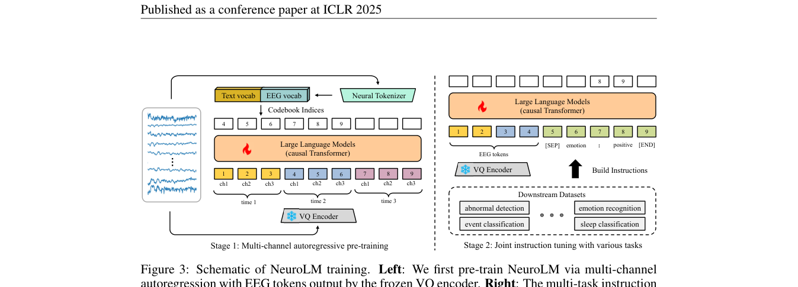

# NeuroLM: A Universal Multi-task Foundation Model for Bridging the Gap between Language and EEG Signals

> **ICLR 2025**

NeuroLM (ICLR 2025)

**作者**：Wei-Bang Jiang, Yansen Wang, Bao-Liang Lu, Dongsheng Li（上海交大 / MSRA）

#### 5.1 问题定位

LaBraM 等模型每个下游任务都要全量微调，浪费算力且一个模型只能干一件事。NeuroLM 是**首个 EEG 多任务基础模型**：把 EEG 当作"外语"，通过三阶段训练接入 LLM（GPT-2），实现单模型多任务学习与推理。三大挑战：EEG-text 对齐难（无成对数据）、LLM 范式下如何学通用表示、多任务统一。

#### 5.2 方法（三阶段）

**阶段一：文本对齐神经 Tokenizer（text-aligned neural tokenizer）**

- 在 LaBraM 的 VQ tokenizer 基础上改进，codebook `V ∈ R^{K×D}`（8192），ℓ2 归一化最近邻查表；
- **改进 1——时频双域重构（vector-quantized temporal-frequency prediction）**：LaBraM 重构幅值+相位，NeuroLM 发现相位贡献很小，改为**两个独立 decoder**：时域 decoder 重构原始信号 + 频域 decoder 重构 DFT 幅值（幅值做样本内 z-score）；损失 L1 = 时域重构 + 频域重构 + codebook loss + commitment loss；
- **改进 2——EEG-文本空间对齐**：因 EEG-text 成对数据稀缺、EEG 内容难以用语言完整描述，放弃 embedding 级对齐，改用**空间级（space-wise）对齐**：
  - 训练一个 domain classifier C 判断 embedding 来自 EEG 还是文本（文本 embedding 每批随机采自 GPT-2 词表）；
  - VQ encoder 后接**梯度反转层（GRL, Ganin et al. 2016）**对抗训练，把 EEG embedding 推入文本 embedding 空间；
  - 总目标：`min L1 + λ Σ d_i log C(h_i)`，λ 随训练从 0 渐增到 1（`λ = 2/(1+e^{−10t/T}) − 1`）。

**阶段二：多通道自回归预训练（multi-channel autoregressive pre-training）**

- 冻结 VQ encoder；加载预训练 GPT-2，**把 8192 个 codebook 索引并入 GPT-2 词表**（Text vocab + EEG vocab）；
- EEG token 复用 LLM 的时间 embedding，另学空间 embedding；序列最长 1024，零 padding 处屏蔽注意力；
- **stair-stepping mask（阶梯式注意力掩码）**：语言可以逐 token 预测，EEG 通道配置各异不行——改为"**同通道 token 预测同通道下一时间步 token**"：`p(I_11,...,I_CT) = Π_t p(I_1n,...,I_Cn | h_11,...,h_{C(t−1)})`；实现上每个 EEG token 可见所有通道在当前及之前时间步的 token；
- **VAE 理论解释**：tokenizer = 后验 q_φ(z|x)，decoder = p_ψ(y|z)，多通道自回归预训练 = 学习先验 p_θ(z)，整个范式对应 ELBO 两项（重构 + KL）；
- 预训练同时在每批混入少量纯文本数据，保持 LLM 语言能力。

**阶段三：多任务指令微调（multi-task instruction tuning）**

- 为 6 个下游数据集分别设计文本指令（如 TUAB："[SEP] Question: Is this EEG segment abnormal? Answer: {Yes, No} [END]"）；
- **[SEP] token** 拼接 EEG token 与文本指令，标记模态切换；**loss 只算答案部分**（预测更稳定）；继续混入文本数据；
- 推理时直接取最大 logits（不用 beam search）保证稳定。

**模型规格**：基座 GPT-2；NeuroLM-B/L/XL = 254M / 500M / 1696M（含 VQ encoder）；预训练约 **25000 小时** EEG。

#### 5.3 创新点

1. **首个 EEG 多任务基础模型**：单模型通过指令微调统一六种 BCI 任务（检测/分类/情绪/睡眠/负荷/慢波），首次把 instruction tuning 引入 EEG 领域；
2. **文本对齐 tokenizer**：GRL 对抗式空间对齐，使 EEG token 能直接作为 LLM 的输入 token（消融证明：不对齐则注意力紊乱、模型输出随机词）；
3. **多通道自回归预训练 + 阶梯掩码**：让因果 LLM 学到跨通道的 EEG 因果关系（消融证明对指令微调性能贡献显著）；
4. EEG 词表并入 LLM 词表的"外语"接入范式；配 VAE/ELBO 理论解释；
5. 最大变体 1.7B 参数（EEG 信号处理领域当时最大）。

#### 5.4 流程

```
阶段一：训练 text-aligned tokenizer
   EEG patch → VQ encoder(含GRL) → 查表 → {时域decoder → 重构原始信号
                                          {频域decoder → 重构DFT幅值   } L1
                        ↘ domain classifier(EEG vs 文本) ← GRL 反转梯度对抗
阶段二：多通道自回归预训练（GPT-2 词表扩充 EEG vocab）
   冻结 VQ encoder → EEG tokens + 时空 embedding → GPT-2（阶梯掩码）
   → 同通道下一时间步 token 预测（+ 混入文本保语言能力）
阶段三：多任务指令微调
   [EEG tokens][SEP][Question...Answer] → GPT-2 → loss 只算 Answer 部分
```

#### 5.5 实验与结果

- 下游 6 数据集：TUAB、TUEV、SEED（情绪）、HMC（睡眠分期）、Workload（认知负荷）、TUSL（慢波分类）；
- 单模型多任务推理，性能接近多数单任务基线（作者坦言仍逊于单任务 SOTA 的 LaBraM，但具备零样板泛化到新任务/新 prompt 的潜力）；
- 消融：多通道自回归预训练对所有任务显著有益；指令选项乱序（shuffle）在数据充足的 TUEV/HMC 上鲁棒（说明真的理解了问题语义），小数据 TUSL 上受损；预训练 20 epoch 最优；注意力可视化显示浅层处理文本问题、深层聚焦 EEG token 生成答案，多数数据集信息汇聚到 Cz 通道。

---

## 架构图



*Figure 2 · 文本对齐 tokenizer 训练：时频重构 + 域分类器（GRL 梯度反转）*



*Figure 3 · 两阶段：多通道自回归预训练（左）→ 多任务指令微调（右）*


## 要点速览
!!! abstract "TL;DR"
    - 约 25000 小时 EEG 预训练；GPT-2 基座，B/L/XL = 254M / 500M / 1696M
    - 首个单模型多任务 EEG 模型：指令微调统一 6 种 BCI 任务
    - token 接入方式：8192 codebook 并入 LLM 词表 + GRL 对抗式文本空间对齐


## 与其他论文的关系

| 论文 / 工作 | 关系说明 |
|---|---|
| LaBraM | 同团队续作：tokenizer 继承 VQ + 频谱思想，但改为时域+幅值双域重构（发现相位贡献小） |
| BrainGPT | 多任务路线之争的另一方：指令微调 vs 图联合微调 |
| CLIP 类模型 | 对齐思路的差异：因 EEG-text 无成对数据，选择 space-wise（域分类器+GRL）而非 embedding-wise 对齐 |

## 个人思考
- 论文很诚实：单模型多任务的性能仍逊于单任务 SOTA 的 LaBraM——其价值在范式（prompt 泛化到新任务、免逐任务微调），不在当前数字。
- EEG-text 没有成对数据 → 只能做粗粒度的空间对齐，这是当前范式的天花板；附录展望了'用预定义句子描述 EEG + 对比损失'的细粒度对齐方向。
- 阶梯掩码是'把语言的自回归搬到多通道信号'的干净答案：同通道 token 预测同通道下一时刻，每个 token 可见所有通道的当前与历史。

## 自问自答

??? question "Q1 · 为什么选择空间对齐而不是 CLIP 式的 embedding 对齐？"

    CLIP 式对齐需要大规模成对数据（图文对），而 EEG-text 对几乎不存在——一段 EEG 同时包含情绪、运动、病理等多重信息，人类语言无法完整标注。所以 NeuroLM 退而求其次做 space-wise 对齐：只要求 EEG embedding 落在与文本相同的分布空间里（域分类器 + 梯度反转），不要求逐条语义对应。


??? question "Q2 · GRL（梯度反转层）是怎么工作的？"

    前向传播时是恒等变换，反向传播时把梯度取反。效果：域分类器 C 正常训练（学会分辨 EEG 和文本），而 VQ encoder 收到反向梯度、朝骗过分类器的方向更新——两者的极小极大博弈把 EEG embedding 推进文本 embedding 空间。λ 从 0 渐增到 1，避免训练初期扰动过大。


??? question "Q3 · 为什么不能像语言那样逐 token 自回归？"

    语言是单序列、词序固定；EEG 的通道数和排列因数据集而异，没有统一的下一个 token。阶梯掩码的答案：同通道 token 预测同通道下一时间步（时序因果），同时每个 token 可见所有通道的当前与历史（空间全可见）——把语言的 AR 结构迁移到通道乘时间的二维格子上。


??? question "Q4 · 为什么每批要混入少量纯文本数据？"

    防止 LLM 的语言能力灾难性遗忘。指令微调全部是 EEG 到短答案的任务，若纯用这些数据训练，GPT-2 的通用语言分布会迅速退化，泛化到新 prompt 的能力也随之丧失。
