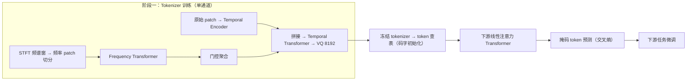
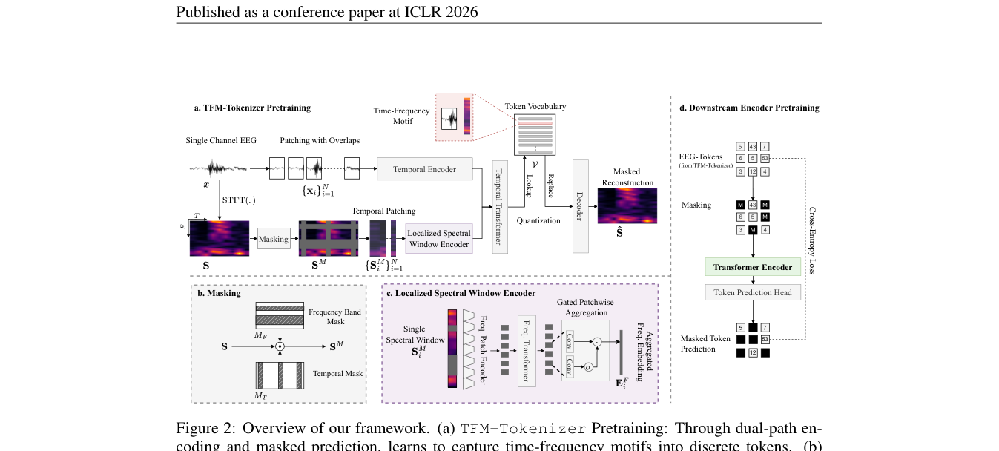

# TFM-Tokenizer: Tokenizing Single-Channel EEG with Time-Frequency Motif Learning

> **ICLR 2026**

TFM-Tokenizer (ICLR 2026)

**作者**：Jathurshan Pradeepkumar, Xihao Piao, Zheng Chen, Jimeng Sun（UIUC / 大阪大学 SANKEN）

#### 6.1 问题定位

EEG tokenization 是被忽视的关键问题。对现有方法的批评：① 多数基础模型只是把连续信号规则切段（"仅仅离散化"，没有学词表）；② LaBraM 虽学了 VQ tokenizer，但 token **只作为训练目标、推理时被丢弃**，基础模型仍然吃连续段级 embedding——没享受 tokenization 的红利。TFM-Tokenizer 要学一个**时频 motif 词表**，并把离散 token **真正作为下游模型输入**。

三大设计原则：① **单通道级**训练（channel-agnostic，跨设备泛化）；② **Token 分辨率**应捕捉 motif（短时、重复、有判别意义的时频波形模式，如振荡爆发、棘波）；③ 学习目标应**显式包含时频表示**（纯时域 motif 会被低频主导、丢失高频信息）。

#### 6.2 方法

**（a）TFM-Tokenizer（单通道 motif 学习，双路径）**

- 输入：单通道 EEG，切重叠 patch（窗长 L、hop H），每 patch 对应一个 STFT 频谱窗口 `S_i`（窗长 200 点=1s，hop 100=0.5s，Hann 窗，只取幅值）；
- **频域路径——Localized Spectral Window Encoder**（相比 BIOT"整窗过一个线性层"的改进）：
  1. **Frequency Patch Encoder**：每个频谱窗沿频率轴切成 P 个不重叠 patch（每 patch 覆盖 Δf 个频点），线性投影 + GroupNorm + GeLU；
  2. **Frequency Transformer**：沿频率轴做注意力，建模**窗内跨频段依赖**；
  3. **Gated Patchwise Aggregation**：sigmoid 门控聚合（强调重要频段、抑制无关频段，如睡眠任务只关心 <32Hz）；
- **时域路径——Temporal Encoder**：原始 EEG patch 线性投影 + GeLU + GroupNorm；
- 两路 embedding **拼接** → **Temporal Transformer** 建模 N 个 patch 间的长程依赖 → 输出量化进 VQ 词表（**codebook 8192**，与 LaBraM 对齐以便公平比较）；
- **关键设计：不加位置编码**——EEG 非平稳、motif 可出现在任意位置；消融证明去掉 PE 后 Cohen's Kappa 0.5119→0.5337，token 利用率下降、类独有 token 上升（避免同一 motif 因位置不同学成不同 token 的冗余）。

**（b）训练目标：时频掩码预测**

- **频带掩码 + 时间掩码**（消融：随机掩码最差；频带掩码最关键，Kappa +8%；加时间掩码 balanced acc 再 +5%）+ **对称掩码**（沿用 LaBraM，数据增强+稳定）；
- 损失：总损失 = 掩码重构 + codebook + commitment 三项之和（下式）；码字用 EMA 更新：

\[ \mathcal{L}_{\mathrm{token}} = \underbrace{\sum_{(f,t)} \left\| S(f,t) - \hat{S}(f,t) \right\|_2^2}_{\text{掩码重构}} \;+\; \underbrace{\alpha \sum_i \left\| \mathrm{sg}[E_i] - v_i \right\|_2^2}_{\text{codebook}} \;+\; \underbrace{\beta \sum_i \left\| E_i - \mathrm{sg}[v_i] \right\|_2^2}_{\text{commitment}} \]

**（c）下游 Transformer**

- token embedding 查表（**用 VQ codebook 初始化**）+ 通道/位置 embedding + [CLS] token → **线性注意力 Transformer**（仅 ~0.7M 参数）；
- **masked token prediction 预训练**（随机 mask 跨通道跨时间的 token，交叉熵预测）——同时增强对缺失通道/损坏时间段的鲁棒性；
- 最后微调分类。

**（d）Plug-and-play 集成**

- **BIOT-TFM**：用 TFM-Tokenizer 替换 BIOT 的 patch 线性投影层（token 直接作 BIOT 输入）；
- **LaBraM-TFM**：用 TFM-Tokenizer 替换 LaBraM 的神经 tokenizer 做 masked EEG modeling。

#### 6.3 创新点

1. **首次系统研究 EEG 的"可学习词表"问题，且 token 作为真正的输入**（与 LaBraM"一次性标签"形成对照）；
2. **时频 motif 作为离散 token**：双路径显式建模时频结构（频域路径窗内跨频段依赖 + 门控聚合），token 具有生理可解释性（如 token 4035 稳定对应 PLED 的"棘波-慢波"周期模式）；
3. **单通道、channel-agnostic**：不依赖 10-20 系统，可迁移到 ear-EEG 等非标准设备（EEGPT 的固定空间 embedding 则无法扩展到该场景）；
4. **去掉位置编码**的 tokenizer 设计（有消融和理论论证）；
5. **模型极小**：tokenizer ~1.2M + 下游 ~0.7M ≈ 1.9M，比 BIOT（3.2M）、LaBraM（5.8M+8.6M）小，性能反而更好；
6. token 质量分析体系：类-token 独有性（uniqueness）、类内一致性（检索 precision@K）、频率学习能力（token 序列谱熵）、token 利用率。

#### 6.4 流程

#### 6.5 实验与结果

- 数据集：TUEV、TUAB、CHB-MIT、IIIC Seizure（+ 跨设备 EESM23 ear-EEG 睡眠分期）；
- 两种设定下绝大多数指标-设定组合最优（例外：多数据集 CHB-MIT 的 balanced acc 0.6471 低于 BIOT 的 0.7068）：多数据集 TUEV Kappa 0.6189（次优 0.5588，+11%）；IIIC Kappa 0.4979（比复现 LaBraM +36%）；
- plug-and-play：集成进 BIOT/LaBraM 后 93% 的指标-设定组合有提升（如单数据集 CHB-MIT 上 LaBraM-TFM 的 AUC-PR 提升 147%）；
- 跨设备：ear-EEG 睡眠分期（仅 ~8K 标注样本、预训练完全没见过的采集方式）超过 BIOT/LaBraM 14%，EEGPT 因固定通道布局无法参与；
- 消融：双域联合建模优于单时域（-R）或单频域（-S）变体；masking 策略与比例（频率 0.5 最优）；窗长 0.5s/0.25s hop 其实最好（但为对齐基线统一用 1s/0.5s）；embedding 维度 64 最优；下游 2 层即接近 12 层性能。

---

## 架构图

*Figure 2 · 框架总览：(a) 双路径 tokenizer 预训练 (b) 掩码策略 (c) 频谱窗口编码器 (d) 下游掩码 token 预测*

## 要点速览
!!! abstract "TL;DR"
    - 总参数仅 ~1.9M（tokenizer 1.2M + 下游 0.7M），最小的那个反而最强
    - 多数据集设定 TUEV Kappa 0.6189（次优 0.5588，+11%）；IIIC Kappa 0.4979（比 LaBraM +36%）
    - 跨设备 ear-EEG 睡眠分期超过 BIOT/LaBraM 14%；plug-and-play 提升 BIOT/LaBraM 93% 指标

## 与其他论文的关系

| 论文 / 工作 | 关系说明 |
|---|---|
| LaBraM | 直接批评其 token '只当训练目标'；LaBraM-TFM 实验证明换用 TFM tokenizer 后性能普遍提升 |
| BIOT | 批评其 FFT 整窗线性投影过于粗糙；BIOT-TFM 用 token 替换其输入投影后同样提升 |
| EEGPT | 单通道设计 vs 固定 58 通道布局：ear-EEG 实验中 EEGPT 因空间 embedding 无法扩展而缺席 |

## 个人思考
- 去掉位置编码的反直觉设计有消融支撑：PE 会让同一 motif 因出现位置不同学成不同 token → 词表冗余；motif 词表要的正是平移不变性。
- token 可解释性分析（如 PLED 类的 token 4035 稳定对应'棘波-慢波'周期模式）是把 NLP 的 token 分析方法迁移到 EEG 的漂亮示范。
- 作者自认局限：固定窗长可能把大 pattern 切断到不同窗口，导致同一事件被分到不同 token——这是切分式 tokenization 的共同软肋。

## 自问自答

??? question "Q1 · 为什么 tokenizer 内要去掉位置编码？"

    消融证据：去掉 PE 后 TUEV Kappa 从 0.5119 升到 0.5337，token 利用率下降（12.87% 到 9.78%）、类独有 token 上升。机理：EEG motif 非平稳，同一模式可出现在任意位置；加了 PE，相同 motif 会因位置不同被学成不同 token，造成词表冗余。motif 词表需要的是平移不变性。注意：下游 Transformer 仍有位置编码，去掉的只是 tokenizer 内部的。

??? question "Q2 · 频域路径为什么要把频谱窗沿频率轴切 patch？"

    BIOT 的做法是把整个频谱窗直接过一个线性层，频率信息被一次性压缩，模型容易只看能量最大的低频段。沿频率轴切 patch 后用频率 Transformer 建模窗内跨频段依赖，再用 sigmoid 门控聚合——让哪些频段重要变成可学习的决策（睡眠任务可以学会忽略 32Hz 以上）。

??? question "Q3 · 为什么频带掩码比随机掩码重要得多？"

    消融：随机掩码 Kappa 0.4772，频带掩码 0.5193（+8%）。随机掩小块太容易靠邻域插值恢复；按频带整条掩掉迫使模型从其他频带和时域上下文推断缺失频段的结构，学到的是跨频段依赖而非局部平滑。

??? question "Q4 · 这套 tokenization 的主要局限是什么？"

    作者自认：固定窗长可能把跨越窗口的大 pattern 切断，同一事件被分配到不同 token（误判为不同 motif）。此外属个人推断（论文仅自认窗长局限）：VQ 硬量化可能吞掉码字边界附近的微小波形差异。

!!! abstract "复现速查卡"
    - **代码**：[github.com/Jathurshan0330/TFM-Tokenizer](https://github.com/Jathurshan0330/TFM-Tokenizer)（含预训练权重与全部预处理脚本）
    - **关键超参**：tokenizer ~1.2M + 下游 ~0.7M；STFT 窗 200 点/Hann/hop 100；码本 8192；token embedding 64；频带掩码率 0.5 + 时间掩码 + 对称掩码；tokenizer 内**无位置编码**；Ray Tune + Optuna 调参
    - **数据**：TUEV/TUAB/CHB-MIT/IIIC（遵循 BIOT 划分）；跨设备 EESM23
    - **算力参考**：无 GPU 规模要求披露——tokenizer 极小，消费级单卡可训

---

**相关阅读**

:material-arrow-left: [上一篇：NeuroLM](0918-neurolm.md) ｜ :material-arrow-right: [下一篇：BIOT](0918-biot.md) ｜ :material-vector-link: [Tokenization 演进](../../topics/tokenization.md) ｜ :material-chart-box: [战绩总表](../../comparison.md#benchmarks)
