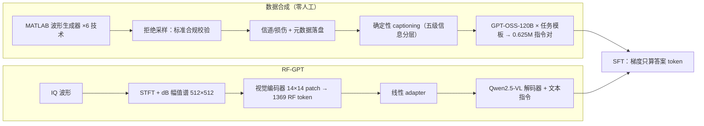
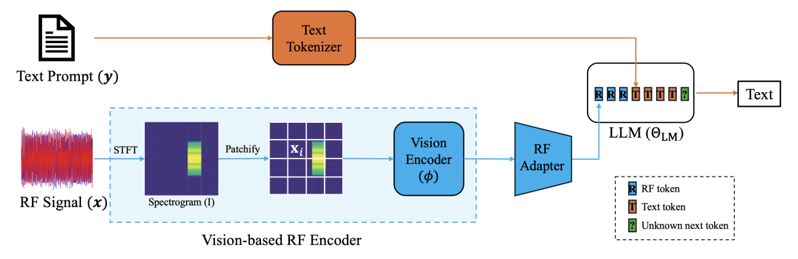

# RF-GPT: Teaching AI to See the Wireless World

> **arXiv 2026**（eess.SP, 2602.14833）· Khalifa University / 浙江大学 / Université de Lorraine —— 跨领域精读：这是"时频图 + 大模型"在**射频域**的完整落地，与 EEG 时频路线互为镜像参照。

**作者**：Hang Zou, Yu Tian, Bohao Wang, Lina Bariah, Samson Lasaulce, Chongwen Huang, Mérouane Debbah

!!! abstract "TL;DR"
    - 提出 **RFLM**（radio-frequency language model）概念并给出首个实现 RF-GPT：IQ 波形 → STFT 时频图 → **直接复用预训练 VLM 的视觉编码器** → 线性 adapter → 解码器 LLM 生成 RF-grounded 回答
    - 完全跳过自监督预训练：6 种无线技术的**标准合规波形生成器**造出 ~12,000 场景，"配置即标签"确定性 captioning + 文本 LLM 合成 **0.625M 指令对，零人工标注**
    - 通用 VLM（Qwen2.5-VL、GPT-5）精心 prompt 后仍**接近随机猜测**；RF-GPT 在技术识别达 **99.6% joint 准确率**，5 个 benchmark 全面碾压
    - 消融最扎心的一条：**IQ 不平衡是最具破坏性的损伤**（镜像/交叉泄漏直接毁掉视觉结构）——对所有"时频图当图片"的方案都是普适警示

#### 1 问题定位

LLM 与多模态模型已统一了文本、视觉、音频，唯独**射频（RF）信号**——无线通信、雷达、ISAC 的物理层载体——没有被纳入基础模型框架。两侧各有困境：

- **传统 RF 深度学习**是任务专用的窄模型（调制识别/信道估计/波束选择/干扰识别/频谱感知），四个共性局限：① 每个任务一套架构、数据集、训练管线，难以复用；② 多样且标注良好的 RF 数据集昂贵（要专家标注）；③ 换 SNR/信道/硬件场景性能骤降；④ 只吐标签或回归值，无解释、无自然语言交互接口；
- **电信 LLM**（TelecomGPT 等 LLM4Telecom 一系）是 text-centric 的——处理工单、日志、KPI、配置表，**不碰物理层**，形成模态鸿沟；
- 已有的无线/RF 基础模型（WFM、LWM、WirelessGPT 类）仍依赖任务专属输出头 + 逐任务微调，模型偏小、benchmark 窄，难以按 scaling law 扩展。

作者的答案是把 RFLM 定义为**以 RF token 为条件的条件语言模型**：给定一段 RF 录波，能用自然语言回答"这个频段里有哪些调制和技术？""有没有重叠传输、时频关系如何？""该行为是否符合相关无线标准？"，并输出结构化 JSON 供下游控制器使用。RF 恰好特别适合合成数据：标准波形生成器可以产生**精确的 ground truth**（调制类型、SNR、带宽、资源分配全是仿真器内部变量），从而摆脱专家标注。

#### 2 方法

**（a）RFLM 形式化**：RF 编码器把复基带 IQ 序列映射为 M 个 d 维 RF token：

\[ \varphi_{\mathrm{RF}}: \mathbb{C}^T \to \mathbb{R}^{M \times d}, \qquad \mathcal{P}_\Theta(\mathbf{y} \mid \varphi_{\mathrm{RF}}(\mathbf{x})) = \prod_{t=1}^{N} \mathcal{P}_\Theta\big(y_t \mid \mathbf{y}_{<t}, \varphi_{\mathrm{RF}}(\mathbf{x})\big) \]

RF token 作为前缀条件驱动自回归解码。实现上完整编码器是"频谱图管线 ∘ 视觉管线"的复合：

\[ \varphi_{\mathrm{RF}}(\mathbf{x}) = \mathcal{E}_v\big(\mathrm{Spec}(\mathbf{x})\big) \]

**（b）频谱图前端——为什么不直接吃原始 IQ**：原始 IQ 采样率极高，直接进 Transformer 计算不可行，且丢掉时频结构的强归纳偏置。于是先做 STFT（窗 w、FFT 点数 F、hop H_hop），再对复谱做 dB 幅值压缩：

\[ A_{\mathrm{dB}}[k,t] = 10 \log_{10}\big(|S[k,t]|^2 + \varepsilon\big) \]

归一化后映射为灰度图（C=1）或固定 colormap（viridis）伪 RGB 图（C=3），交给**预训练视觉编码器**。选这个路线的两个动机：① RF 信号跨技术的载频/带宽/采样率差异巨大，单一 raw-IQ tokenizer 很难同时高效适配窄带、宽带、多标准场景；② STFT 本身就是有效的 RF 特征提取器，而图像预训练的视觉编码器能从任何图像（包括谱图）中提取通用语义结构。谱图切 P×P patch 后线性投影 + 可学习位置 embedding，过 Transformer 编码器层；**不设 [CLS] token**，全部 M 个 patch token 都作为 RF token 交给语言模型。

关于**幅值谱丢相位**：作者明确区分两个范畴——真正的相位重构（从幅值恢复整个波形，PhaseLift 一类）不在此列；RF-GPT 只推任务相关属性（调制族、技术、SNR 档位、重叠结构），这些是波形的**多对一映射**，主要取决于时频能量模式而非逐样本相位，因此幅值谱作为"丰富但有损"的前端足够。

**（c）RF adapter 与 LLM**：视觉编码器输出的 M 个 token 经一个线性投影（LLaVA 式模态 adapter）映射到 LLM 嵌入维度，与文本 token 查表 embedding 拼接成单一序列：RF token 在前、文本在后。解码器骨干是 Qwen 系现代设计——pre-norm **RMSNorm** + **GQA** 因果注意力 + **SwiGLU 门控 MLP** + RoPE。输出只取文本位置的 logits。

**（d）RF-grounded SFT**：在合成三元组 (x, q, y) 上做监督指令微调，(q, y) 按角色标记拼成单序列、RF token 注入为前缀，**梯度只算答案 token**，标准自回归交叉熵：

\[ \mathcal{L}(\Theta) = -\sum_{(\mathbf{x},\,q,\,\mathbf{y}) \in \mathcal{D}_{\mathrm{RF}}} \sum_{t=1}^{|\mathbf{y}|} \log \mathcal{P}_\Theta\big(y_t \mid \mathbf{y}_{<t},\, q,\, \varphi_{\mathrm{RF}}(\mathbf{x})\big) \]

关键性质：**所有监督都是 RF-grounded 的**——答案里的每个 token 都由构造保证与底层 RF 场景一致，迫使模型把谱图中的 RF 模式与语言中的 RF 概念对齐。

#### 3 数据流水线：零人工标注的三段式（本文最大贡献）

**第一段 · 标准合规波形生成**：用 MATLAB Wireless Waveform Generator 家族（5G/LTE/UMTS/WLAN/卫星通信/蓝牙 Toolbox）为 **5G NR、LTE、UMTS、WLAN、DVB-S2、Bluetooth** 六种技术生成宽带场景。流程是统一模板：随机采样技术配置 → 过 MATLAB API 生成 → **拒绝采样**保证合规（PRB/RU 分配非法、带宽-numerology 不兼容、导频模式不一致即拒绝重采）→ 可选信道与损伤（衰落、频率选择性信道、目标 SNR）→ 全部配置与信道参数逐字存入元数据。另用 **TorchSig** 补充宽带调制的多样性（WBMC 即基于其 57 类调制扩展为宽带设定）。

**第二段 · 确定性 captioning**：因为每个谱图都由已知配置对象生成，标签天然零噪声。caption 信息按**五级信息分层**——Summary（一句话概述）/ Global visual（SSB、CSI-RS/SRS burst 等全局可视模式）/ Global context（带宽、SCS 等元数据可知但视觉不显的量）/ Signal visual（每信号的相对 SNR 与时频占据）/ Signal context（视觉难推的上下文，如 DM-RS/PTRS 设置）。

**第三段 · 指令合成**：确定性的密集 caption 太长、顺序固定、不是指令格式，直接训会难优化。于是按任务模板库（信号计数、调制/技术识别、信息抽取、重叠分析、一致性检查、开放描述）采样模板，把五级信息按难度选择性拼进隐藏上下文，交给强文本 LLM（**GPT-OSS-120B**）生成格式受控的指令-答案对（纯标签/JSON/短段落）。

规模：**~12,000 个 RF 场景、0.625M 指令对，全程零人工标注**。

#### 4 创新点

1. **提出并实现 RFLM 概念**：以 RF token 为条件的语言模型——RF 感知与高层推理之间的第一座桥；
2. **零 RF 预训练**：不训任何 RF 编码器，把频谱图当图片、整个复用预训练 VLM 的视觉栈，SFT 一步到位；
3. **全自动数据飞轮**：标准合规生成器（拒绝采样保真）+ "配置即标签"确定性 captioning + 文本 LLM 指令合成，0.625M 对零人工；
4. **系统化 benchmark 套件**：WBMC/WBOD/WTR/WNUC/NRIE 五族任务，覆盖调制、重叠推理、技术、计数、协议参数抽取，含难度分级与严格匹配准则。

#### 5 流程

#### 6 实验与结果

- **设置**：Qwen2.5-VL-3B/7B-Instruct 底座 → RF-GPT-3B/7B；3 epoch，AdamW lr 2×10⁻⁴，global batch 256，5% warmup + cosine 衰减，BF16，8×H200（140GB）；STFT Blackman 窗、FFT/窗/hop 均 512、无居中、频轴 fftshift；
- **通用 VLM 没有 RF 先验**：Qwen2.5-VL-3B/7B-Instruct 与 GPT-5 在"明确告知输入是 RF 谱图 + 轴含义 + 要机器可解析答案"的精心 prompt 下仍接近随机——WBMC 最高 7%、数信号正确率 <5%、WTR joint 仅 ~5%，且预测高度偏斜（如永远答 DL）。结论：任何非零分都来自瞎猜；
- **五族 benchmark**（E/M/H = 易/中/难）：

| 任务 | RF-GPT-3B | RF-GPT-7B | 通用 VLM 参照 |
|---|---|---|---|
| WBMC 调制分类（E/M/H） | 80.0 / 71.4 / 43.7 | 82.4 / 74.2 / 47.8 | ≤7%，hard 近 0 |
| WBOD 重叠检测（E/M/H） | 91.2 / 85.2 / 65.0 | 91.5 / 87.6 / 71.7 | easy 23–25，hard 5–12 |
| WTR 技术+链路方向（joint） | 99.42% | 99.64% | ~5%（GPT-5 无法解析） |
| WNUC WLAN 用户数（平均） | 65.43% | 70.17% | ~23% |
| NRIE NR 参数抽取（平均） | ~72% | SCS 99.1 / SSB 94.1 / UE 64.2 | ~20% |

数信号存在性正确率约 98%（通用 VLM 几乎全错）；NRIE 说明模型能从纯视觉证据恢复 SCS、SSB 图案、CSI-RS/SRS 数量等协议参数；WNUC 中 11be 好于 11ax，作者归因于 11be 单用户占 RU 而 11ax 常见 MU-MIMO 共享 RU——视觉上掩盖个体用户特征；

- **消融 · 损伤鲁棒性**：CFO 与 PA 非线性几乎不掉点、TDL 多径中等下降、**IQ 不平衡最致命**（NRIE 75.29% → 70.21%）：IQ 增益/相位失配制造镜像频率分量与交叉泄漏，直接干扰计数与结构线索；
- **消融 · vs CNN/Transformer**：EfficientNet/ViT-B/ViT-H + 每属性专属任务头在 NRIE 上，ViT-H 训 30 epoch 到 76.39%；RF-GPT-7B 只训 **3 epoch 就到 76.96%**——10 倍数据效率，且一个模型一个目标替代五套任务头；
- **消融 · 分辨率**：224→384→512 单调提升（WBMC-Easy 72.94→78.72→82.41，hard +8.3），代价是 token 数与推理延迟。

---

## 架构图

*Figure 1 · RF-GPT 框架总览：频谱图经视觉编码器变成 RF token 前缀，LLM 在其条件下生成回答*

## 要点速览
!!! abstract "TL;DR"
    - RFLM 概念首作：频谱图 → 现成 VLM 视觉编码器 → RF token 前缀 → LLM 回答，**零 RF 预训练**
    - 纯合成数据飞轮：6 种技术标准波形 + 确定性 captioning + GPT-OSS-120B 合成 0.625M 指令对，零人工标注
    - WTR 99.6% joint、数信号 98%；通用 VLM（含 GPT-5）精心 prompt 仍随机猜——**模态接地必须靠专门 SFT**
    - IQ 不平衡是最伤损伤（镜像伪影破坏视觉结构）；3 epoch 效率 = ViT-H 30 epoch

## 与其他论文的关系

| 论文 / 工作 | 关系说明 |
|---|---|
| TFM-Tokenizer | 同样把 STFT 谱图当图像切 patch；TFM 从头训 VQ motif 词表，RF-GPT 直接复用预训练视觉编码器、完全不学 RF 词表 |
| SleepGPT（Nature Comms 2026，待读清单） | 同为"时频图 + 大模型"：SleepGPT 走自监督预训练时频编码器（科学发现导向），RF-GPT 走纯合成 SFT（工程接口导向）——设计空间两极 |
| NeuroLM | 都把非文本 token 拼在 LLM 前缀；NeuroLM 用 GRL 对齐的离散码字接入 GPT-2，RF-GPT 用现成视觉编码器的连续 token 接入现代 VLM |
| LaBraM | 对照：LaBraM 把频谱当**重构目标**学表示，RF-GPT 把频谱图当**唯一输入**做指令跟随 |
| LoRA（模型架构基础） | 同属"冻结大底座 + 轻量适配"工具箱：RF-GPT 走 SFT 路线（论文未说明是否全参，按 8×H200 + AdamW 配置推断为全参），小显存场景可换 LoRA（EEG 迁移的自然选择） |

## 个人思考

- **对 EEG 时频路线的启示**：RF-GPT 证明了"频谱图当图片 + 现成 VLM + 合成指令 SFT"可以完全绕开自监督预训练。这条路搬到 EEG 的瓶颈在数据侧：EEG 没有"标准波形生成器"级别的合规仿真器，做不到 RF 这种配置即标签的零噪声监督——但睡眠纺锤波/棘波注入仿真、受控范式重放是部分替代；
- **"通用 VLM 随机猜"这个阴性结果和阳性结果同样值钱**：GPT-5 级模型读不懂 RF 谱图，同理大概率也读不懂 EEG 谱图——"看起来像图"不等于"有先验"，模态接地没有捷径；
- **IQ 不平衡最伤**对一切时频输入方案是普适警示：通道间失配制造的镜像/交叉泄漏在时频图上是结构性破坏。EEG 的电极阻抗失配、工频干扰本质同类，做时频图输入方案时值得专门做敏感性分析；
- 与六篇 EEG 论文相比最大的方法论差异是**预训练的缺位**：六篇都在卷"怎么预训练"，这篇把宝全押在 VLM 底座的通用视觉语义 + 合成数据的零噪声监督上——是工程主义路线的极端样本。

## 自问自答

??? question "Q1 · 幅值谱丢了相位，为什么 RF-GPT 不在乎，LaBraM 却要重构幅值+相位？"

    目标不同。LaBraM 用重构学通用表示，相位携带波形精细结构信息，是表示学习的一部分；RF-GPT 是任务驱动的判别式 SFT，其任务（调制族/技术/计数/重叠）是波形的**多对一映射**，只依赖时频能量分布。论文专门讨论了 STFT 相位恢复文献（合适冗余/支撑假设下、至多差一个全局相位即可由幅值恢复信号），但明确声明不重构波形、只要任务属性——"丰富但有损"的前端够用。

??? question "Q2 · 为什么不自己训一个 RF 前端编码器？"

    两个动机：① 异构性——RF 跨技术的载频/带宽/采样率差异巨大，单一 raw-IQ tokenizer 难以同时高效适配窄带、宽带、多标准；② STFT 已是有效的特征提取器，而图像预训练的视觉编码器自带通用语义结构，对"长得像图像"的谱图开箱即用。消融间接支撑：分辨率越高收益越大（224→512 各难度 +8~10 点），说明视觉路径确实在利用时频细节。

??? question "Q3 · 纯合成数据训出的模型能信吗？"

    作者自认局限：grounding 全部来自合成、只支持单输入谱图，真实 OTA 数据、多天线、ISAC 留作未来。合成→真实的域差在 RF 尤其尖锐（真实硬件损伤与干扰谱远比仿真复杂）。但硬币另一面：配置对象逐字入元数据，训练信号**零噪声**——这是任何人工标注都给不了的精度，0.625M 对的规模也正因此才可行。

??? question "Q4 · 相比六篇 EEG 论文，这篇最值得「偷」的是什么？"

    三样：① 五级信息分层的 captioning 设计（把元数据按"视觉可辨/需元数据"×"全局/单信号"组织，按难度选择性出题）可直接迁移到任何生理信号仿真；② 拒绝采样保证"标准合规"的思想 = 数据质量前置校验；③ 用"通用模型随机猜"做阴性对照来论证接地必要性——EEG FM 论文很少做这个对照。

!!! abstract "复现速查卡"
    - **代码**：论文未附官方代码链接（精读时点）；组件全部公开可得——Qwen2.5-VL、LLaVA 式 adapter、PEFT
    - **关键超参**：STFT Blackman 窗、FFT/窗长/hop 均 512、无居中、频轴 fftshift；dB 幅值 + 动态范围裁剪；512×512 输入；14×14 patch → 1369 RF token（无 [CLS]）；3 epoch；AdamW 2×10⁻⁴；batch 256；5% warmup + cosine；BF16
    - **数据**：MATLAB 6 工具箱（5G NR/LTE/UMTS/WLAN/DVB-S2/蓝牙）+ TorchSig 调制类（WBMC 用其 57 类）；~12,000 场景 / 0.625M 指令对；指令由 GPT-OSS-120B 按模板生成
    - **算力参考**：8×H200 140GB SFT（论文未说明是否冻结部分模块，按配置推断全参）；迁移到 EEG 小底座（2B 级）+ LoRA 可降一档

---

**相关阅读**

:material-arrow-left: [上一篇：TFM-Tokenizer](0918-tfm-tokenizer.md) ｜ :material-angle-acute: [LoRA · 低秩适配](../../basics/lora.md) ｜ :material-vector-link: [Tokenization 演进](../../topics/tokenization.md) ｜ :material-home: [首页](../../index.md)
