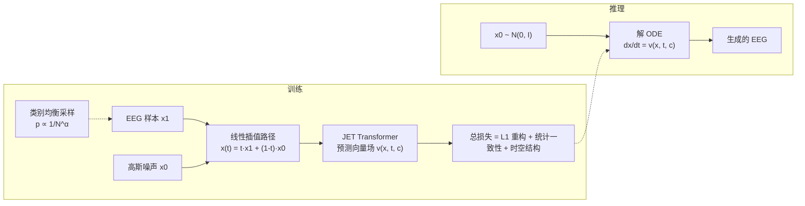
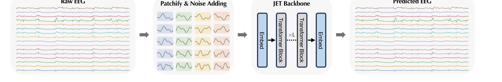

# JET: Let EEG Models Learn EEG

> **ICML 2026**（PMLR 306）· Stony Brook University / UTHealth Houston —— 精读的第 8 篇，也是**第一条与「表示/解码」平行的轴线：直接生成原始 EEG**。对我自己的 Flow Matching EEG 生成项目（JET 骨干）而言，这是最核心的一篇源头文献。

**作者**：Yifan Wang, Yijia Ma, Wen Li, Chenyu You

!!! abstract "TL;DR"
    - 核心主张：**EEG 生成应建模为连续动力过程**，而非离散去噪（GAN 的隐式密度估计 / diffusion 的迭代去噪与神经信号的连续演化不匹配）
    - 方法：条件流匹配学一个向量场，把高斯噪声沿连续轨迹输运到 EEG 数据分布；用标准 Transformer 直接吃原始多通道序列
    - 三条"principled constraints"正则化生成流：L1 重构（Laplacian 先验，抗尖波伪迹）+ 统计一致性（一阶/二阶矩）+ 时空结构（时间全变分 + Pearson 相关）
    - 三个 TUH 基准上 TS-FID 降 **40%+**（如 TUSZ 274→151）；Silhouette 近 0.99（基线 0.66–0.89）；下游 CBraMod 增强收益全为正
    - 效率：129.9M 参数，单张 B200；32 条 10 秒样本 4.78 s 生成（149 ms/条，约 **67× 实时**）

## 1 问题定位：为什么 EEG 生成这么难

EEG 建模的根本瓶颈是数据——高质量临床记录昂贵、需专家标注、受隐私法规限制，即便是最大的公开语料 TUH EEG Corpus 也比现代基础模型的预训练数据小几个数量级。生成建模是自然的出路，但现有范式（GAN、扩散）都栽在同一件事上：**EEG 的统计特性与通用生成范式的前提假设不匹配**。

论文把这种不匹配拆成三条内在挑战：

| 挑战 | EEG 的真实性质 | 通用范式的失效方式 |
|---|---|---|
| 幂律频谱结构（谱偏置） | 功率谱服从 1/f^χ，高频瞬变能量低但信息密集 | 以能量最小化为主的损失压制高频成分 → 过度平滑 |
| 非平稳时间动态 | 亚秒级持续变化的能量与连接性 | 离散生成步难以刻画流体式过渡 → 波形静止、重复 |
| 重尾幅度分布 | 幅值重尾、方差模式复杂 | 高斯先验坍缩向均值 → 覆盖不到病理记录的极端幅值 |

论文的归因很干脆：离散去噪形式在**各向同性噪声假设下优化局部重构精度**，而 EEG 生成需要的是**跨时间、频率、幅度的全局结构保真**；局部小误差在生成步中累积，最终表现为频谱偏置、时间相干性退化、统计特性错配。

由此提出核心论点：脑活动在高维状态空间里**平滑演化**，因此生成应当跟随一条连续轨迹，而不是一串离散的去噪步骤——这正是条件流匹配的适用场景。

## 2 方法

### 2.1 条件流匹配的形式化

记 x₁ ~ q(x₁) 为 EEG 数据样本，x₀ ~ N(0, I) 为标准高斯先验。流匹配要学的是随时间演化的向量场 v_t(x, t)，把概率密度从 x₀ 输运到 x₁（t 从 0 到 1）。

为了让训练可解，采用条件流匹配：给定配对 (x₀, x₁)，定义线性插值路径

\[ x_t = t\,x_1 + (1-t)\,x_0, \qquad t \in [0, 1] \]

其时间导数给出了回归目标向量场：

\[ u_t(x_t \mid x_0, x_1) = \frac{dx_t}{dt} = x_1 - x_0 \]

网络 \(f_\theta\)（即 JET）接收带噪状态 \(x_t\)、时间 \(t\)、类别标签 \(c\)，预测 \(v_\theta(x_t, t, c)\)。**推理时**从 \(x_0 \sim \mathcal{N}(0, I)\) 出发解常微分方程即可采样：

\[ \frac{dx_t}{dt} = v_\theta(x_t, t, c) \]

与扩散的对照：扩散是"随机去噪动力学"（每步注入/去除噪声），流匹配是"学习一个平滑的时变向量场，其积分曲线实现从源分布到目标分布的最优输运"。论文用三个流形上的玩具实验（螺旋、8 高斯、双月）直观对比了 GAN / 扩散 / 流匹配三种范式学到的分布。

### 2.2 架构：为什么不切时频图、也不要邻接矩阵

论文的架构选择有一个明确的立场：**直接在原始多通道序列上建模**，不做时频变换、不用预定义邻接矩阵。理由是 EEG 的两个物理性质违反了卷积与静态图模型的先验假设——**容积传导**让单一神经源的活动同时扩散到多个电极（空间依赖不是局部的），**功能连接**随时间连续演化（连接结构不是静态的）。自注意力提供的全局感受野天然适合表达跨越远近时间点与空间分布通道的依赖。

**原始 EEG 的 tokenization**：输入 X ∈ R^{C×T}（C 通道、T 时间点），沿时间轴切成 N = T/P 个不重叠 patch，得到 X_p ∈ R^{C×N×P}；每个 patch 线性投影到 D 维。**关键细节**：与标准 ViT 先把空间维展平再做投影不同，JET 在初始 embedding 阶段**保留通道身份**以维持空间结构，得到 token 序列 Z₀ ∈ R^{(C·N)×D}，另加可学习位置编码表达时间顺序。

**Transformer 骨干**：标准堆叠（多头自注意力 + FFN + LayerNorm + 残差）。条件信息（流时间 t 与类别标签 c）沿用 DiT / JiT 的做法，通过 **adaptive layer normalization** 注入——每层归一化的 scale/shift 参数由时间嵌入与类别嵌入之和预测，保证整条流轨迹都可被条件控制。

**自适应类别均衡采样**：临床 EEG 天然严重类别不平衡（正常背景远多于癫痫发作等罕见病理事件），均匀采样会让模型偏向多数类、甚至模式坍塌。为此给每个训练样本按类别频率赋采样概率：

\[ p_i \propto \frac{1}{N_c^{\alpha}}, \qquad \alpha \in [0, 1] \]

α 控制再平衡强度，使训练分布的期望类别频率近似均匀，让模型在不被主导节律带偏的前提下学好罕见病理模式。

### 2.3 三条"principled constraints"

论文强调"principled"的含义是：这些约束**源自 EEG 的建模假设与统计结构**，而不是临时拼凑的正则项。它们沿重构、统计、时空三个维度约束学习到的流。

**（a）Laplacian 先验的重构损失**——EEG 常含肌电、电极移动引起的脉冲式非高斯伪迹，L2 重构对应高斯似然、对离群点敏感；改用 L1 重构，隐含 Laplacian 先验，对瞬态偏离更稳健，同时保住尖锐的神经事件（如癫痫样棘波）：

\[ \hat{x}_1 = x_t + (1-t)\,v_\theta(x_t, t, c), \qquad \mathcal{L}_{\mathrm{recon}} = \mathbb{E}_t \left\| x_1 - \hat{x}_1 \right\|_1 \]

论文在附录 C 给了定理与证明：若残差服从独立同分布 Laplacian，最小化 L1 范数等价于最大似然估计。

**（b）统计一致性**——约束生成信号的一二阶矩与真实 EEG 对齐，防止幅值统计漂移。µ(·)、σ(·) 为逐通道时间轴上的均值与标准差（再对通道与 batch 取平均）：

\[ \mathcal{L}_{\mathrm{cons}} = \lambda_{\mathrm{cons}} \Big( \left\| \mu(x_1) - \mu(\hat{x}_1) \right\|_1 + \left\| \sigma(x_1) - \sigma(\hat{x}_1) \right\|_1 \Big) \]

**（c）时空结构**——时间全变分（TV）正则抑制无意义的高频抖动、保留生理上有意义的动态；Pearson 相关最大化则鼓励波形形态对齐（对幅度缩放不变，捕捉的是形态而非绝对幅值）：

\[ \mathcal{L}_{\mathrm{geo}} = \lambda_{\mathrm{tv}} \mathcal{L}_{\mathrm{tv}} + \lambda_{\mathrm{corr}} \mathcal{L}_{\mathrm{corr}} = \lambda_{\mathrm{tv}} \, \frac{1}{T} \sum_t \left\| \nabla_t \hat{x}_1 \right\|_1 + \lambda_{\mathrm{corr}} \big( 1 - \rho(x_1, \hat{x}_1) \big) \]

**总目标**：

\[ \mathcal{L}_{\mathrm{total}} = \mathcal{L}_{\mathrm{recon}} + \mathcal{L}_{\mathrm{cons}} + \mathcal{L}_{\mathrm{geo}} \]

## 3 流程

## 4 实验与结果

**数据**：TUH 语料的三个大规模子集，合计超 10,000 次临床 session，统一 16 通道：

| 数据集 | 任务 | 类别 | 输入形状 | 建模重点 |
|---|---|---|---|---|
| TUAB | 正常/异常二分类 | 2 | 16 × 2000（10 s @200Hz） | 全局病理分布 |
| TUEV | 六类事件识别 | 6（spsw/gped/pled/eyem/artf/bckg） | 16 × 1000 | 细粒度瞬态波形 |
| TUSZ | 发作/背景二分类 | 2 | 16 × 1000 | 极端非平稳发作动态 |

**评价协议**（三维度，都用领域定制口径）：

- **TS-FID**（生成质量）：注意不是图像 FID——论文在附录 A.3 专门论证了为什么 ImageNet Inception 特征不适合 EEG 谱图（频域**不具备平移不变性**：谱图上竖直平移意味着 10Hz α 节律变成 40Hz γ 节律，神经状态从放松变成主动加工，而 Inception 特征设计上恰恰是平移不变的）；也不适合直接在原始时域上算 FID（**相位敏感**：同一振荡状态相位略移就被判为不同）。TS-FID 因此在**频谱特征空间**计算 Fréchet 距离，对相位不变、严格惩罚功率谱与节律结构的偏差；
- **Silhouette**（条件一致性）：用 δ/θ/α/β/γ 五频带 PSD 特征做聚类，检验生成样本是否按病理标签良好分离（排除模式坍塌）；
- **∆Acc**（下游实用性）：用生成的合成数据增强一个 SOTA EEG 分类器 **CBraMod**，看测试集准确率增益。

**主结果**：

| 方法 | TUAB TS-FID ↓ | TUEV TS-FID ↓ | TUSZ TS-FID ↓ | Silhouette ↑ | ∆Acc ↑ |
|---|---|---|---|---|---|
| EEG-GAN | 324.18 | 448.65 | 274.37 | 0.667–0.891 | ≈ 0 或负 |
| Vanilla Diffusion | 342.91 | 415.82 | 300.47 | 0.703–0.746 | ≈ 0 |
| **JET** | **188.27** | **235.86** | **151.27** | **0.983–0.995** | **+0.017 ~ +0.032** |

三点值得注意：① TS-FID 相对最强基线降幅超过 40%；② 基线方法的 ∆Acc 基本为零甚至为负——生成的样本给分类器引入了噪声或分布偏移，而 JET 的合成数据是**真正分布对齐**的；③ 效率上 JET 32 条 10 秒样本 4.78 s，优于扩散的 7.01 s（EEG-GAN 4.12 s 略快但保真度与下游效用差得多），综合是保真度–延迟权衡最优。

**生理结构分析**（论文最有说服力的部分，逐条对应开头的三大挑战）：

- **频谱**：生成 PSD 在 δ 频段（0–5Hz，含高幅病理慢波）紧贴真值、无基线失真；α 频段（8–13Hz）能复现出**清晰的 α 峰**而非塌成平滑 1/f 曲线，说明学到了具体的节律特征；15Hz 以上（β/γ）生成谱相对真值**轻度衰减**，论文的解释是选择性地抑制了无结构的高频成分（真实记录该段常被肌电与传感器噪声污染），属于"优先保留生理有意义动态"而非谱坍塌；
- **时间动态**：用通道聚合 RMS 包络的线性斜率、以及首末四分位的一二阶矩漂移构造统计量，与留出真数据比 1-Wasserstein 距离（以真对真划分为经验下界）。JET 的三个漂移距离（0.015/0.021/0.018）都在真对真下界的 **2 倍以内**，而 EEG-GAN（0.065/0.078/0.071）与扩散（0.051/0.063/0.058）明显更远；
- **幅度分布**：log-density 直方图显示生成样本同时复现了尖锐的中心峰与重尾衰减；群体多样性上生成与真实的谱方差置信区间大幅重叠，说明没有模式坍塌（高频段生成分布略窄，与上面的"保守约束"一致）。

**消融**：

- **噪声空间拓扑**：零噪声初始化 δ(0) 灾难性失败（TS-FID 1615/1964/1958 vs 高斯的 188/236/151）。论文从拓扑角度解释：从单个点出发要把退化的分布展开成复杂多模态分布，是**不可表示的一对多映射**，连续流做不到；高斯先验有全空间支撑，才能把概率质量平滑输运到目标分布；
- **约束层级**：只用 `L_recon` 最差（TUEV 287.81）——纯逐像素距离导致均值化、丢失高频纹理；单项添加中结构约束（`L_tv`、`L_corr`）收益最大，`L_tv` 大幅压高频噪声、`L_corr` 保证相位对齐；`L_cons` 是必要的能量包络正则（单独追求平滑或相关会得到物理上不合理的信号）。四项齐全最好（235.86）；
- **约束设计 vs tokenizer 式损失**：把 JET 的约束换成 BrainOmni 式的 tokenizer 损失集、同一骨干重训，三个基准全面变差（314.87/471.15/369.28）。论文诚实声明"单个项（L1 重构、Pearson 相关）在先前工作中并非首创"，但强调**这套组合是与原始 EEG 结构对齐的**——增益来自约束设计而非单纯增加损失项；
- **Patch 大小**：P ∈ {50, 100, 200} 的分布保真度稳定，更细的 patch 对瞬态事件形态略好但 token 数翻倍/四倍；P=400 全局与局部质量都退化，故默认 P=200 作为效率–保真折中。

## 架构图

*Figure 7 · JET 架构：patch 化 tokenization（保留通道身份）→ Transformer 堆叠 → 反 patch 投影回信号维度*

## 要点速览
!!! abstract "TL;DR"
    - 把 EEG 生成明确表述为**连续动力过程**并给出完整框架（条件流匹配 + 原始多通道序列 + 标准 Transformer）
    - 三条 principled constraints（L1 重构 / 统计一致性 / TV+Pearson）不是临时正则，而是从 EEG 统计结构推出
    - TS-FID 188/236/151（基线 274–449），Silhouette 近 0.99，下游增强 ∆Acc 全正——**基线方法的 ∆Acc 基本为 0**
    - 零噪声初始化灾难性失败（TS-FID 1600+）：非退化先验是覆盖多模态分布的拓扑必要条件
    - 129.9M 参数、单 B200、21.5GB 显存可训、149 ms/样本（约 67× 实时）

## 与其他论文的关系

| 论文 / 工作 | 关系说明 |
|---|---|
| CBraMod | 本文用它做下游效用评估的骨干分类器——生成质量最终由它的准确率增益来背书，是生成侧的"裁判" |
| LaBraM / TFM-Tokenizer | 谱域对照：LaBraM 把频谱当**重构目标**学表示、TFM 把时频图当**离散 token**；JET 直接生成**原始时域波形**，只在损失函数里通过 TV/相关约束间接控制频谱 |
| NeuroLM / BrainGPT | 那些是"解码/表示"轴线（EEG → 语义），JET 是"生成"轴线（噪声 → EEG）——本笔记是站内第一篇生成向论文 |
| EEG-GAN / Vanilla Diffusion | 本文的两个直接对照基线，两者在 TS-FID 与下游增强上都被大幅超越 |
| MEG-GPT / GPT2MEG | 论文批评的对象：它们对 MEG 做自回归生成，依赖**离散化表示**，与神经信号的连续本性先天错位 |
| SleepGPT（待读清单） | 对照：SleepGPT 是"时频编码器 + 生成式预训练 + 多任务解码"的大模型路线（用生成能力做增强与伪迹修复），JET 是"流匹配 + 原始波形"的专用生成器路线 |

## 个人思考

- **对我的项目直接可用的三件事**：① 三条约束里 `L_recon`（L1）+ `L_corr` 是性价比最高的起点，消融显示结构约束单项收益最大；② 类别均衡采样的 \(p_i \propto 1/N_c^{\alpha}\) 几乎零成本，直接对应 EEG 数据集的严重不平衡；③ adaLN 注入条件（时间 + 类别嵌入之和预测 scale/shift）是流匹配 + Transformer 组合的标准做法，值得直接沿用；
- **"保留通道身份"这个细节只在正文 §3.2 出现过一次**（附录 B.1 描述 tokenization 时并未重申，只说了切 patch 与线性投影）——它是容易被复现者忽略的隐含设计：与 ViT 先展平空间维不同，JET 让 token 序列是 (C·N) 而非 N，对 EEG 而言通道是物理量，展平等于把电极身份交给模型自己从位置编码里猜；
- **零噪声失败的拓扑解释**值得记住：这不是超参问题而是**结构性不可表示**。如果我之后尝试 shortcut/one-step 生成（把噪声起点变少），这篇的论证提示了边界在哪里——退化起点会破坏一对多映射的表达能力；
- **论文最诚实的部分**是承认单独损失项并非首创、以及明确给出高频衰减并给出"选择性抑制噪声"的解释。高频段那个 15Hz 以上轻度衰减，反过来也说明当前约束**偏向保守**：TV 正则本质上是惩罚高频，和"保留高频瞬态信息"存在张力。若我要生成对高频敏感的范式（如高频振荡 HFO、γ 节律研究），这个 `λ_tv` 需要重新标定——这是一个现成的改进切口。（注：附录 D.2 对 >20Hz 的表述与正文 §4.3(3) 的"轻度衰减"不一致，引用时以正文为准。）
- **一个可以补的实验**：论文的生理分析缺"生成数据是否真的改善**罕见类**下游性能"的分层报告——∆Acc 是整体准确率，而 EEG 临床价值恰在罕见病理事件。类别均衡采样 + 生成增强的组合，最该证明的正是"罕见类召回率提升"。

## 自问自答

??? question "Q1 · 流匹配相比扩散，在 EEG 上到底赢在哪？"

    三点。① **轨迹连续且更直**：流匹配学的是确定的向量场（ODE 积分曲线），没有扩散的随机去噪噪声注入；论文把 EEG 视为在高维状态空间平滑演化的动力系统，连续轨迹更贴合这个假设；② **不需要离散噪声调度**：扩散要对噪声水平做离散调度，论文认为这种离散步与 EEG 的连续时间结构错配；③ **单次采样墙钟时间更短**（正文报告 JET 生成 32×10s 用 4.78s，扩散 7.01s；采样步数论文未报告）。代价是不确定性来源更集中——所有随机性都来自初始噪声 x₀ 的采样。

??? question "Q2 · 为什么用 L1 重构而不是 L2？"

    L2 对应高斯误差模型，而 EEG 的残差是重尾非高斯的——肌电与电极移动制造脉冲式伪迹。L2 会被这些离群点主导，倾向于平滑掉尖锐瞬态（包括临床最关心的癫痫样棘波）。L1 对应 Laplacian 先验，对离群点稳健；附录给了定理：残差为 i.i.d. Laplacian 时最小化 L1 等价于最大似然估计。

??? question "Q3 · 统计一致性约束听起来像只是「对齐均值方差」，为什么是必要的？"

    以 TUEV 为例（表 5）：它单独看不像 `L_tv`/`L_corr` 那样带来大跳变，但缺了它，只优化平滑（TV）或只优化相关（Pearson）会产生**物理上不合理的信号**——例如相关项对幅度缩放不变，模型可以把波形形态对齐得极好而幅值包络完全走样。`L_cons` 把生成流钉在正确的统计流形上，是其他约束能安全发挥作用的前提。（注：在 TUSZ 一列，`L_cons` 的单项增益与 `L_tv` 基本持平。）

??? question "Q4 · Patch 化会不会割断跨 patch 的长程依赖？"

    这正是题目"Let EEG Models Learn EEG"的反面担忧。论文的答卷有两层：① 自注意力提供全局感受野，跨 patch 依赖由注意力显式建模（不像卷积受局部窗口限制）；② patch 大小消融显示 P ∈ {50,100,200} 分布保真度稳定，说明 P=200（1 秒 @200Hz）没有明显割断全局结构。不过注意 P=200 时 TUAB 的时间轴只切成 **10 个 token**——序列极短，这既是效率来源（21.5GB 显存可训），也意味着模型在时间粒度上相当粗。

!!! abstract "复现速查卡"
    - **项目页**：[y-research-sbu.github.io/JET](https://y-research-sbu.github.io/JET/)（代码/权重以项目页为准）；论文 arXiv:2605.21280
    - **关键超参**：AdamW；lr 5×10⁻⁵；batch 256；200 epoch；warmup 5；betas (0.9, 0.95)；EMA 0.9999；label drop 0.1；训练时 \(t\) 采样 \(P_{\mathrm{train}}(\mu, \sigma) = (-0.8, 0.8)\)；最小时间 \(t_\epsilon = 5 \times 10^{-2}\)；patch P = 200
    - **数据**：TUAB 16×2000（10s @200Hz）/ TUEV 与 TUSZ 16×1000；统一 16 通道；原始幅值统乘 0.01 归一化
    - **模型**：129.9M 参数；时间轴 patch 数 N = T/P 为 10（TUAB）/ 5（TUEV·TUSZ），但因保留通道身份，实际进入 Transformer 的 token 序列长度是 C·N = **160 / 80**；adaLN 注入时间与类别条件
    - **算力参考**：单张 **B200**；训练显存 21.5GB（TUAB）/ 12.5GB（TUEV/TUSZ）；1.16 s/step（batch 256）；推理 32 条 4.78 s（149 ms/条，约 67× 实时）
    - **推荐起步**：先复现 L1 重构 + `L_corr` + 类别均衡采样，再加 `L_tv` / `L_cons`；`λ_tv` 需按任务频段重标定

---

**相关阅读**

:material-arrow-left: [RF-GPT（跨领域：时频图 + LLM）](0921-rf-gpt.md) ｜ :material-hammer-wrench: [LoRA · 低秩适配](../../basics/lora.md) ｜ :material-vector-polyline: [Attention 替代方案](../../basics/attention-alternatives.md) ｜ :material-heart-pulse: [CBraMod 作为本文下游裁判 → BIOT 笔记](../../papers/2026-09/0918-biot.md) ｜ :material-home: [首页](../../index.md)
