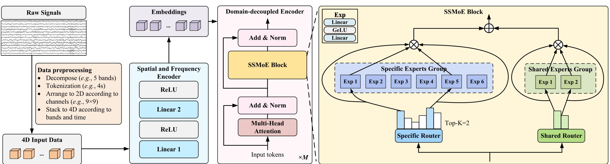

# EEGMoE: A Domain-Decoupled Mixture-of-Experts Model for Self-Supervised EEG Representation Learning

> **IEEE TNNLS vol. 37 no. 8, 2026** · 中科院自动化所 —— 与 LUNA 同日精读的姊妹篇：LUNA 主张把拓扑差异**抹平**，EEGMoE 主张把任务/数据集域差异**解耦保留**——通道异构问题的两条相反哲学。

**作者**：Xuange Gao, Danli Wang, Yanyan Zhao（State Key Laboratory of Multimodal Artificial Intelligence Systems, CASIA）

!!! abstract "TL;DR"
    - 动机：现有自监督预训练**只统一数据格式、不解耦域**，多任务联合训练存在梯度冲突（论文用三个任务的梯度方向可视化实证）
    - 方法：Transformer 域解耦编码器 + **SSMoE 块**——Specific 专家组 Top-K 路由学域特定表征，Shared 专家组软路由学域共享表征，输出相加
    - 规模现实：9 个数据集 / 3 类任务（情绪 ER、运动想象 MI、心理负荷 MWL），6 个预训练 + 3 个 LOSO 微调；**总参数仅 1.68M、激活 0.89M**
    - 结果：DEAP-V/A 59.40/62.73、BCIC4-2a 47.92、STEW 72.41，全面超过复现的 EEGNet/TSception/EEG-Conformer/LGGNet/BIOT/LaBraM
    - 可解释性是亮点：专家激活分析显示 ER 偏好专家 1/3/5、MI 偏好 1/4/6、MWL 偏好 2——**解耦确实发生了**

## 1 问题定位：统一格式 ≠ 学好表征

任务专用 EEG 模型（DEAP 上调好的情绪模型换到 MI 就失效）泛化受限，这已是共识；近年的回应是大规模自监督预训练——LaBraM、BIOT、DMAE-EEG 等把不同数据集**统一成同一格式**喂给一个模型。EEGMoE 对这条路线的批评是：**统一格式只处理了"怎么喂"，没处理"喂进去之后域与域打架"的问题**。

论文的实证很直观（Fig. 1）：在经典 Transformer 上对 DEAP（ER）、BCIC4-2a（MI）、STEW（MWL）三个任务交替做自监督预训练，把每步梯度更新方向投影到 2-D 参数空间——ER 把参数往右下拉、MI 往左上拉、MWL 往右上拉。**异质域的梯度冲突是真实存在的**，而同质参数硬吃异构数据的后果是域特定细节被抹掉。

对 EEG 里已有的 MoE 工作，论文的批评分三类：IDMMOE、Seizure-MoE 用**全部专家加权求和**（丧失 MoE"选择性激活"的核心优势）；MoGE 是单任务有监督特征提取器；EEGMamba 虽有 MoE 但靠**任务 token 引导专家选择**、面向有监督多任务兼容，而非自监督的细粒度域解耦。EEGMoE 自称是**首个用 MoE 做解耦式 EEG 表征学习**的工作。

## 2 方法

### 2.1 数据预处理：4-D 脑地图输入

原始信号切 Ts 秒不重叠片段 → 每段分解为 **5 个频带**（δ 1–4Hz、θ 4–8Hz、α 8–14Hz、β 14–31Hz、γ 31–45Hz）→ 每个频带按电极的头皮位置摆成 **2-D 脑地图**（高斯平滑/z-score 消除突变）→ 沿频带堆成 3-D → 按时间堆成 4-D：X ∈ R^{(T×Sr)×B×H×W}。一个空间与频率编码器（两层 MLP，隐藏 64→128）沿通道和频带维度聚合，得到 embedding Z。注意这一步顺带解决了**跨数据集 montage 不一致**——所有数据集都被映射到统一的 2-D 电极网格上。

### 2.2 SSMoE 块：Specific + Shared 双专家组

域解耦编码器的 Transformer 层中，FFN 被替换为 SSMoE 块，由两部分相加：

**Specific MoE（Top-K 硬路由 → 域特定）**：E 个专家（每个是两层 MLP + GELU），路由器按 token 计算激活概率后只选 Top-K 个：

\[ g_x = W_e \cdot x, \qquad p_i(x) = \frac{\exp(g_{x_i})}{\sum_{j=1}^{|E|} \exp(g_{x_j})}, \qquad \mathrm{SpecMoE}(x) = \sum_{i \in \mathrm{TopK}} p_i(x)\, e_i(x) \]

**Shared MoE（软路由 → 域共享）**：F 个固定专家**无论输入是什么都全部参与**，保证共性表征不被路由丢弃：

\[ \mathrm{ShareMoE}(x) = \sum_{i \in F} p_i(x)\, f_i(x) \]

**SSMoE(x) = SpecMoE(x) + ShareMoE(x)**——简单相加。直觉分工：不同 token 按域挑选不同专家组合（特性），同一组共享专家对所有数据一视同仁地学习（共性）。

### 2.3 两阶段训练

**Stage 1 自监督预训练**：随机掩码 embedding，SSMoE 重构被掩表示，L1 重构损失 + **负载均衡辅助损失**（防 Top-K 路由把 token 都塞给少数过载专家）：

\[ \mathcal{L}_{\mathrm{pretrain}} = \mathcal{L}_1 + \alpha \mathcal{L}_{\mathrm{aux}}, \qquad \alpha = 1 \times 10^{-4} \]

**Stage 2 有监督微调**：继承预训练的域解耦编码器，接**单层线性分类头**，交叉熵微调。

## 3 实验设置

9 个数据集、3 类任务，**6 个用于预训练、3 个用于微调验证**（LOSO 逐被试交叉验证，A800-80G）：

| 任务 | 预训练数据 | 微调/验证数据 |
|---|---|---|
| 情绪识别 ER | DREAMER（22.9h）、SEED（45h）、MAHNOB-HCI（12.2h） | DEAP（21.3h，valence/arousal 二分类 ×2） |
| 运动想象 MI | EEGMMIDB（47.2h）、BCIC IV-1（8.2h） | BCIC4-2a（5.8h，四分类） |
| 心理负荷 MWL | EEGMat（6h） | STEW（3.8h，三分类） |

**注意预训练总量只有约 142 小时**——"large-scale" 在这里是相对这 9 个小数据集而言，与 LaBraM 的 2500h 不是一回事。

## 4 结果

| 基准 | EEGMoE | 专用 SOTA 对照（论文口径） | 复现的自监督基线 |
|---|---|---|---|
| DEAP-V（ACC%） | **59.40 ± 7.10** | EEGFuseNet 56.44（+2.96） | EEGNet 57.18 / BIOT 53.35 / LaBraM 56.83 |
| DEAP-A（ACC%） | **62.73 ± 11.39** | EEGFuseNet 58.55（+4.18） | EEGNet 61.33 / BIOT 60.88 / LaBraM 58.72 |
| BCIC4-2a（ACC%） | **47.92 ± 11.53** | DeepCNN 41.91（+6.01） | EEGNet 45.66 / Seizure-MoE 46.23 / BIOT 41.10 / LaBraM 29.59 |
| STEW（ACC%） | **72.41 ± 18.99** | STEW 模型 69.20（+3.21） | LGGNet 71.85 / BIOT 69.70 / LaBraM 52.49 |

（注：论文的对照口径是与 EEGFuseNet/DeepCNN/STEW 模型三个专用 SOTA 比；DEAP-A 表内另有 TAS-Net 60.51 高于 EEGFuseNet，故 62.73 对全表最强的领先幅度小于 4.18。）

对自监督同行的优势最有信息量：**LaBraM 在 BCIC4-2a 上复现只有 29.59**。作者的归因值得记住——BIOT/LaBraM 的预训练语料以癫痫临床数据为主，与下游认知任务差异过大，域失配拖垮了迁移。

**消融**（avg 为四基准平均 ACC）：

- **预训练有效**：从零训练 59.25 vs 继承预训练 60.62；
- **两组专家都不可少**（总专家数固定为 4 排除参数量干扰）：去掉 Specific 组 59.73、去掉 Shared 组 58.18、默认 Top-K 2 + Shared 2 为 60.62；
- **SSMoE 架构本身有效**：与"激活参数等价"模型（0.89M，59.73）和"总参数等价"模型（1.68M，58.91）比，EEGMoE（总 1.68M/激活 0.89M，60.62）以相当或更低的计算量胜出——收益来自域解耦而非参数量；
- **专家数量**：候选 6 / Top-K 2 / Shared 2 最优；Top-K=2 即够（每个 token 组合少数域专家即可），Shared 多于 1 个普遍有益；
- **预训练目标很鲁棒**：L1（60.62）> 相对定位对比 RP（60.10）> L2（59.66）> 时序打乱 TS（59.33）> Cosine（58.33），差异不大——说明收益来自架构对多种预训练范式的兼容性；
- **融合方式**：简单相加（60.62）> 注意力融合（57.15）> 门控融合（56.46）——复杂融合反而有害；
- **掩码率**：0.4 最优，0.2→0.8 呈倒 U 型（太低训练不足，太高重构太难）。

**可视化（最有说服力的证据）**：Fig. 5 显示 ER 偏好激活专家 1/3/5、MI 偏好 1/4/6（少用 3/5）、MWL 偏好专家 2（少用 1）；Fig. 6 反向看每个专家的"业务构成"——专家 1/3/5 主要处理 ER、专家 2/4 主要处理 MWL、专家 6 主要处理 MI。两个视角互相印证：**路由真的把任务分配给了不同的专家**。

## 架构图

*Figure 2 · SSMoE 块细节：Specific Router 按 token 选 Top-K=2 个特定专家，Shared Router 让 2 个共享专家对所有 token 全程参与*

## 要点速览
!!! abstract "TL;DR"
    - SSMoE = Top-K 硬路由（域特性）+ 软路由（域共性），相加融合；负载均衡损失 α=1e-4
    - 1.68M 总参数 / 0.89M 激活参数——MoE 在这里不是用来 scale，是用来**管理异构性**
    - 四基准全面领先，其中对自监督同行的差距最大（LaBraM 复现 BCIC4-2a 仅 29.59）
    - 专家-任务分工可视化给出解耦成功的直接证据
    - 相加融合 > 门控/注意力融合；L1 重构 + mask 0.4；架构对预训练目标不敏感

## 与其他论文的关系

| 论文 / 工作 | 关系说明 |
|---|---|
| LUNA（本站同期笔记） | **哲学相反的姊妹篇**：EEGMoE 把域差异当"信号"解耦保留（MoE 分工），LUNA 把拓扑差异当"噪声"统一抹平（query 瓶颈）；且一个作用于任务/数据集轴，一个作用于电极几何轴 |
| EEGMamba | 都在 EEG 用 MoE：EEGMamba 靠任务 token 引导专家选择、面向**有监督多任务兼容**，EEGMoE 做**自监督细粒度域解耦**（差异在特征层） |
| LaBraM / BIOT | 被反超的对照组：癫痫域预训练 → 认知任务下游的域失配是它们复现成绩差的主因（论文归因） |
| IDMMOE / Seizure-MoE | 早期 EEG-MoE：全专家加权求和，没有选择性路由 |
| NeuroLM | 同为"多任务统一"但路线不同：NeuroLM 把 EEG 变成 LLM 的外语用指令微调；EEGMoE 在表征层用专家分工 |
| [通道异构专题](../../topics/spatial.md) | 本篇是"第五种解法"：不统一格式（LaBraM）、不绑定拓扑（EEGPT）、也不抹平（LUNA），而是**解耦路由** |

## 个人思考

- **参数量是最好的清醒剂**：1.68M 总参数/0.89M 激活——MoE 在 EEG 的价值压根不在 scale（那是 NLP 千亿参数的游戏），而在**用条件计算管理异构性**。这也解释了为什么 total-equivalent 模型（1.68M 稠密）反而比 EEGMoE 差：同样的参数量，解耦路由的"分工先验"本身就是收益；
- **"large-scale" 这个词要打折看**：预训练语料约 142 小时、9 个数据集全是小样本认知任务数据集。这更像一次严肃的多域联合训练研究，而非 NeurIPS 意义上的基础模型工作——它的可扩展性（换更多域、更多数据）恰恰是 MoE 路线的理论优势，但论文没验证；
- **4-D 脑地图输入是个隐藏的大决定**：把波形离散化到 2D 电极网格 + 5 频带，等于放弃原始波形的相位/形态细节（对比 JET/TFM 的 raw/时频路线），换来的是**任何 montage 都能摆进同一张网格**。这个取舍和 LUNA 的 query 统一异曲同工——都是"牺牲信号细节换拓扑统一"，只是实现位置不同（输入端 vs 编码器内）；
- **掩码的是 embedding 而非原始信号**：预训练目标是重构空间/频率编码器输出的 embedding，不是重建波形。这与 CBraMod（重构 raw patch）形成对比——重构 embedding 更容易（信息已压缩），但学到的动态也受限于编码器的表达能力；
- **DEAP 上 STD 高达 7–11 个百分点**（LOSO 逐被试波动大），和基线同量级——跨被试方差这个 EEG 老大难并没有被 MoE 化解，域解耦按数据集/任务分工，但"被试内差异"这层域没有被显式建模。IDMMOE 按被试分配子空间的思路其实可以叠上来。

## 自问自答

??? question "Q1 · 为什么 Top-K 路由对应「域特定」、软路由对应「域共享」？这个对应关系是设计出来的还是学出来的？"

    是结构性设计：Top-K 让每个 token 只见少数专家——不同域的 token 自然聚到不同专家组合，形成分工（可视化证实）；软路由强制所有专家对所有 token 负责——任何单个专家都必须学到跨域共性，否则在自己不见的域上掉链子。但注意：**哪个专家管哪个域是学出来的**，设计只保证"存在分工的机制"。

??? question "Q2 · 为什么相加融合反而比门控/注意力融合好？"

    论文没有给机理证明，只给结果（60.62 vs 57.15/56.46）。一个合理猜测：门控和注意力融合引入了额外的可学习参数来决定"特性和共性怎么混合"，而混合权重本身也要在多域数据上训练——小数据下这些额外自由度更容易学到域偏置；相加把混合问题留给下游微调的注意力层，预训练阶段保持解耦的纯粹性。

??? question "Q3 · 预训练只有约 142 小时，凭什么和 2500 小时的 LaBraM 比？"

    硬比规模确实比不了，但注意两点：① 比较是公平的——基线也在相同的 3 个下游任务上微调，LaBraM 的癫痫域语料在这些认知任务上不占便宜反而吃亏（BCIC4-2a 复现 29.59）；② 域邻近性可能比数据量更重要：EEGMoE 的 6 个预训练数据集与下游任务同属认知 EEG 域（情绪/MI/MWL），分布距离近。这正呼应了 RF-GPT 笔记里的观察——预训练语料与下游的域距离是迁移成败的第一变量。

??? question "Q4 · 这套 MoE 思路对生成式模型（如 JET）适用吗？"

    论文只做了判别式验证，但机制上可迁移：生成模型同样面临"不同病理模式的动态特性冲突"（发作 vs 背景 vs 睡眠纺锤波的频谱结构差异极大）。把 SSMoE 放进去噪/流匹配骨干的 FFN 位置，让不同专家分管不同信号模式、共享专家管普适动态，是顺理成章的延伸——目前站内已读的生成工作（JET/EEG-GAN）都没做这一步。

!!! abstract "复现速查卡"
    - **代码**：论文声明 "code and model will be released"，精读时未见公开仓库链接
    - **模型**：空间/频率编码器 MLP hidden 64→128；域解耦编码器 hidden 512、注意力头 4、Top-K 2、Shared 专家 2、掩码率 0.4；总参数 1.68M / 激活 0.89M
    - **训练**：AdamW；预训练 lr 1e-4、5 epoch、warmup 0.05、batch 64、负载均衡权重 1e-4；微调 lr 1e-3、batch 128、DEAP 35 / BCIC4-2a 50 / STEW 15 epoch；线性分类头 + 交叉熵
    - **数据**：预训练 6 数据集约 142h；微调 DEAP / BCIC4-2a / STEW，LOSO 交叉验证；4-D 输入（时间 × 5 频带 × 9×9 脑地图）
    - **算力参考**：NVIDIA A800-SXM4-80G；模型极小，消费级单卡可复现

---

**相关阅读**

:material-arrow-right: [LUNA（拓扑统一路线，对照阅读）](0924-luna.md) ｜ :material-arrow-left: [JET（流匹配生成）](0923-jet.md) ｜ :material-grid-large: [通道异构的四种解法 → 本篇是第五种](../../topics/spatial.md) ｜ :material-chart-box: [十篇方法对比](../../comparison.md) ｜ :material-home: [首页](../../index.md)
