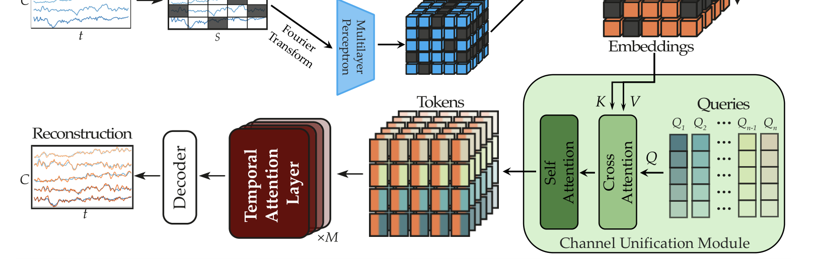

# LUNA: Efficient and Topology-Agnostic Foundation Model for EEG Signal Analysis

> **NeurIPS 2025** · ETH Zürich —— 与 EEGMoE 对照阅读：EEGMoE 解耦"域差异"，LUNA 抹平"拓扑差异"。这是站内已读工作里**第一个把"跨 montage 泛化"和"计算效率"当主贡献**的基础模型。

**作者**：Berkay Döner, Thorir Mar Ingolfsson, Luca Benini, Yawei Li（Integrated Systems Laboratory, ETH Zürich）

!!! abstract "TL;DR"
    - 痛点有数据：MI 解码器从 PhysioNet 迁到 KU **最多**掉 **14 个百分点**；BIOT/MMM 在 SEED↔DEAP 蒙特间掉 13–15pp；只保留公共电极的方案要丢掉最多 **80%** 的数据
    - 核心机制：**Channel-Unification Module**——Q 个学习 query 对 C 个通道的 patch 特征做交叉注意力，压进固定隐空间（置换不变 → 拓扑无关）；之后时间注意力只在这个 Q×E 的隐空间上做
    - 复杂度：对通道数**线性**（vs LaBraM 的 O((S·C)²)、CBraMod 的 O(max(S²,C²))）；论文总括声称对全注意力基线 FLOPs 降 **300×**、显存省最多 **10×**（对 BIOT 这一线性注意力基线的实测对比：8000 通道 4156 GFLOPs vs LUNA-Base 23，约 180×）
    - 预训练 21,900h（TUEG+Siena，3 种拓扑）；TUAR AUROC **0.921**、TUSL **0.802** 双 SOTA；TUAB 81.57%（略低于 LaBraM-Huge/CBraMod）；未见 62 通道 SEED-V 落后 CBraMod 2–3pp（论文口径，按其表格实算约 1.9pp；作者坦承对未见拓扑敏感）
    - 统计实践罕见地严谨：消融差异配对 t 检验（p=0.2136 不显著），用「实践优势」而非「统计显著」措辞

## 1 问题定位：拓扑异构是 EEG 基础模型的地基问题

每个公开 EEG 数据集自定义电极布局，模型换 montage 就崩。论文给的三组数字把问题钉死：运动想象解码器跨数据集最多掉 14pp；SOTA 情绪模型（BIOT、MMM）在 SEED 与 DEAP 蒙特之间掉 13–15pp；sEEG 的被试间迁移在无显式空间编码时接近随机。

现有方案的取舍都不彻底：**每个 montage 训专用模型**（放弃统一）；**只保留公共电极**（丢掉最多 80% 数据）；**通道+时间展平成超长序列**（O((S·C)²) 复杂度，高密度帽直接爆显存）。论文要的是**单一、montage 无关、对电极数高效扩展**的架构。

## 2 方法

### 2.1 Patch 特征提取（双路 + 3D 空间编码）

原始 EEG x ∈ R^{B×C×T} 每通道切 S = T/P 个不重叠 patch，两路并行嵌入后求和：

- **时域路**：1D 卷积网络（GroupNorm + GELU），与 LaBraM/CBraMod 同款；
- **频域路**：每个 patch 做 FFT，幅值与相位经 MLP 投影；
- **通道位置编码**：对归一化的 **3D 电极坐标**做 NeRF 式正弦编码再过 MLP，加到特征上。注意这是比 10–20 系统离散 embedding 更连续优雅的空间先验——任意位置都有定义。

预训练时随机掩码部分 token（可学习 mask embedding）。

### 2.2 Channel-Unification Module：拓扑无关的核心

这是全文的关键创新，思想来自 Set Transformer 的 inducing points 与 PerceiverIO 的隐空间瓶颈：

- **Q 个学习 query** Q_learn ∈ R^{Q×E}（**无 batch 维**的共享参数，正交初始化），对每个 (batch, patch) 实例的 C 个通道特征做交叉注意力（query→Q，通道特征→K,V）：

\[ \mathbf{A}_{\mathrm{out}} = \mathrm{MultiHeadAttention}(\tilde{\mathbf{Q}}, \mathbf{X}', \mathbf{X}') \in \mathbb{R}^{(B \cdot S) \times Q \times E} \]

- 再经 FFN + L 层 Transformer（在 Q 维上做自注意力）得到统一表示 X_unified ∈ R^{(B·S)×Q×E}。

两个性质：**置换不变**（打乱通道顺序输出不变 → 拓扑无关），**对 C 线性**（交叉注意力只算 Q×C 的注意力图）。每个时间 token 从此封装的是"该时刻所有通道的聚合信息"，而非单通道片段。

### 2.3 Patch-wise 时间编码器 + 双解码器

统一表示重排为 X'_unified ∈ R^{B×S×(Q·E)}，用带 **RoPE** 的 Transformer 块建模时间依赖——**有效序列长度从 S·C 降到 S**，这是效率的第二个来源（第一个是 Q ≪ C）。

解码器按任务分两种：**重构头**（预训练）用 C 个**按通道标签索引**的学习 query 交叉注意力还原各通道 patch 值（电极有重叠的数据集可复用）；**分类头**（微调）用单个聚合 query 生成池化表示过 MLP。

### 2.4 训练目标：重构 + query 特化

Smooth L1 同时作用于被掩与可见 patch（可见部分系数 α=0.05——让可见部分也承担弱约束）；外加 **query 特化损失**：对通道统一模块的 query-channel 亲和矩阵，惩罚其非对角元素相似度，促使各 query 关注不同空间区域：

\[ \mathcal{L}_{\mathrm{spec}} = \frac{\lambda_{\mathrm{spec}}}{B' \cdot Q \cdot (Q-1)} \sum_{b'} \sum_{i} \sum_{j \neq i} \big( (\mathbf{A}_{\mathrm{affinity}} \mathbf{A}_{\mathrm{affinity}}^{\top})_{b',i,j} \big)^2 \]

**预训练规模**：TUEG + Siena 共 **21,900 小时**原始 EEG，覆盖 20/22 通道双极 + 29 通道单极共 3 种拓扑，mask 率 0.5。三个模型规格：Base 7M（8 层/Q=4/E=64/hidden 256）、Large 43M（10 层/Q=6/96/576）、Huge 311.4M（24 层/Q=8/128/1024）。

## 3 复杂度账本

| 方法 | 瓶颈复杂度 |
|---|---|
| **LUNA**（隐空间注意力） | O(B·S²·Q·E) 或 O(B·S·Q·C·E) |
| 全注意力（LaBraM） | O(B·S²·C²·E) |
| 交替注意力（CBraMod，patch 维） | O(B·S²·C·E) |
| 交替注意力（CBraMod，通道维） | O(B·S·C²·E) |

效率曲线（附录 Table 9/10）：patch 数 4000 时 BIOT 2286 GFLOPs vs LUNA-Base 768；**通道数 8000 时 BIOT 4156 GFLOPs / 12.3GB vs LUNA-Base 23 GFLOPs / 2GB**。结论：通道数增加时 LUNA 计算近乎恒定，且 LUNA-Base（7M 参数、16-bit 约 14MB）能塞进可穿戴 SoC 的实时预算——这是同组（ETH 低功耗组）的看家视角。

## 4 结果

**临床 TUH 系**（预训练语料严格排除下游被试与记录）：

| 基准 | LUNA-Huge | 对照 |
|---|---|---|
| TUAB（异常检测） | Bal Acc 81.57% / AUROC 0.8957 | **LaBraM-Huge 82.58% / 0.9162**、CBraMod 82.49% / 0.9156 —— LUNA 落后约 1pp |
| TUAR（伪迹检测，5 类） | **AUROC 0.921 ± 0.011** | 超 FEMBA-Large 0.915，SOTA |
| TUSL（慢波分类，4 类） | **AUROC 0.802 ± 0.005** | 全场最高（FEMBA-Base 0.731） |

**SEED-V（未见过的 62 通道拓扑）**：LUNA-Huge Bal Acc 0.3900，**落后 CBraMod（0.4091）2–3pp**（论文口径；按其 Table 3 实算约 1.9pp）。作者诚实归因：对未见通道拓扑敏感，可能源于预训练学到的位置编码约束；且 Base→Large 有正向 scaling，Large→Huge 点估计不再提升（0.3918→0.3900，差异在种子方差内——此句为从 Table 3 得出的推断，论文未评价）。

**消融**（TUAB/TUAR）：

- **学习 query vs 固定空间区域**（MMM 式）：AUROC 变化仅 -0.004~-0.006，在种子方差内——论文明确强调学习 query 的价值是**实践优势**（数据驱动、无需解剖先验）而非统计显著的指标增益；
- **去掉 query 特化损失**：AUROC 降 0.003~0.007（论文正文记 -0.003~-0.006，其 Table 4 与 Table 13 给 TUAR 为 -0.007）；配对 t 检验 **p=0.2136 不显著**（该检验仅针对 TUAR AUROC 这一次比较）；保留它的理由是正则作用——促使 query 学成多样、非冗余的空间滤波器（可视化显示去掉后**两个** query 退化为粗粒度左右侧化模式、**其余** query 宽泛且互相重叠）；
- **去掉频域特征**：掉得最多——AUROC 至 -0.011、AUC-PR 至 -0.012（TUAB；论文正文表述为 "up to -0.012 AUROC"，与其自身表格略有出入）——时频信息再次被证明是 EEG 表征的关键补全；
- **Q×E 权衡**：固定 Q·E=256 预算下，平衡配置 4×64 最好，16×16（query 多维度小）明显退化。

## 架构图

*Figure 1 · Channel-Unification Module：Q 个学习 query 对 C 通道特征做交叉注意力，时间注意力只在固定隐空间上进行*

## 要点速览
!!! abstract "TL;DR"
    - 学习 query + 交叉注意力 = 可微分的"通道压缩器"：任意拓扑 → 固定 Q×E 隐空间，置换不变
    - 时间序列长度从 S·C 降到 S，通道复杂度从平方到线性——8000 通道时 FLOPs 仅为 BIOT 的 1/180
    - TUAR/TUSL 双 SOTA；TUAB 略逊 LaBraM/CBraMod 约 1pp；未见拓扑 SEED-V 落后 2–3pp——效率与容量的真实 trade-off
    - 消融统计实践严谨（t 检验、种子方差、"实践优势"措辞）；频域特征是最不可去的组件
    - 代码开源（pulp-bio/biofoundation）；LUNA-Base 7M/14MB 面向可穿戴边缘部署

## 与其他论文的关系

| 论文 / 工作 | 关系说明 |
|---|---|
| EEGMoE（本站同期笔记） | **对照哲学**：LUNA 把拓扑差异当噪声抹平（query 瓶颈），EEGMoE 把域差异当信号解耦（MoE 分工）——作用轴不同（电极几何 vs 任务/数据集），可叠加 |
| LaBraM / CBraMod | 精度上限对照组：展平/交替注意力的容量优势在 TUAB 上兑现约 1pp，但通道复杂度平方——高密度场景不可行 |
| BIOT | 效率路线前作：BIOT 展平后用线性注意力（其原文为 Linformer 式低秩投影），LUNA 先统一通道再全注意力；论文正文 4.3 把 BIOT 作为效率基线，附录 Table 9/10 给出详细对比——8000 通道时 LUNA-Base FLOPs 约为 BIOT 的 1/180 |
| MMM | 显式拓扑映射前作：预定义解剖区域 + 手工 DE 特征；LUNA 用学习 query + 原始信号端到端（消融显示两者指标相当，但学习 query 免解剖先验） |
| Set Transformer / PerceiverIO | 机制来源：inducing points / 隐空间瓶颈，LUNA 加了 3D 电极坐标编码与两种任务解码头（重构/分类） |
| Brant / GNN 系 | 被绕开的路线：固定拓扑空间编码器 / 预定义邻接图，都需要为动态拓扑打补丁 |
| [通道异构专题](../../topics/spatial.md) | 第六种解法：**先统一再建模**——与 JET 的"无空间结构"、EEGPT 的"固定 58 通道表"都不同 |

## 个人思考

- **与 EEGMoE 连读极有收获**：两篇对"异构性"的态度完全相反却都成立——EEGMoE 认为任务/数据集域差异是需要**保留的信号**（专家分工），LUNA 认为电极几何差异是需要**抹掉的噪声**（query 瓶颈）。合起来其实给出了一个二维地图：任务轴用解耦管理、几何轴用统一抹平。一个自然的组合实验是 LUNA 的统一隐空间 + EEGMoE 的 SSMoE 块；
- **TUAB 上那 1pp 是"瓶颈税"**：Q 个 query 是信息瓶颈，高密度通道的信息被有损压缩，因此上限略低于全注意力的 LaBraM/CBraMod。论文的 Q×E 消融（16×16 明显退化）证实瓶颈容量确实有限。这不是缺陷而是定价——问题是**哪些任务愿意为 300× 效率付 1pp**：高密度研究级 EEG、长程监测、可穿戴，都是愿意的；
- **统计实践是全站已读论文里最严谨的**：报告配对 t 检验并承认 p=0.2136 不显著、把学习 query 的优势明确表述为"实践性而非统计性"、给出 ±0.01 AUROC 的实用等价带。对比之下多数 EEG FM 论文把种子方差内的差异包装成 SOTA——这个措辞标准值得本站的 benchmark 表引用时警惕；
- **频域特征消融掉得最多（AUROC 至 -0.011）**又一次印证时频信息的价值——与 TFM（时频 motif 词表）、SleepGPT（时频双流）的结论三方互证。有趣的是 LUNA 只在 patch embedding 里加了 FFT 幅相这一小块，性价比极高；
- **位置编码是未见拓扑的阿喀琉斯之踵**：SEED-V 的失利被归因于预训练学到的位置编码绑定了训练拓扑。这提示"连续 3D 坐标编码"（NeRF 式）仍不够泛化——预训练拓扑只覆盖 3 种布局，坐标空间的采样太稀疏。未来做多数据集预训练 + 随机通道 dropout（论文展望）是对的；
- **对我的项目**：LUNA-Base（7M、14MB、线性复杂度）是"可穿戴低功耗 EEG FM"的现成参考配置；其"先统一通道再时间建模"的结构与 eeg2text-lite 的单通道设计不冲突——若扩展到多通道可穿戴（如耳 EEG 多触点），LUNA 的统一模块可直接借用。

## 自问自答

??? question "Q1 · 为什么先统一通道、再做时间注意力，而不是反过来（先时间再统一）？"

    效率的乘法结构决定的：统一在前，时间注意力只作用于 Q×E 的隐空间（序列长 S）；若反过来，每个通道先做完整时间编码（C 倍计算），统一阶段还要处理 S·C×C 的交叉注意力。统一在前还让"每个时间 token 是全通道聚合"成为时间建模的输入归纳偏置——模型从第一层就在学跨通道整合后的动态。代价是空间压缩不可逆，重构头必须从 Q 个 query 里恢复 C 个通道的细节（这也是它需要按通道索引的学习解码 query 的原因）。

??? question "Q2 · Q 个 query 是不是信息瓶颈？多大合适？"

    是，而且是设计出来的瓶颈。Q×E 消融显示：固定预算下平衡配置最好（4×64），query 太多维度太小（16×16）反而差——q 数量超过可分辨的空间模式后只是冗余切分，维度不足则每个 query 表达力不够。Base/Large/Huge 依次用 Q=4/6/8 也说明：**Q 应随模型容量温和增长**，而不是堆大。

??? question "Q3 · SEED-V 上为什么落后 CBraMod？能修吗？"

    论文自认：SEED-V 的 62 通道拓扑在预训练中未见，位置编码绑定了训练时的三种布局。可行的修复方向论文自己也点了：多数据集预训练扩充拓扑覆盖、随机通道 dropout 增强鲁棒、混合学习/几何嵌入。注意 CBraMod 也未必"泛化更好"——它的交替注意力对输入形状更宽容，但代价是 O(C²) 复杂度，在 62 通道小数据集上付得起，在 256 通道长程监测上付不起。

??? question "Q4 · 可见（未掩码）patch 为什么也参与损失？"

    重构损失对可见部分以小系数（α=0.05）加权。直觉是：掩码重构训练信号集中在被掩区域，但通道统一模块对**所有** token 做压缩——如果可见 patch 完全不管，隐空间可能对可见内容失真，下游微调（通常不用掩码）就会吃亏。小系数既约束隐空间保真，又不喧宾夺主。

!!! abstract "复现速查卡"
    - **代码**：[github.com/pulp-bio/biofoundation](https://github.com/pulp-bio/biofoundation)（官方开源）
    - **规格**：Base 7M（8 层/Q=4/query 64/hidden 256/MLP 1024/8 头）、Large 43M（10 层/Q=6/96/576/2304/12 头）、Huge 311.4M（24 层/Q=8/128/1024/4096/16 头）；patch 长 40 时间戳
    - **预训练**：TUEG+Siena 21,900h（3 拓扑）；AdamW lr 1.25e-4 cosine（min 2.5e-7）、β(0.9,0.98)、wd 0.05；batch 总 8160（Base）/11520（Huge）；60 epoch、warmup 10；Smooth-L1，mask 0.5，可见系数 0.05，query 特化系数 0.8；bf16-mixed；8×A100 约 1 天（Huge 16 卡）
    - **微调**：lr 1e-4、50 epoch、早停 patience 10、warmup 5、layer-wise lr decay 0.5(B)/0.8(L/H)、drop path 0.1(B/L)/0.2(H)、标签平滑 0.1（多分类）
    - **预处理**：0.1–75Hz 带通 + 50/60Hz 陷波 + 256Hz 重采样；TUEG/TUAB/TUAR/TUSL 双极（纵联差分，论文附录 A.7 给全电极对）、Siena/SEED-V 单极；逐通道 z-score
    - **边缘参考**：LUNA-Base 16-bit 约 14MB，GFLOPs 在可穿戴 SoC 实时预算内

---

**相关阅读**

:material-arrow-left: [EEGMoE（域解耦路线，对照阅读）](0924-eegmoe.md) ｜ :material-heart-pulse: [BIOT（效率前作对照）](0918-biot.md) ｜ :material-grid-large: [通道异构的解法 → 本篇是第六种](../../topics/spatial.md) ｜ :material-vector-polyline: [Attention 替代方案（效率视角）](../../basics/attention-alternatives.md) ｜ :material-home: [首页](../../index.md)
