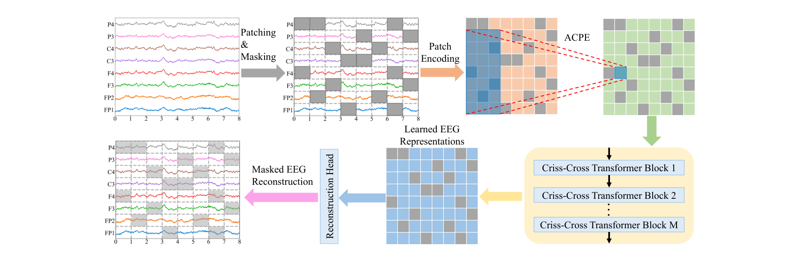
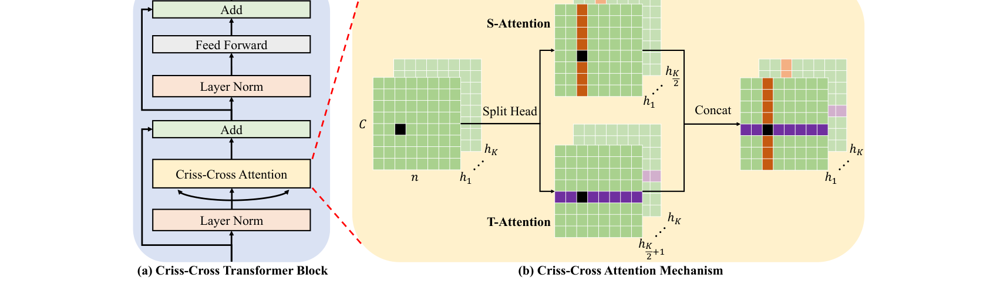

# CBraMod: A Criss-Cross Brain Foundation Model for EEG Decoding

> **ICLR 2025** · 浙江大学 + 阿里巴巴 —— EEG-FM-Compass（NSR 2026）12 模型统一 benchmark 的**综合第 1 名**（平均秩 6.56，防泄漏复评仍第 1）。站内第一篇「把注意力结构本身当 EEG 先验」的论文：不换数据、不换 tokenizer，只改注意力怎么数 patch。

**作者**：Jiquan Wang, Sha Zhao\*, Zhiling Luo（阿里）, Yangxuan Zhou, Haiteng Jiang, Shijian Li, Tao Li, Gang Pan\*（浙大大脑机智能重点实验室；\*通讯）

!!! abstract "TL;DR"
    - 两个动机：① **全注意力一锅炖**忽略 EEG 特有的异构依赖——同通道/同时刻的 patch 依赖更强，而图像只有空间依赖，ViT 式展平把两种轴混在一起；② **电极编号式绝对位置编码**把「通道 ↔ 电极位置」焊死，换参考方案（耳参考/平均参考/双极）就失效
    - 解法一：**criss-cross transformer**——8 头注意力劈成两半，4 头 S-Attention 只在「同一时刻的全部通道」内做，4 头 T-Attention 只在「同一通道的全部时间段」内做，两路并行，复杂度从 O((Cn)²) 降到 O(Cn² + nC²)
    - 解法二：**ACPE 非对称条件位置编码**——1 层 2D depthwise 卷积从 patch 邻域动态生成位置编码，卷积核 (19,7) 长边管空间（长程）、短边管时间（短程），任意通道格式都有定义
    - 预训练：TUEG 清洗后 **1,109,545 个 30 秒样本（>9000h，LaBraM 的 3.5 倍）**，MAE 式掩码重构，mask 50%，全零 mask token，4.0M 参数，4×A5000 五天
    - 结果：**10 个下游 BCI 任务、12 个公开数据集全部 SOTA**（附录脚注：把审稿人建议的 BCIC-IV-2a 算上实评 13 个数据集）——TUEV 上 4.0M 打过 369M 的 LaBraM-Huge（0.6671 vs 0.6616）；TUAB 0.8289（防泄漏重训版 0.8249 仍 SOTA）；ISRUC 睡眠分期 Kappa 0.7442；附录 G 证明**架构贡献 > 预训练数据贡献**

## 1 问题定位：两处「照搬 ViT」的不合身

第一代 EEG 基础模型（BIOT/LaBraM/EEGPT 等）的通用配方是：切段 → 展平 → 全注意力，再用「电极编号 → embedding」编码通道位置。CBraMod 指出这套配方在 EEG 上有两处错配：

**异构的空间-时间依赖**。图像 patch 之间只有空间依赖，而 EEG 是「多通道 × 时间序列」的二维结构：同一通道内相邻时间段、同一时刻相邻通道之间的依赖，强于跨通道跨时间的任意两 patch。全注意力对这 C·n 个 patch 一视同仁地建模，既浪费容量又超出合适的建模范围（19 通道 × 30 秒 = 570 个 patch，已超出全注意力的舒适区）。

**通道变异性**。EEG 通道不只由电极位置决定，还受参考方案影响（耳参考、平均参考、REST、双极纵联）。LaBraM 式的「电极编号 → 绝对位置编码」假设通道和电极位置一一对应，换数据集换参考就崩。

## 2 方法

### 2.1 切段与掩码

EEG 样本 \(S \in \mathbb{R}^{C \times T}\) 按固定时间窗 \(t\) 切成 \(X \in \mathbb{R}^{C \times n \times t}\)（\(n = \lfloor T/t \rfloor\)），每通道 \(n\) 个 patch。按 Bernoulli 比例 \(r\) 随机生成掩码 \(M\)，被掩 patch 替换为全零 mask token（消融显示全零与可学习 token 无显著差异）。

### 2.2 时频双分支 patch 编码

每个 patch 过两条并行支路再相加：

- **时域支路**：3 层 1D 卷积块（Conv + GroupNorm + GELU）提局部波形特征；
- **频域支路**：对 patch 做 rFFT 得到能量向量（每维是一个频率的能量），过全连接层投影到同一维度。

\[ e_{i,j} = e^{t}_{i,j} + e^{f}_{i,j} \]

与 LUNA 的 FFT 幅相支路、TFM 的时频 motif 一脉相承——时频信息补全在 patch embedding 这一层是各家共识，且 CBraMod 的消融（附录 I）给出排序：**时域+频域 > 纯时域 > 纯频域**（频域丢失时域信息掉得更多）。

### 2.3 ACPE：非对称条件位置编码

改造自 CPVT 的 CPE（条件位置编码）：用**1 层 2D depthwise 卷积**从 patch embedding 的时空邻域动态生成位置编码，加回 embedding。非对称性体现在卷积核 (19, 7)——空间维长边编码**长程空间**位置关系，时间维短边编码**短程时间**位置关系，对应「EEG 通道少而时间步多」的结构。

与两类前代的关系：比 APE 强在**动态生成**（不焊死通道-电极对应，换蒙太奇/换参考都适用）；比 CPE 强在**非对称设计**（图像 patch 两个轴对称，EEG 不是）。消融排序：w/o PE < APE < CPE < ACPE。

### 2.4 Criss-Cross Attention：空间/时间两路并行

把 K=8 个注意力头**劈成两半**，4 头管空间、4 头管时间，在同一层并行计算：

- **S-Attention**：把 embedding 按 n 个时刻切成 n 条「空间条带」，每条条带内 C 个通道做注意力——只在**同一时刻的通道间**交互；
- **T-Attention**：同理按 C 个通道切成「时间条带」，条带内 n 个时间段做注意力——只在**同一通道的时间步间**交互。

\[ \mathrm{CrissCrossAttn}(\tilde{E}) = \mathrm{Concat}(\mathrm{head}_1, \dots, \mathrm{head}_K), \quad \mathrm{head}_k = \begin{cases} \text{S-Attention}_k(\tilde{E}) & k \le K/2 \\ \text{T-Attention}_k(\tilde{E}) & k > K/2 \end{cases} \]

backbone 共 12 层（hidden 200 / FF 800 / pre-norm），复杂度 \(O(Cn^2 + nC^2)\)——把全注意力的 \(O(C^2n^2)\) 拆成两个一维注意力的和。附录 L 的头数配比消融：4:4 最优，偏科（6:2 或 2:6）都掉分，说明**空间与时间依赖同等重要**。

### 2.5 掩码重构预训练

FC 重构头从表示还原被掩 patch，MSE 损失**只算被掩位置**（MAE 惯例）。

## 3 预训练流水线

```mermaid
flowchart LR
    A["TUEG 27,062h 原始临床 EEG<br/>69,652 记录 / 14,987 被试"] --> B["清洗：<5min 剔除<br/>掐头去尾 1min<br/>选 19 个 10-20 公共通道"]
    B --> C["0.3-75Hz 带通<br/>60Hz 陷波<br/>重采样 200Hz"]
    C --> D["切 30s 样本<br/>任意点 >100µV 整段剔除<br/>单位 100µV 归一"]
    D --> E["1,109,545 样本<br/>合计 >9000h"]
    E --> F["切段 1s/patch<br/>30s → 19×30=570 patch<br/>随机掩码 50%（全零 token）"]
    F --> G["时频双分支编码<br/>3 层 1D CNN ⊕ rFFT 能量+FC"]
    G --> H["ACPE<br/>2D depthwise conv 核 (19,7)"]
    H --> I["12 层 Criss-Cross Transformer<br/>4 头 S-Attn 并行 4 头 T-Attn"]
    I --> J["FC 重构头<br/>MSE 只算被掩 patch"]
```

关键数字：清洗环节剔掉了大量脏数据后仍剩 **>9000h**（LaBraM 预训练语料 2,534.78h 的 3.5 倍）；训练配置 AdamW lr 5e-4 / wd 5e-2 / cosine 退火 / batch 128 / 40 epoch，4×RTX A5000 约 5 天。

## 架构图

*Figure 2 · 预训练总览：左上切段+掩码，右上 ACPE 从邻域动态生成位置编码，右下 12 层 criss-cross 块，左下只重构被掩 patch*

*Figure 3 · criss-cross 注意力机制：空间条带（同一时刻跨通道）与时间条带（同一通道跨时刻）两路并行，各占一半注意力头*

## 4 结果与消融

### 4.1 主结果：10 任务 12 数据集全 SOTA

| 任务 / 数据集 | CBraMod（4.0M） | 最强基线 | 差距 |
|---|---|---|---|
| 情绪 FACED（9 类） | Kappa **0.5041** | LaBraM-Base 0.4698 | +3.4pp |
| 情绪 SEED-V（5 类，开源 16 人版） | Kappa **0.2569** | LaBraM 0.2386 | +1.8pp |
| 运动想象 PhysioNet-MI（4 类） | Kappa **0.5222** | LaBraM 0.4912 | +3.1pp |
| 运动想象 SHU-MI（2 类） | AUROC **0.6988** | BIOT 0.6609 | +3.8pp |
| 睡眠分期 ISRUC（5 类） | Kappa **0.7442** | LaBraM 0.7231 | +2.1pp |
| 癫痫检测 CHB-MIT | Bal Acc **0.7398** | LaBraM 0.7075 | +3.2pp |
| 想象语音 BCIC2020-3（5 类） | Kappa **0.4216** | LaBraM 0.3800 | +4.2pp |
| 抑郁诊断 Mumtaz2016 | Bal Acc **0.9560** | LaBraM 0.9409 | +1.5pp |
| 警觉度回归 SEED-VIG | Pearson **0.6459** | BIOT 0.5996 | +4.6pp |
| 心理压力检测 MentalArithmetic | Bal Acc **0.7256** | LaBraM 0.6909 | +3.5pp |
| 事件分类 TUEV（6 类） | Bal Acc **0.6671** | LaBraM-**Huge**(369M) 0.6616 | +0.6pp |
| 异常检测 TUAB | Bal Acc **0.8289** / AUC-PR 0.9258 | LaBraM-Huge 0.8258 / 0.9204 | +0.3pp |

两个防泄漏版本值得单独记：TUEV/TUAB 都是 TUEG 的子集，作者**剔除后重新预训练**再评——TUAB 0.8249 / TUEV 0.6659，仍然 SOTA。这是站内已读论文里少见地把「预训练包含下游数据」摆在明面上处理的（NeuroLM/LaBraM 均未做）。

### 4.2 关键消融

- **注意力机制对比**（图 4）：全注意力最差；CCNet 式 criss-cross 略好于全注意力但显著差于 CBraMod；轴向注意力好于全注意力但仍不及 CBraMod。全注意力垫底印证了 570 patch 超出建模范围；双路并行优于串行（轴向）说明两类依赖应该**同时**建模而不是排队（注：原文未直接比较轴向与 CCNet 的相对高下，两者均劣于本文方案是明确结论）；
- **位置编码对比**：w/o PE < APE < CPE < ACPE——APE 输给 CPE 说明「动态生成」比「绝对绑定」重要，CPE 输给 ACPE 说明「非对称」比「对称」重要；
- **预训练消融**（表 4）：清洗版 > 脏数据版 > 不预训练，且清洗版**方差最小**——脏数据不仅拉低均值还放大不稳定；
- **架构 vs 数据**（附录 G，全文最干净的一张牌）：把 BIOT / LaBraM 的架构搬到 CBraMod 的 9000h 语料上重训，BIOT(ours) ≈ BIOT(original)，LaBraM(ours) 仅小幅提升，而 CBraMod 全面碾压 LaBraM(ours)——**换数据没用，换架构才有用**；
- **Scaling**（附录 F）：预训练数据 1h→9000h 单调提升但 **1000h 后边际递减**；模型 0.1M→4M 持续提升，作者明确声明不外推 scaling law；
- **微调消融**（附录 J）：冻结 backbone 只训分类头**性能崩塌**（FACED Kappa 0.5041→0.2579）——CBraMod 目前**不能当 CLIP 式冻结特征提取器**，但冻结版仍好过 BIOT/LaBraM 冻结版；30% 低资源微调下优势保持（附录 K）；
- **成本**（附录 O，CHB-MIT 16ch 10s 输入）：318.9M FLOPs——比 BIOT（483M）/ LaBraM-Base（483M）省 1/3，criss-cross 是四种注意力变体里最省的；
- **可解释性**（附录 P）：Grad-CAM 地形图左右手对称、patch 相关热图呈十字形状且**深层出现非局部依赖**——分层结构让 criss-cross 之外的全局交互也能学到。

## 与其他论文的关系

| 论文 / 工作 | 关系说明 |
|---|---|
| [LaBraM](0918-labram.md) | 最主要对照：同用 TUEG 系语料，LaBraM 全注意力 + 神经码字预测，CBraMod 双路并行注意力 + 像素重构——4M 打 369M（LaBraM-Huge，TUEV/TUAB 数字引自 LaBraM 原文；其 Large/Huge 权重未开源，作者只自行微调了 LaBraM-Base） |
| [BIOT](0918-biot.md) | 另一基础模型基线：BIOT 线性注意力逐通道处理但**限 18 通道**（超出要拆多个模型），CBraMod 无此限制 |
| [EEGPT](0918-eegpt.md) | 同为掩码系但走「表示对齐 + 重构」双目标；EEGPT 固定 58 通道表，CBraMod 用 ACPE 动态编码——通道适应的两种哲学 |
| [TFM-Tokenizer](0918-tfm-tokenizer.md) | 同为 ICLR（2026 vs 2025）的掩码预训练，路线相反：TFM 单通道 + 时频 motif 离散词表，CBraMod 多通道 + 原始信号连续重构；EEG-FM-Compass 统一 benchmark 里 CBraMod 综合**第 1**、TFM **第 20**（垫底） |
| [LUNA](0924-luna.md) | 复杂度对照组：LUNA 对通道线性（O(S·C·Q)），CBraMod 是 O(Cn²+nC²)——高密度通道场景 LUNA 更优（8000 通道时 FLOPs 1/180），小通道场景 CBraMod 精度上限更高（TUAB 上 +1pp） |
| CCNet / CSWin（视觉前作） | 机制来源：CCNet 的 criss-cross 是单注意力图仿射近似，CSWin 十字窗口启发双路设计——CBraMod 把「十字交叉」从图像搬到 EEG 并论证了为什么 EEG 更需要（图像没有时间轴） |
| [JET](0923-jet.md) | 互补轴线：JET 用 FM 生成 EEG（结构先验进损失），CBraMod 用注意力结构先验做判别表征——两条「EEG 结构先验」路线分头走 |
| [EEG-FM-Compass](../../blog-2023-2026.md) | 外部裁判：12 FM × 9 数据集统一重测，CBraMod 平均秩 6.56 综合第一，防泄漏版仍第一——本文自报的 SOTA 经第三方复核成立 |

## 个人思考

- **这是「归纳偏置设计」的样板论文**。全文没有新数据、新 tokenizer、新损失，唯一做对的事是把注意力的计算图改成匹配 EEG 结构的形状——然后 4M 参数横扫 369M。附录 G（架构迁移实验）是全篇最值得学的实验设计：固定数据换架构，把「贡献归因」做成了可证伪的对照。对照 EEG-FM-Compass 的发现（top-6 FM 参数全 ≤5.8M、无 scaling law），「EEG 基础模型当下的竞争维度是结构先验而非规模」这条结论有了双重证据；
- **ACPE 是被低估的贡献**。它把 CPVT 的「位置编码当卷积副产品」思想推广到非对称双轴。对比 LUNA 的 NeRF 式 3D 坐标编码：ACPE 不需要电极坐标元数据（很多公开数据集没有），从数据里学相对位置——代价是它编码的是「邻域模式」而非绝对空间位置，跨蒙太奇时语义会漂。SEED-V 这个 62 通道未见蒙太奇上，CBraMod（0.4091）确实赢了 LUNA-Huge（0.3900），但 ACPE 学到的仍是「19 通道临床蒙太奇的邻域规律」，面对高密度或可穿戴拓扑能撑多少，论文没测——通道异构问题没有在这里终结，只是换了个表达方式；
- **「不能冻结」是个诚实的坏消息**。附录 J 显示冻结版 Kappa 从 0.50 直接掉到 0.26，说明 MAE 式重构学到的表征仍高度任务特化，通用性靠微调兑现。对我的 eeg2text-lite（预训练→LoRA→解码）路线这是个提醒：**别指望冻结提取器**，LoRA/全参数微调是必选项——好在与 EEG-FM-Compass 的微调方式结论（LoRA 介于全微调与线性探针之间）方向一致；
- **1000h 后数据边际递减值得警惕**。这给「堆数据」路线（REVE 的 61,415h、SleepGPT 的 86,335h）打了个问号：至少在 CBraMod 的架构和清洗流程下，9000h 已接近饱和。当然可能只是清洗后数据同质化（19 通道临床 EEG 单一分布）——REVE 的多数据集多样性是否突破这个饱和点，是读 REVE 时要专门验证的问题；
- **十字交叉 vs 线性注意力的取舍**写进了[通道异构专题](../../topics/spatial.md)：CBraMod 的复杂度 O(Cn² + nC²) 在 C 大时仍平方爆炸，LUNA 的隐空间瓶颈才是高密度的答案。CBraMod 自己在讨论里也承认部署门槛比非基础模型高。

## 自问自答

??? question "Q1 · 为什么 4:4 劈头？劈 6:2 会怎样？"

    附录 L 实测：6:2 和 2:6 都系统性变差（FACED Kappa：2:6 为 0.4921、6:2 为 0.4910；PhysioNet-MI Kappa：2:6 为 0.4995、6:2 为 0.5013）。结论是空间与时间依赖在 EEG 表征里**同等重要**，没有先验理由偏科。这也反过来给「EEG 是时间序列还是空间拓扑」的争论一个经验答案：两个轴的信息量相当。

??? question "Q2 · S-Attention 和 T-Attention 并行，信息怎么流通的？"

    靠层叠 + 头拼接：每层内 S/T 两路的输出 concat 后过 FFN 进下一层，下一层再做新一轮 S/T。单层内空间信息和时间信息不直接交互（各自条带内注意），但**层的堆叠让交互自然发生**——附录 P.3 的热图显示浅层相关呈严格十字形，深层出现非局部依赖，说明多层结构确实学到了 criss-cross 之外的全局模式。

??? question "Q3 · TUAB/TUEV 的防泄漏重训说明了什么？"

    TUEG 是 TUAB/TUEV 的父集，正常预训练等于「考前见过题」。作者剔除下游数据重新预训练，TUAB 0.8289→0.8249、TUEV 0.6671→0.6659——下降不到半个百分点，SOTA 保住。这说明模型的泛化不是靠背下游数据，同时也给全行业提了个醒：凡是用 TUEG 系预训练的模型（LaBraM/NeuroLM 都算），报 TUAB/TUEV 成绩都该补这组对照。EEG-FM-Compass 专门做了 leakage-aware 复评，CBraMod 仍第一。

??? question "Q4 · 为什么不用可学习的 mask token？"

    试了（附录 N）：可学习 token 与全零 token 无显著差异（FACED Kappa 0.5033 vs 0.5041）。直觉是 mask token 只在预训练出现、下游微调即弃，其参数没有梯度压力去学有意义的语义；MAE 系（图像/时间序列）也大多用固定 token。省掉一组参数和调参负担。

!!! abstract "复现速查卡"
    - **代码**：[github.com/wjq-learning/CBraMod](https://github.com/wjq-learning/CBraMod)（官方开源，已进 Braindecode）
    - **规格**：4.0M 参数；12 层 criss-cross transformer，hidden 200 / FF 800 / 8 头（4S+4T）；patch 编码 3 层 1D CNN（核 49/3/3，stride 25/1/1）；ACPE 1 层 2D depthwise conv 核 (19,7)
    - **预训练**：TUEG 清洗版 1,109,545 样本 >9000h（19 通道 10-20 系统，0.3-75Hz 带通，60Hz 陷波，200Hz，30s 样本，>100µV 剔除，单位 100µV）；patch 1s；mask 50% 全零 token；AdamW lr 5e-4 / wd 5e-2 / cosine（min 1e-5）/ batch 128 / 40 epoch；4×A5000 约 5 天
    - **微调**：重构头换成展平 + MLP 任务头；AdamW lr 1e-4 / wd 5e-2 / cosine / batch 64 / 50 epoch；标签平滑 0.1（多分类）；二分类 BCE、回归 MSE；所有下游统一重采样 200Hz、patch 1s
    - **防泄漏协议**：TUAB/TUEV 从预训练剔除后重训版本权重若公开可直接用；下游 5 种子取均值±方差，二分类看 Bal Acc / AUC-PR / AUROC（AUROC 为早停指标），多分类看 Bal Acc / Kappa / Weighted F1（Kappa 为早停指标）
    - **成本参考**：CHB-MIT 16ch×10s 输入 318.9M FLOPs（criss-cross 比全注意力变体省 32%）

---

**相关阅读**

:material-arrow-left: [LaBraM（最主要对照：神经码字 vs 像素重构）](0918-labram.md) ｜ :material-compress: [LUNA（通道线性复杂度的另一极）](0924-luna.md) ｜ :material-sine-wave: [TFM-Tokenizer（ICLR 2026 掩码路线的另一端）](0918-tfm-tokenizer.md) ｜ :material-grid-large: [通道异构的解法（ACPE 是第三种）](../../topics/spatial.md) ｜ :material-vector-polyline: [Attention 替代方案（因子化注意力谱系）](../../basics/attention-alternatives.md) ｜ :material-home: [首页](../../index.md)
