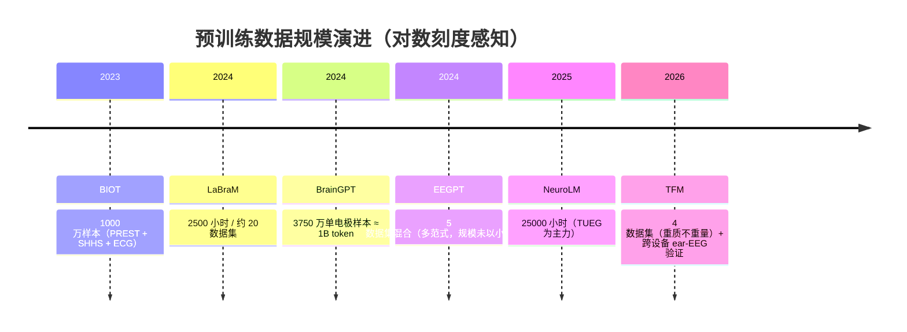

# EEG 预训练数据全景

> 六篇论文的预训练语料从 1000 万样本到 25000 小时不等——规模与构成直接决定了模型的通用性上限。

## 规模一览

## 语料构成对比

| 论文 | 主力语料 | 构成特点 | 域偏斜风险 |
|---|---|---|---|
| BIOT | PREST（静息）+ SHHS（睡眠）+ ECG | 跨模态（EEG+ECG+IMU），但 EEG 部分集中在静息/睡眠 | 中（缺任务态 EEG） |
| LaBraM | TUSZ（1138h）+ TUEP + TUEG 系 | **临床癫痫数据占近半**，20 个数据集摊薄 | 高——BrainGPT 据此解释其 specialist 迁移偏弱 |
| EEGPT | PhysioMI + HGD + TSU + SEED + M3CV | 多范式均衡（MI/SSVEP/EMO/多任务） | 低（但总量小，~10M 参数够用） |
| BrainGPT | 12 个基准的预训练拆分 | 电极级拆分使样本量 ×E，任务覆盖最广 | 低（但单电极丢失空间信息） |
| NeuroLM | TUEG（~24000h）+ 12 个公开集 | **绝对量最大**，仍以临床 TUEG 为主 | 高（同 LaBraM，但指令微调缓解） |
| TFM | TUEV/TUAB/CHB-MIT/IIIC | 最小语料；单通道 motif 学习弥补规模 | 中；跨设备能力由单通道设计保证 |

## 关键观察

### 1. 规模 ≠ 通用性，构成决定迁移半径

BrainGPT 的发现最有说服力：以癫痫临床数据为主的预训练模型，在情绪/运动想象等非临床下游上**反而不如从头训练**——域差异吞掉了预训练收益。EEGPT 用小而均衡的语料 + linear probing 达到 SOTA，是"构成比规模重要"的另一佐证。

### 2. 临床数据是规模的主力，也是偏斜的来源

TUEG 体系（Temple 大学）是唯一能拿到万小时级 EEG 的公开来源，LaBraM 和 NeuroLM 都重度依赖它。这解释了为什么**脑机接口类任务（MI/SSVEP）的 pretrain-then-finetune 收益普遍不如临床任务**。

### 3. 数据需求量与模型规模的关系

- LaBraM：Base 用 500h 就接近 2500h 的效果；Huge 在 2500h 仍未饱和（推断需万小时级）
- NeuroLM：L 和 XL 的验证困惑度接近 → 25000h 喂不饱十亿参数
- BrainGPT：数据 0→1B token 一直涨，未饱和

结论：**当前 EEG 语料规模仍是所有大模型的瓶颈**，且临床偏斜短期无解（没有第二来源）。

### 4. 单电极拆分是"数据倍增器"

BrainGPT 把多电极信号拆成单电极样本，等效样本量 ×E（E 为电极数）——3750 万样本里含水量高，但换来了对任意电极配置的兼容性。TFM 的单通道 tokenizer 是同一思想的 tokenization 版。

## 对新建笔记的提示

读新论文时，在笔记的「实验与结果」里记录其预训练语料的：**总时长（或样本数）、主力数据源、域构成**。如果它报告了 scaling 实验（数据量 vs 性能曲线），单独记一段——这类实验目前只有 LaBraM/BrainGPT/EEGPT 做过，非常稀缺。

## 关联页面

[数据集索引](../datasets.md) · [六篇方法对比](../comparison.md) · [预训练范式对比](pretraining.md)
