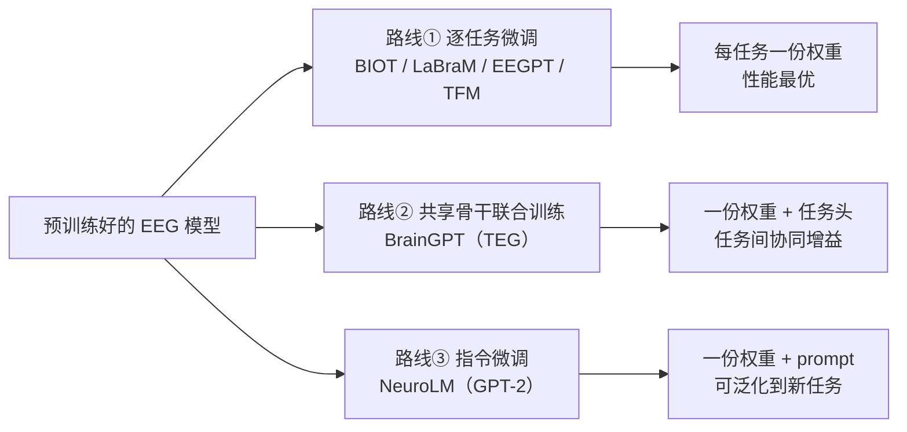

# 多任务三条路线

> "一个模型能不能同时干多种 EEG 任务？"——六篇论文给出了三种答案，外加传统基线。

## 路线总览

## 三条路线深度对比

| 维度 | ① 逐任务微调 | ② 共享骨干联合训练 | ③ 指令微调 |
|---|---|---|---|
| 代表 | BIOT / LaBraM / EEGPT / TFM | BrainGPT（TEG 图网络） | NeuroLM（GPT-2 + instruction） |
| 权重份数 | 每任务一份 | 一份骨干 + 每任务一个头 | **一份权重** |
| 新任务成本 | 再微调一次（全量） | 新任务头 + 图子图（轻量） | **写一个 prompt 即可尝试** |
| 任务间协同 | 无 | ✅ 有（joint 比 separate 全任务提升，小任务受益最大） | ✅ 有（混任务训练） |
| 性能天花板 | **最高**（LaBraM/TFM 均为此路线） | 略低于单独训练的最优，但全面高于各自 separate | 目前略逊单任务 SOTA，接近多数基线 |
| 存储成本 | 模型数 × 任务数 | 1 份骨干 + N 个小头 | 1 份 |
| 泛化到新任务 | 需要数据 + 微调 | 需要少量数据 | **零样本尝试 prompt** |

## 关键机制细节

### BrainGPT 的 TEG：为什么联合训练能双赢

任务 A 和任务 B 的电极集重叠部分（如 C4），其**节点向量被两个任务的梯度共同更新**——相当于大任务给小任务做数据增强。论文证据：MW（仅 4K 样本）在联合训练中 +3.9%，SS（42K 样本）只 +0.9%——**小任务受益与数据量成反比**。

### NeuroLM 的指令微调：为什么要把任务变成问答

把"6 类事件分类"变成 `[SEP] Question: Which event type...? Answer: {(A)...(F)}`，任务差异就被压进了**文本 prompt** 而非模型结构。配套设计：只对答案部分算损失（稳定）、混入纯文本防遗忘、评测取 argmax 而非 beam search。消融显示模型对选项乱序鲁棒（TUEV/HMC），说明真的理解了问题语义而非背选项位置。

### 性能差距从哪来

NeuroLM 坦言多任务版本仍逊于单任务 SOTA 的 LaBraM（如 TUAB 0.7969 vs 0.8258）。三个原因：① 任务间梯度干扰；② 文本对齐是粗粒度的空间级（无 EEG-text 成对数据）；③ GPT-2 基座偏小且老。**多任务的价值在范式与效率，不在当下数字**。

## 与传统多任务学习的对比

EEG 领域传统 MTL（hard/soft parameter sharing、跨任务预训练）一直存在，但这六篇的差异在于：

1. **骨干来自大规模自监督预训练**（而非随机初始化的多任务网络）；
2. **输入表示天然任务无关**（channel patch / 单电极 token），这是多任务能共享骨干的前提；
3. NeuroLM 首次把 NLP 的 instruction tuning 完整范式搬进 EEG。

## 新论文入库提示

读新论文时记录：它是哪条路线？如果是联合训练，报告 joint vs separate 对比了吗？如果是指令微调，prompt 模板长什么样、泛化到没见过的任务了吗？——这两问是判断多任务工作含金量的关键。

## 关联页面

[BrainGPT 笔记](../papers/2026-09/0918-braingpt.md) · [NeuroLM 笔记](../papers/2026-09/0918-neurolm.md) · [通道异构的四种解法](spatial.md)
