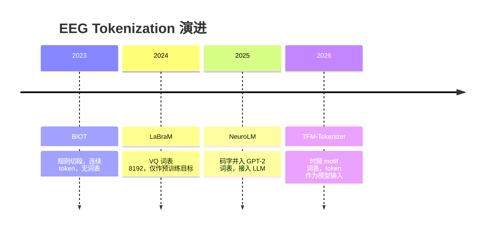

# EEG Tokenization 演进

> 一条主线：**token 从"预处理产物" → "训练靶子" → "真正的模型输入"**。

## 演进时间线

| 时间 | 论文 | Token 形态 | 词表 | Token 的用途 |
|---|---|---|---|---|
| 2023 | [BIOT](../papers/2026-09/0918-biot.md) | 连续向量（1s 规则切段） | 无 | 模型输入 |
| 2024 | [LaBraM](../papers/2026-09/0918-labram.md) | 离散码（VQ，8192） | 有 | **仅作预训练目标**，推理时丢弃 |
| 2025 | [NeuroLM](../papers/2026-09/0918-neurolm.md) | 离散码（VQ） | 有（并入 GPT-2 词表） | LLM 的输入 token |
| 2026 | [TFM-Tokenizer](../papers/2026-09/0918-tfm-tokenizer.md) | 离散码（VQ 时频 motif） | 有 | **基础模型的输入** + 可插拔复用 |

## 三步跃迁

### 第一步：BIOT —— "tokenize 但没词表"

逐通道独立切段（1s 窗、0.5s 重叠），token embedding = FFT 能量 → FCN ⊕ 通道 embedding ⊕ 正弦位置编码。

- 解决了：异构格式统一（缺通道直接丢 token）；
- 没解决：token 是确定性切分的产物，没有数据驱动的词表，谈不上"语义单元"。

### 第二步：LaBraM —— "学词表但只当标签"

VQ-VAE 式 codebook（8192×64），重构目标用 DFT 幅值+相位（原始波形不收敛）。但 token **只在 masked EEG modeling 里当预测目标**，下游微调时 tokenizer 被丢弃，模型实际吃的仍是连续 patch embedding。

- TFM-Tokenizer 对此的批评：tokenization 的红利（压缩、归纳偏置、输入表示质量）根本没落到模型输入上。实验佐证：并入 TFM tokenizer 后（BIOT-TFM/LaBraM-TFM 合计）93% 的指标情形提升。

### 第三步：NeuroLM / TFM —— "token 真正上岗"

两条不同的上岗方式：

- **NeuroLM**：把 codebook 索引**并入 GPT-2 词表**，EEG 变成"外语句子"喂给 LLM，靠 GRL 对抗对齐文本空间 → 通向多任务指令推理；
- **TFM**：token embedding 查表（码字初始化）作为轻量 Transformer 的**输入**，且作为即插即用组件替换 BIOT/LaBraM 的输入端 → 通向通用 tokenization 层。

## 关键技术分歧

### 频域信息怎么进 token

| 方案 | 做法 | 问题 |
|---|---|---|
| BIOT | FFT 能量向量 → FCN | 丢失相位；1s 窗过粗，时域任务（P300）吃亏 |
| LaBraM | DFT 幅值+相位作重构目标 | 相位贡献小（NeuroLM 实验证实） |
| NeuroLM | 时域信号 + DFT 幅值双 decoder | — |
| TFM | 频率轴切 patch + 频率 Transformer + 门控聚合 | **显式建模窗内跨频段依赖**，最彻底 |

### 位置编码的争论

BIOT 用正弦相对位置编码，LaBraM 用可学习时/空 embedding，**TFM 在 tokenizer 内刻意去掉位置编码**（消融：Kappa 0.5119→0.5337，token 利用率 12.87%→9.78%[^pe]。

理由：EEG motif 非平稳，同一模式可出现在任意位置；加 PE 会让相同 motif 在不同位置学成不同 token → 词表冗余。motif 词表需要的是**平移不变性**。

（注意区分：TFM 的下游 Transformer 仍加位置/通道 embedding，去掉的只是 tokenizer 内部的 PE。）

## 遗留问题

- **固定窗长的软肋**（TFM 作者自认）：大 pattern 可能跨窗被切断，同一事件分到不同 token；
- **词表大小与利用率的权衡**：TFM 消融显示词表越大类独有 token 越多，但 token 利用率下降；
- **与自然语言对齐**：LaBraM/NeuroLM 都展望过把神经码与语言词汇对齐，目前仍停留在空间级（粗粒度）。

## 关联论文

[BIOT](../papers/2026-09/0918-biot.md) · [LaBraM](../papers/2026-09/0918-labram.md) · [NeuroLM](../papers/2026-09/0918-neurolm.md) · [TFM-Tokenizer](../papers/2026-09/0918-tfm-tokenizer.md)

[^pe]: TFM-Tokenizer 附录 C.6 消融：位置编码会让同一 motif 因位置不同学成不同 token，移除后 Cohen's Kappa 0.5119→0.5337、利用率 12.87%→9.78%、类独有 token 1.94%→2.14%（此处利用率下降为正向信号：说明词表更紧凑）。
